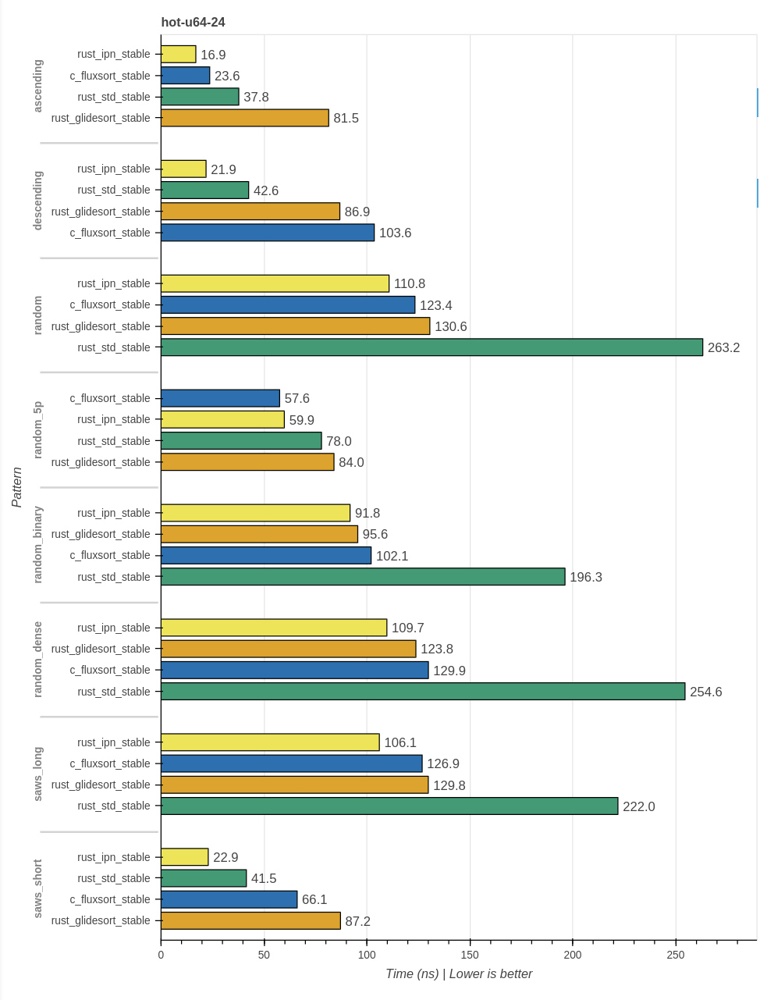
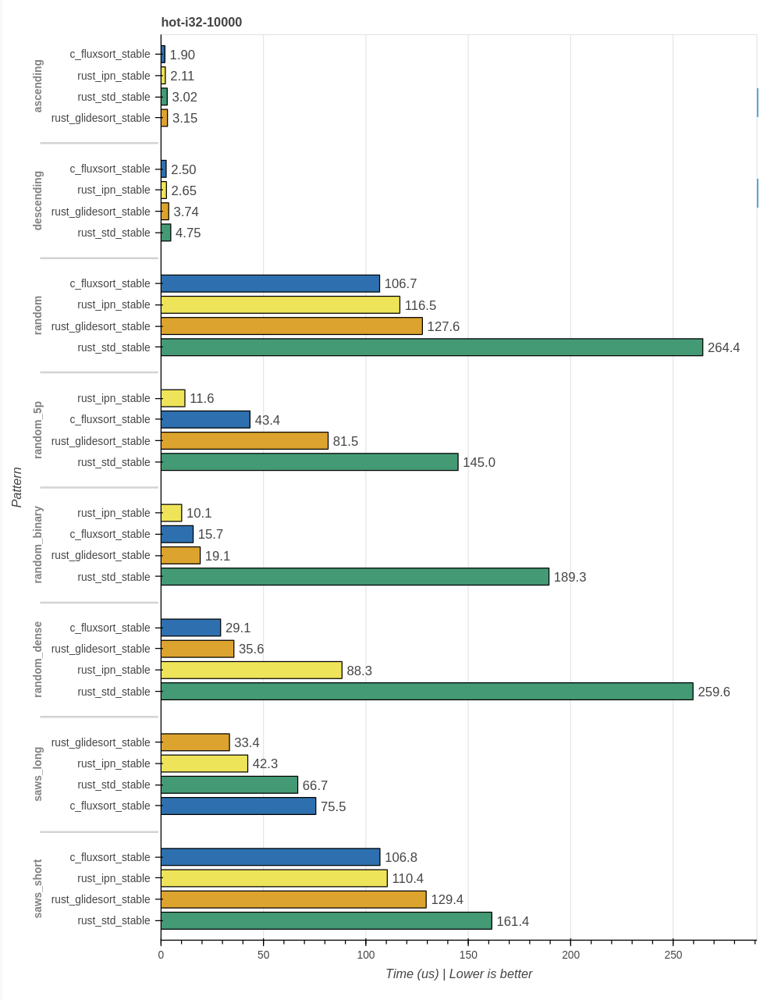
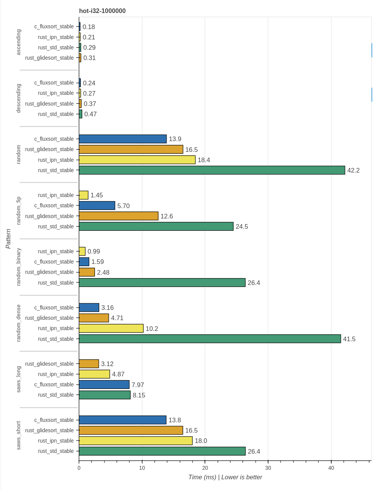
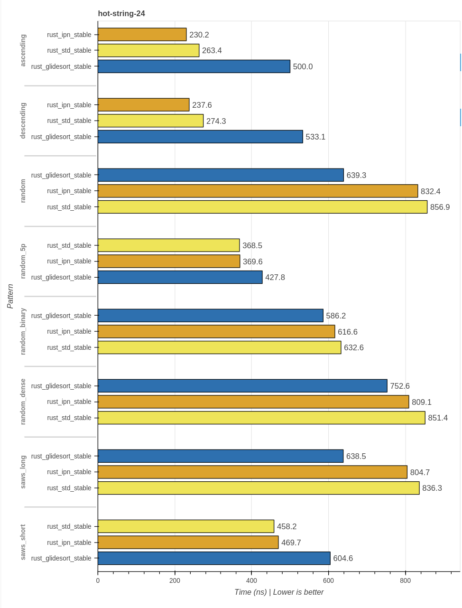
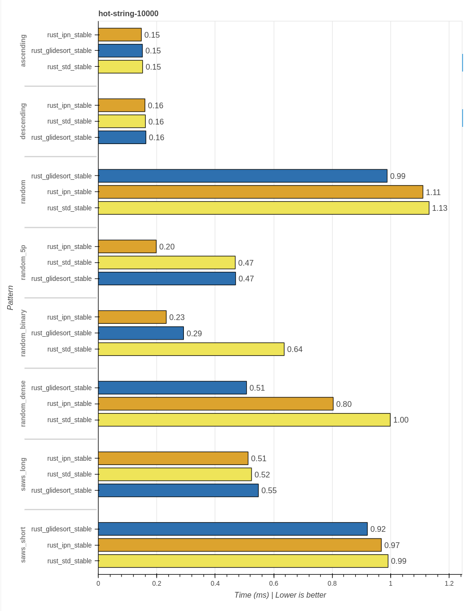
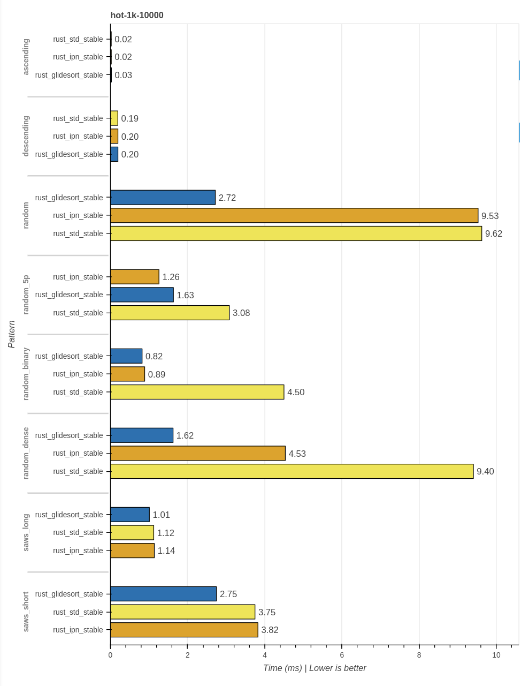
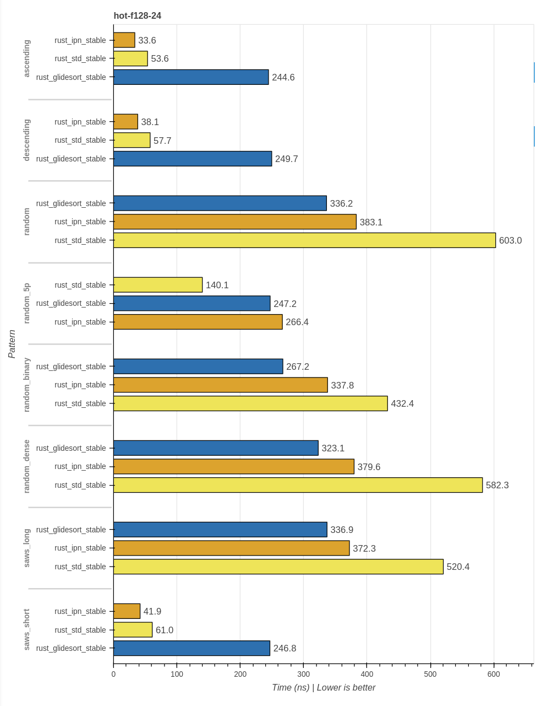
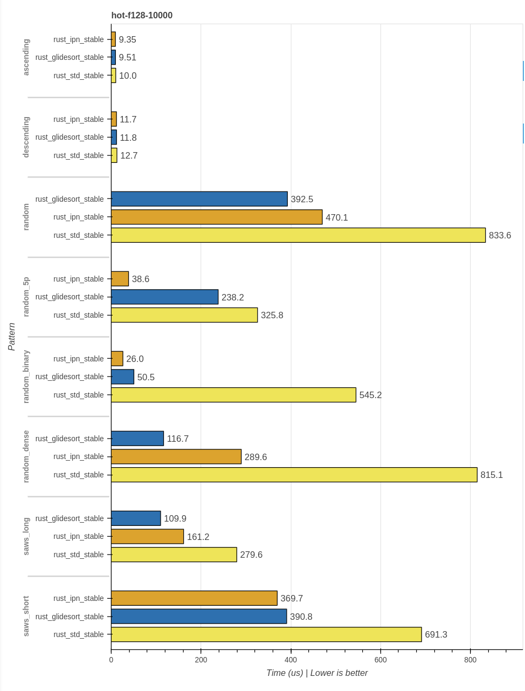

# A limited performance analysis of glidesort

WIP: Please do not publish.

Author: Lukas Bergdoll @Voultapher
Date: 04.02.2023

This is a limited performance analysis of the recently released novel sort implementation glidesort [1](https://github.com/orlp/glidesort).

Bias disclaimer. The author of this analysis is the author of the ipn family of sort implementations.


### Benchmark setup

Benchmarking is notoriously tricky, and especially synthetic benchmarks may not be representative. An incomplete list of relevant factors:

- Input size
- Input type (price to move? price to compare?)
- Input pattern (already sorted, random, cardinality, streaks, mixed etc.)
- Hardware prediction and cache effects

Test system:

```
- rustc 1.69.0-nightly (d7948c843 2023-01-26)
- clang version 15.0.7
- gcc (GCC) 12.2.1 20230111
- Linux  6.1.9
- AMD Ryzen 9 5900X 12-Core Processor (Zen3 micro-architecture)
```

See the README of this project to see how these benchmarks are performed. You can repeat them with `cargo bench <sort_name>-<prediction_state>-<type>-<pattern>-<size>`.

The benchmarks were performed with default rustc architecture settings, meaning no `march=native`, restricting rustc to SSE2 for this platform. The build flags for the C/C++ code can be found in `build.rs`.

Modern sort implementations are adaptive, they will try to exploit existing patterns in the data to do less work. A breakdown of the benchmark patterns:

- `random`, random numbers generated by rand gen [2](https://github.com/rust-random/rand)
- `random_dense`, uniform random numbers in the range `0..=(((size as f64).log2().round())`
- `random_binary`, uniform random numbers in the range `0..=1`
- `random_5p`, 95% 0 and 5% random data, not uniform
- `ascending`, numbers `0..size`
- `descending`, numbers `0..size` reversed
- `saws_long`, `(size as f64).log2().round()` number of randomly selected ascending and descending streaks
- `saws_long`, randomly selected ascending and descending streaks of length 22

The contestants are:

```
- rust_std_stable            | `slice::sort` https://github.com/rust-lang/rust
- rust_ipn_stable            | https://github.com/Voultapher/sort-research-rs
- rust_glidesort_stable      | https://github.com/orlp/glidesort
- c_fluxsort_stable          | https://github.com/scandum/fluxsort
```

rust_ipn_stable is in a solid state, but still work in progress. A larger writeup and introduction together with rust_ipn_unstable are in progress.

### Results `u64`

A good benchmark to shine light into the ability of the sort to exploit instruction-level-parallelism (ILP) is hot-u64-10000. The input are 10k u64 values, which fits into the core private L2 data cache for the used Zen3 test machine. The upper limit should be in the order of 4-5 instructions per cycle for such a dataset. 10k elements is enough to reliably exploit existing patterns in the input data.


Starting with the fully ascending and descending patterns. Both rust_ipn_stable and c_fluxsort_stable can sort these by doing a forward scan, and reversing the input if necessary, without allocating. rust_std_stable will do an allocation for all inputs N > 20, and also scan them in one go, but does so starting at the end of the input. Effectively scannings backwards. A mix of code-gen and hardware prefetchers may be responsible for the 1.5x speedup for rust_ipn_stable and c_fluxsort_stable over rust_std_stable. rust_glidesort_stable handles these cases sub-optimally being better than rust_std_stable, but still leaving some room. Curiously gcc seems able to generate better code for the simple act of scanning forward, while rustc seems to catch up when adding a `slice.reverse()` operation.

The bread and butter of sort algorithms is their performance, or viewed differently their power efficiency, when sorting random inputs. Here rust_ipn_stable and c_fluxsort_stable are very closely matched, even though they have completely different implementations. rust_glidesort_stable eclipses the current Rust standard library implementation by a factor of 2, but falls short of reaching the top, requiring ~2.3x the time and energy of c_fluxsort_stable to perform the same task.

The next pattern random_5p allows rust_ipn_stable to really flex its capabilities, fundamentally it's a Timsort with faster small sort, faster merge function and an analysis that periodically looks for recurring values and filters them out with a stable partition. It finds the common value and merges the partitioned run with the remaining runs. c_fluxsort_stable is hybrid of mergesort and quicksort, switching to a merge sort if a front up analysis suggests the presence of many streaks. Here it misclassifies the input as having many streaks, and is stuck unable to filter out the common value. rust_glidesort_stable doubles the runtime of c_fluxsort_stable, still ~1.65x ahead of it's random performance, clearly it's able to exploit this property of the input somehow. rust_std_stable is ~10.5x slower than rust_ipn_stable. rust_std_stable can find existing short streaks of the common value, and spends less time in insertion sort compared to a fully random input.

The extreme case of low cardinality inputs is random_binary, rust_ipn_stable leads the charts, reliably identifying the two values as common and partitioning them out. rust_glidesort_stable takes ~1.67x the time and energy to perform the same operation. c_fluxsort_stable sits in-between the two. rust_std_stable sits at ~14.9x slower than first place rust_ipn_stable.

A more moderate low cardinality scenario is random_dense. c_fluxsort_stable tops the chart performing the sort ~3.5x faster than with a fully random input. A little slower in second place comes in rust_glidesort_stable. A lot slower is rust_ipn_stable. The mechanism it uses to identify common values is quite conservative, limiting worst case performance. While it will find common values it will do so unreliably and has to merge them repeatedly with other runs that also contain some of these values. Yielding only a 1.2x speedup over it's random performance. In last place, requiring ~7.9x times the time and energy of c_fluxsort_stable, comes rust_std_stable, exhibiting more or less random pattern performance.

Long existing streaks in saws_long are perfect for rust_glidesort_stable, it uses a strategy that allows it to simultaneously merge multiple found streaks. In second place comes rust_ipn_stable ~1.26x slower than rust_glidesort_stable. This is the only pattern where rust_std_stable does not occupy the last place. The last place is c_fluxsort_stable, at ~2.3x of rust_glidesort_stable.

saws_short is interesting in that, it is essentially, random pattern level performance across the board, with the exception of rust_std_stable, which is able to outperform it's random pattern performance by ~1.5x. It most likely does so, by spending less time in insertion sort. While the more advanced other sorts use other mechanisms to generate small sorted batches, eg. rust_ipn_stable uses an 8 element transposition sorting network.

Looking at the scaling upwards for larger inputs, eg. input size 1m:


Overall quite similar. With the notable exception that c_fluxsort_stable pulls ahead for random inputs, and rust_glidesort_stable catching up with rust_ipn_stable. The dataset still fits into the shared L3 data cache of the used test machine.

Looking at scaling downwards, eg. input size 24:



The specialized small-sort implementation in rust_glidesort_stable, seems unable to leverage small fully or partially sorted inputs. c_fluxsort_stable can handle ascending inputs relatively well, but performs the worst for fully descending inputs. rust_ipn_stable can handle fully ascending and descending inputs in N-1 comparisons without allocation, for every input size. rust_std_stable will always heap allocate, but can use the adaptive nature of Timsort to exploit a presorted full or partial streak.

### Results `i32`

Signed 32-bit integers are a very common type used to benchmark sort implementations.






Overall similar results to `u64`, c_fluxsort_stable and rust_glidesort_stable benefit more from the smaller type than rust_ipn_stable.

### Results `String`





For strings `format!("{:010}", val.saturating_abs())`, not supported without source level modification or pointer indirection by c_fluxsort_stable, rust_glidesort_stable is ahead. However rust_ipn_stable is not able to apply it's fast merge and sorting networks because the `Copy` property is used as crude proxy to limit these optimizations to types that can't have interior mutability. Better language support [3](https://internals.rust-lang.org/t/pre-rfc-type-property-functions/18233) would enable these optimizations for types such as `String`. Which would yield:


Giving the lead back to rust_ipn_stable for random inputs.

### Results `1k`

An extreme case, a type that is one kilobyte in size. This type will stress test any sort implementation that performs many copies of the type.




Overall rust_glidesort_stable is much better in such a scenario. rust_ipn_stable only improves on rust_std_stable where it can filter out common values.

### Results `f128`

F128 is not a builtin type, it is relatively cheap to access and copy, but has a relatively expensive comparison function:

```rust
#[repr(C)]
#[derive(PartialEq, Debug, Clone, Copy)]
pub struct F128 {
    x: f64,
    y: f64,
}

fn partial_cmp(&self, other: &Self) -> Option<std::cmp::Ordering> {
    // Simulate expensive comparison function.
    let this_div = self.x / self.y;
    let other_div = other.x / other.y;

    // SAFETY: We checked in the ctor that both are normal.
    let cmp_result = unsafe { this_div.partial_cmp(&other_div).unwrap_unchecked() };

    Some(cmp_result)
}
```

This benchmark rewards be mix of exploiting ILP and reducing the total amount of comparisons performed:





rust_glidesort_stable seems better than rust_ipn_stable at completing the sort with fewer calls to the comparison function, with the exception of inputs with common values that can be filtered out. Both eclipse rust_std_stable in terms of runtime and energy efficiency.

### Debug performance

All the benchmarks above have been performed using highly optimized builds. And while performance of optimized builds is crucial. Performance of debug builds has a widespread effect, from developer experience to test iteration time, CI test times and more. As such this property should not be neglected. Running my test suite as debug build via hyperfine yields:

```
rust_std_stable:
  Time (mean ± σ):      2.756 s ±  0.052 s    [User: 17.205 s, System: 0.244 s]
  Range (min … max):    2.697 s …  2.851 s    10 runs

rust_ipn_stable:
  Time (mean ± σ):      2.776 s ±  0.062 s    [User: 17.713 s, System: 0.229 s]
  Range (min … max):    2.718 s …  2.877 s    10 runs

rust_glidesort_stable:
  Time (mean ± σ):      3.111 s ±  0.046 s    [User: 19.149 s, System: 0.244 s]
  Range (min … max):    3.056 s …  3.224 s    10 runs
```

rust_ipn_stable sees no meaningful change over the existing standard library implementation. In contrast rust_glidesort_stable incurs a significant slowdown for debug builds.

### Code complexity

A crude measurement of code complexity is lines of code as measured with tokei. Non sort related code subtracted:

```
- rust_std_stable ~220 LoC
- rust_ipn_stable ~930 LoC
- rust_glidesort_stable ~2300 LoC
```

rust_std_stable is by far the simplest implementation. An additional source of complexity can be complex state invariants. rust_glidesort_stable introduces 20+ structs, some with very complex state invariants like `MergeStack`. In contrast rust_ipn_stable mostly introduces faster versions of the existing building blocks of rust_std_stable eg. `parity_merge_plus` which implements the same interface as the existing `merge` function, readable as straight line code.

### Binary size

Instantiating the sort for a selection of types (`u64`, `u32`, `i32`, `i16`, `i64`, `i128` and `String`) yields:

Release build `lto = "thin"` and strip:

```
- baseline no sort 312kb
- rust_std_stable 336kb
- rust_ipn_stable 386kb
- rust_glidesort_stable 551kb
```

Code size seems to scale similar to LoC.

Release build `lto = "thin"`, `opt-level = "s"` and strip:

```
- baseline no sort 307kb
- rust_std_stable 324kb
- rust_ipn_stable 373kb
- rust_glidesort_stable 490kb
```

Optimizing for code-size yields similar results.
