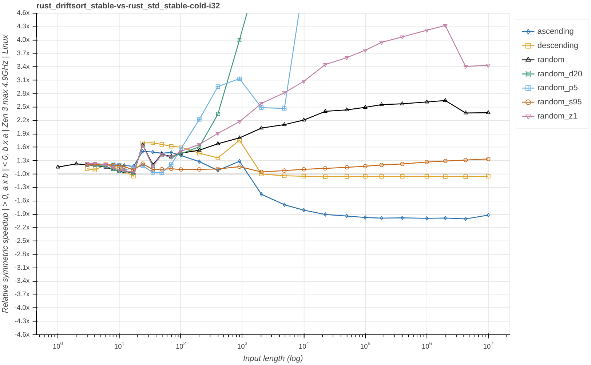
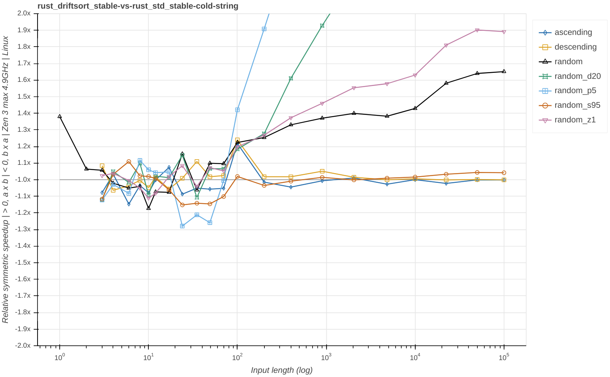
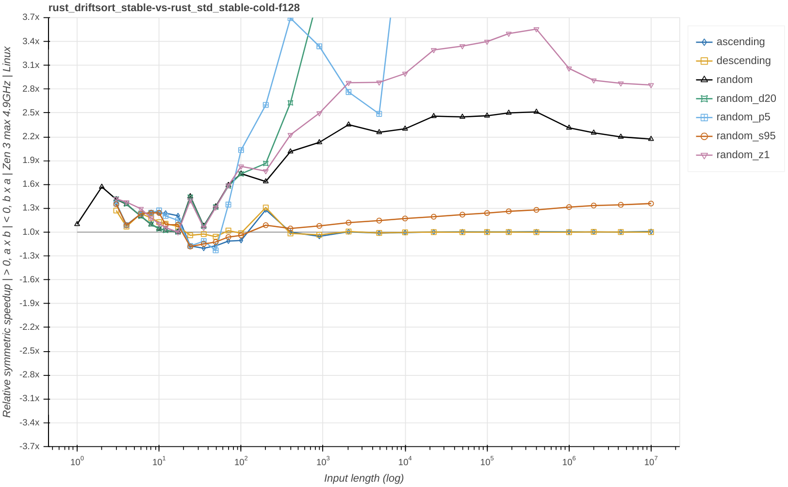
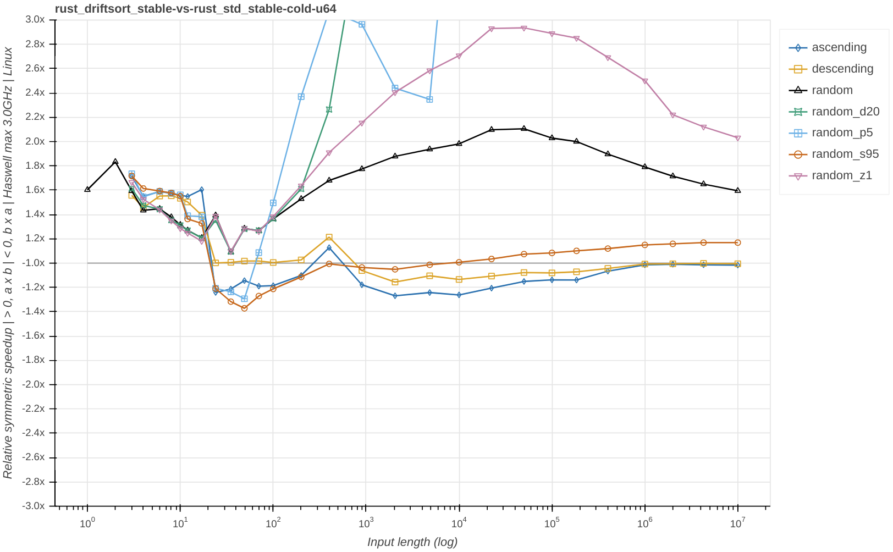
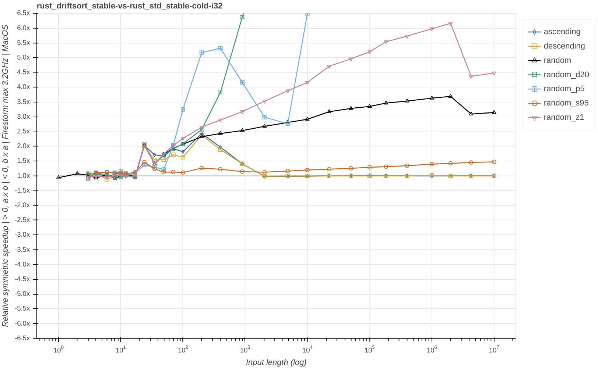
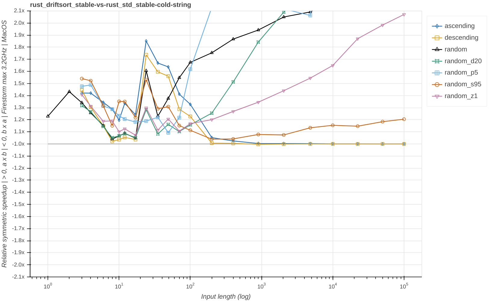
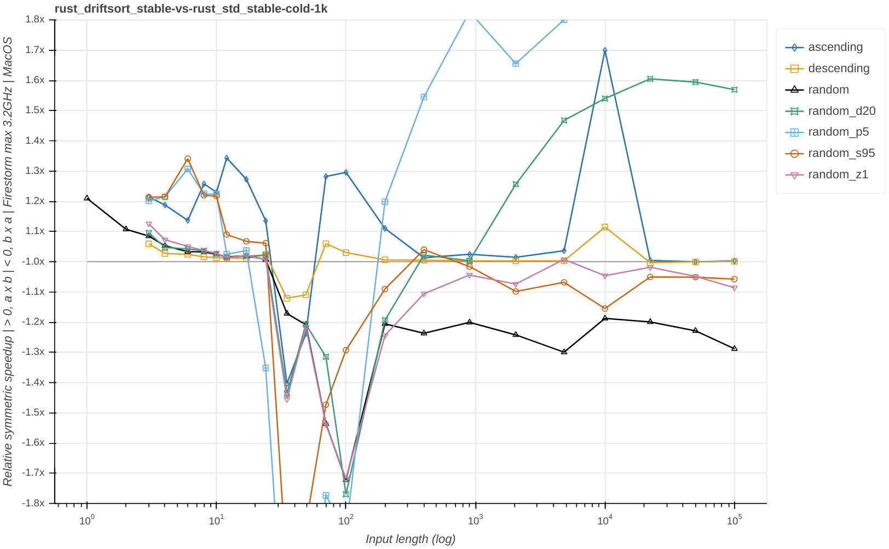

# An introduction to driftsort

# Work in progress please do not publish!

Authors: Lukas Bergdoll @Voultapher and Orson Peters @orlp  
Date: TODO (YYYY-MM-DD)

This is an introduction and overview of an efficient, generic and robust stable sort implementation called driftsort by Orson Peters and Lukas Bergdoll ([source code](https://github.com/Voultapher/driftsort)).

TL;DR: driftsort improves upon `slice::sort` in a variety of ways.

---

Bias disclosure: the authors of this analysis are the authors of driftsort.

## Design goals

The primary goal was to develop a replacement for the current Rust standard library `slice::sort`.

- **Correct**: Correctly sorted output if the user-defined comparison function implements a strict weak ordering.
- **Safe**: Zero UB regardless of input and user-defined comparison function. This includes panic safety, observability of interior mutability, and safety when Ord is violated for any input.
- **Stable**: Equal elements retain the same relative order they were in in the input.
- **Hardware agnostic**: No architecture-specific code.
- **Generic**: Works the same way for builtin types and user-defined types.
  Supports arbitrary comparison functions.
- **Robust**:
  - Guaranteed O(N * log(N)) worst case comparisons.
  - Guaranteed O(N) comparisons for fully ascending and descending inputs.
  - Expected O(N * log(K)) comparisons when sorting K unique values.
  - Smooth run-time scaling with input length.
- **Efficient**: Race to sleep and focus on instruction-level-parallelism (ILP) over SIMD.
  - Optimized and tested along these dimensions, ~6k data points:
    - Input length (0-1e7).
    - Input type (integer-like, medium-sized, large-sized).
    - Input pattern (fully random, Zipfian distributions, low-cardinality, presorted + append, and more).
    - CPU prediction state (hot loop only doing sort, cold code with i-cache misses).
  - Leverage existing ascending and descending runs in the input.
- **Binary-size**: Relatively small binary-size for types like `u64` and `String`. i-cache is a shared resource and the program will likely do more than just sort.
- **Compile-time**: At least as fast to compile as the current `slice::sort` if hardware-parallelism is available and not much worse if not. Both debug and release configurations.
- **N / 2 auxiliary memory**: Heap usage should be limited to N / 2, and explicit stack usage should be limited to a couple kB.
- **Debug performance**: Performance of un-optimized binaries should not be much worse than the current `slice::sort`.

## Design non-goals

- **Fastest non-generic integer sort**: The stated design goals are incompatible with this goal. Generally the existing advice that `slice::sort_unstable` is faster for integers, unless they contain long already sorted parts, still holds with [ipnsort](https://github.com/Voultapher/sort-research-rs/tree/main/ipnsort). In addition, once the sort implementation has a run-time of multiple milliseconds or more, using multithreading becomes beneficial, which is out of the scope of `slice::sort_unstable`.
- **Tiny binary-size**: Implementation complexity and binary-size are related, for projects that care about binary-size and or compile-time above everything else [tiny_sort](https://github.com/Voultapher/tiny-sort-rs) is a better fit.
- **Varied compilers**: Only rustc using LLVM was tested and designed for.

## High level overview

Before working together on driftsort, the two authors had [competing desires](https://github.com/Voultapher/sort-research-rs/blob/main/writeup/glidesort_perf_analysis/text.md) to build a `slice::sort` replacement. In 2023 they decided to work together, combining the best of both competing designs into a new design called driftsort. The influences a varied, but the core structure is derived from [glidesort](https://github.com/orlp/glidesort) by Orson Peters.

Modern high-performance sort implementations combine various strategies to exploit input patterns and hardware capabilities. In effect this makes all of them hybrid algorithms. For this reason it is more appropriate to talk about sort implementations and their components instead of a singular "sort algorithm".

### Current `slice::sort`

- **Small input insertion sort**: Dedicated sort for N <= 20. Profiling shows that 95+% of inputs are of len <= 20. In such scenarios i-cache misses are often the most important factor. A dedicated and inlined insertion sort shows best overall performance across patterns and CPU prediction state, and it avoids allocating the auxiliary memory.
- **Timsort merge**: Top level loop and merging policy based on [Timsort](https://en.wikipedia.org/wiki/Timsort) by Tim Peters.
- **Merge**: Branchless merge that requires at most N / 2 auxiliary memory.
- **Already sorted detection**: Linear scan with early exit to find existing runs of sorted elements in the input.
- **Insertion sort**: Run creation if no existing run was found in the input.

### driftsort

Component level overview of driftsort and how and why it differs from glidesort:

- **Small input insertion sort**: Dedicated sort for N <= 20. Profiling shows that 95+% of inputs have a length <= 20. In such scenarios i-cache misses are often the most important factor. A dedicated and inlined insertion sort shows best overall performance across patterns and CPU prediction state, and it avoids allocating the auxiliary memory.
- **Run creation and lazy merging**: Top level loop and algorithm adapted from glidesort. Combines bottom up merging and top down partitioning, by delaying merging as long as possible. driftsort retains the same logic as glidesort while significantly shrinking the binary-size required to achieve this logic.
- **Powersort merge**: Merging policy based on [powersort](https://www.wild-inter.net/publications/munro-wild-2018.pdf) by J. Ian Munro and Sebastian Wild.
- **Merge**: Branchless merge derived from the current `slice::sort` implementation. Requires at most N / 2 auxiliary memory.
- **Sorted run detection**: Linear scan with early exit to find existing runs of sorted elements in the input. In contrast to glidesort which uses a fixed length after which it counts an existing run as already sorted, driftsort has a min run length of ~sqrt(N). In addition driftsort will not try to find another run within the min run length region, if the first attempt failed. The advantage of disrupting the top-down Quicksort process to allow merging with an existing run, requires a certain length relative to N to be worth it. This approach also avoids trying to find and merge small streaks in inputs with few unique elements, which are more efficiently handled by the top-down Quicksort.
- **Quicksort**: Top-down partitioning loop and algorithm.
- **Pivot selection**: Recursive median-of-three approximating sqrt(N) sampling.
- **Hybrid small-sorts**: Two different small-sort implementations as a base case for recursive quicksort, chosen at compile time based on type characteristics. Insertion sort is used as a fallback for non `Freeze` types. A novel hybrid stable small-sort, based on a fast fixed function for sorting 4 elements combined with bidirectional merging and insertion sort is used for `Freeze` types, shared with ipnsort. This small-sort approach achieves comparable results with the one in glidesort, but does so at a significantly smaller binary-size and compile-time cost.
- **Ancestor pivot tracking**: By keeping track of earlier used pivots in Quicksort we can detect and process common elements, allowing for O(N * log(K)) total comparisons where K is the number of distinct elements. This is also great for Zipfian distributions.
- **Partition**: Branchless stable partition. Left-to-right scan that performs a `cmov` style pointer select to fill the auxiliary memory buffer from left-to-right or right-to-left depending on the comparison outcome.
- **Mergesort**: Mergesort fallback used when a recursion depth limit is reached in the Quicksort. Re-uses the existing merging code in driftsort by calling itself with a flag that forces small runs to be made with insertion sort.

### Components from glidesort which are not incorporated

Some components and techniques from glidesort were intentionally not incorporated because they were considered too niche or have too much binary-size overhead for a generic standard library sort:

- **Merge splitting.** This allows arbitrarily small auxiliary buffers which was not necessary for `slice::sort` and enables interleaved merge loops which were not implemented for binary-size reasons.
- **Quad-merges.** Delaying merges for quad-merges with interleaved loops and avoiding `memcpy`s was not implemented as the interleaved loops were too large and the `memcpy` relatively cheap.
- **Bidirectional partitioning.** This was rather complex and a large amount of code to avoid relatively cheap `memcpy`s in the stable partition, and the interleaved loops were larger and slower on some processors.


## Verification

### Correct

As part of the tailor-made [test suite](https://github.com/Voultapher/sort-research-rs/blob/main/sort_test_tools/src/tests.rs), there are tests that compare the resulting output order to the output of `slice::sort`. All tests are done for a range of input lengths between 0 and 1_000_000. There are tests specifically for different input types as well as for different input patterns. There are also tests that test a specific property along two dimensions: input length and pattern. In addition, the existing Rust standard library test suite also contains tests specifically for `slice::sort`.

driftsort is a hybrid sort algorithm, which allows the individual components to be more easily reasoned about, which reduces the risk of hidden correctness bugs. The only component that could be regarded as employing novel ideas on an algorithmic level would be the lazy merging. However it is essentially the same as eager merging, where Quicksort is used to create runs.

Result: The test suits pass.

### Safe

Like the current `slice::sort` the driftsort implementation contains significant amounts of `unsafe` for reasons of reliable code-gen, as well as run-time, compile-time, and binary-size efficiency. `slice::sort` allows for arbitrary logic in the user-defined comparison function, which may do any combination of: returning correct results, violating strict weak ordering, modify values as they are being compared via interior mutability, and/or panic. In combination with use of auxiliary memory an implementation can easily invoke UB, hang forever, and or return the input in a dangerous partially initialized state. Even implementations written using purely safe abstractions are only guaranteed to avoid direct UB, and are still susceptible to the other issues. More information about the different safety categories and effects, as well as comparison to C and C++ implementations can be found [here](https://github.com/Voultapher/sort-research-rs/blob/main/writeup/sort_safety/text.md).

The bespoke test suite involves tests that trigger all these scenarios for various types, pattern and input sizes. In addition, care was taken to isolate `unsafe` abstractions where possible, localize `unsafe` invariants to small scopes, with each `unsafe` block accompanied by a `SAFETY:` comment explaining the assumptions. In addition some components were model checked with [kani](https://github.com/model-checking/kani), checking the full gamut of possible comparison result and input combinations. The implementations have also been fuzzed with libfuzzer and AFL, however the employed harnesses did assume simple comparisons. In addition the test suite is also run with [miri](https://github.com/rust-lang/miri) both under Stacked borrows and Tree borrows.

Result: The test suits pass both normally and when run with miri.

### Stable

A variety of tests in the sort-research-rs test suite test the stability of the sort.

Result: Automatic tests pass.

### Hardware-agnostic

No architecture-specific code was used, and the implementation relies on branchless instruction-level parallelism instead of auto-vectorization to saturate wide out-of-order (OoO) CPU micro-architectures.

Result: (rip)grepping the source code for "arch" yields no relevant match.

### Generic

The driftsort implementation places the exact same type system trait bounds on its interface as the current `slice::sort`. In addition type introspection is performed via `mem::size_of`, and whether a type implements the `Copy` and or `Freeze` trait. Those traits are not restricted to builtin types, treating user-defined types and builtin types the same way. The fact that the performance characteristics and the order in which comparison operators are called for `u64` vs `Cell<u64>` are noticeably different is novel, and could surprise users. However it's not a case of degrading the performance for `Cell<u64>` but rather improving it for `u64`, `String` and more. All of the current documented properties and more are still upheld. Alternatives would need to sacrifice some of the desired goals.

Result: The interface remains the same.

### Robust

> Guaranteed O(N * log(N)) worst case comparisons.

The same structure as the one found in [introsort](https://en.wikipedia.org/wiki/Introsort) is used by driftsort to avoid the well-known O(N^2) worst-case of Quicksort. Once a recursion depth of 2 * log2(N) is reached, it switches to a different algorithm.

However, in the case of driftsort the algorithm it switches to is itself, but with a boolean flag set that forces small runs to be created in the input with insertion sort. This ensures it will never call quicksort again, only using the guaranteed O(N * log(N)) mergesort routines.

> Guaranteed O(N) comparisons for fully ascending and descending inputs.

The already-sorted detection component will detect fully ascending and descending inputs.

> Smooth run-time scaling with input length.

This point will be explored in more detail in the benchmark section, on some platforms there is a significant drop in throughput at the transition point from insertion sort to hybrid Merge-Quicksort due to implementation-specific and hardware-dependent effecst. But in terms of comparisons the scaling is generally speaking smooth.

Plotting mean comparisons performed divided by N - 1 yields:


Observations:

- driftsort and std_stable, share hitting a worst case for insertion sort in the descending pattern, with the strongest measured log scaling outlier at length 17.
- glidesort uses its core small-sort for N < 20, which has a best, average and worst case of O(N * log(N)).
- For N > 20 driftsort and glidesort have similar scaling curves.
- The changes in the min-run length heuristic allow driftsort to take advantage of random_d20 earlier than glidesort.
- All three implementations handle ascending and descending with O(N) comparisons for N > 20, with a constant of ~1.
- driftsort and glidesort show linear scaling for random_d20, demonstrating the O(N * log(K)) capabilities.
- All three implementations handle random_s95 by finding the 95% already sorted at the start and merging it with the remaining 5% after sorting them. This explains the comparatively low number of comparisons required for random_s95.
- std_stable is incapable of taking advantage of low-cardinality in inputs, as seen by random, random_z1 and random_d20 all requiring a similar amount of comparisons. The only exception is random_p5 which contains many short streaks of consecutive zeros, which std_stable recognizes.
- driftsort shows a jump in required comparisons for random_z1, random_d20 and random_p5 for N > 1e6. This can be explained by the auxiliary memory allocation policy which allocates a buffer of length N, as long as this would consume less than 8MB. The three patterns that see degradation are all those that take advantage of pdqsort style common element filtering. The input type used to generate these graphs is `u64` which is 8 bytes, and past length 1e6, this would be larger than 8MB. The stable partition in the Quicksort requires a buffer length N, which means the implementation will Quicksort multiple sub-slices and then merge them. Common element filtering is most efficient when it is done on the whole input at once. glidesort shows a similar effect, but less pronounced because of differences in the merge logic.
- random_p5 shows the conflict between low-cardinality and already sorted sub-slice detection in driftsort for N > ~1e2 and < ~1e4.

Result: driftsort retains the existing best, average and worst case comparison characteristics, while significantly reducing the number of required comparisons for inputs with repeated values.

### Efficient

Smartphone and server CPUs alike can execute billions of instructions each second. For a variety of reasons many programs spend most of their time waiting, predominantly for memory and cache loads and stores. More than 30 years of CPU design have been invested into doing things while the CPU would otherwise wait. These optimizations such as [pipelining](https://en.wikipedia.org/wiki/Instruction_pipelining) cause new bottlenecks such as [pipeline control hazards](https://en.wikipedia.org/wiki/Hazard_(computer_architecture)#Control_hazards_(branch_hazards_or_instruction_hazards)), which then again are addressed by further optimizations like [predictive execution](https://en.wikipedia.org/wiki/Speculative_execution#Predictive_execution). This stack of hardware optimizations, implemented with [shared mutable state](https://raw.githubusercontent.com/Voultapher/Presentations/master/retpoline/assets/shared-mutable-cpu-state-all.jpg) in the CPU, make predicting performance very complex. Measuring performance comes with its own laundry list of pitfalls, spanning the gamut from poor experimental setups, to bad analysis to faulty assumptions about relevance. Performance and efficiency are usually correlated, in that taking half the time to do the same work, means the CPU can go back to sleep after only half the time, using less power overall. That said, improving efficiency has its own set of [conceptual pitfalls](https://solar.lowtechmagazine.com/2018/01/bedazzled-by-energy-efficiency).

Sort implementations can leverage existing patterns in the input to perform less work. The following synthetic patterns represent a limited set of use cases. Their applicability to real-world situations will vary from use case to use case. In the domain of databases, low-cardinality distributions like `random_d20`, `random_p5` and `random_z1` have been found to be quite common in real-world data. Zipfian distributions also known as 80/20 distributions are found in many real-world data sets. Without prior distribution knowledge nor domain knowledge, a generic sort implementation has to exploit the gained information, without spending too much effort looking for an algorithmic optimization that won't be applicable or pay off.

The patterns used in this benchmark:

- `ascending`, numbers `0..size`,
- `descending`, numbers `0..size` reversed,
- `random`, random numbers generated by the [rand crate](https://github.com/rust-random/rand) `StdRng::gen`,
- `random_d20`, uniform random numbers in the range `0..=20`,
- `random_p5`, 95% 0 and 5% random values mixed in, not uniform,
- `random_s95`, 95% sorted followed by 5% unsorted, simulates append + sort, and
- `random_z1`, [Zipfian distribution](https://en.wikipedia.org/wiki/Zipf%27s_law) with characterizing exponent s == 1.0,

The cold benchmarks perform a step before each measurement that [overwrites](https://github.com/Voultapher/sort-research-rs/blob/lomcyc-partition-bench/benches/modules/util.rs#L128) the first level instruction cache and branch-prediction caches with unrelated values. This measures a scenario where prior parts of a hypothetical larger program already loaded or generated the data that will be sorted into the suitable data caches. In this scenario the first level instruction cache and branch predictor caches are trained on other work than the sort implementation. "Hot" benchmarks that keep the data and algorithm in the CPU cache are also possible but are only relevant for usecases where this also happens in the real-world, and are not representative for code which only occasionally calls sort in the context of a larger program.

One common way to improve the performance of sort implementations is to use explicit vectorization. However doing so limits the applicability to a narrow set of built-in types and doesn't support user-defined comparison functions. A generic implementation has to handle user-defined types of various shapes, paired with user-defined comparison functions. For these reasons the implementation focuses on instruction-level parallelism (ILP) instead of SIMD. There are also micro-architectures that have wider capabilities than exposed via the available vectorization, which means an ILP approach may yield [better results](https://github.com/Voultapher/sort-research-rs/blob/main/writeup/intel_avx512/text.md#neon-test-machine). While there is an unlimited amount of possible combinations, it is possible to pick certain types that demonstrate possible properties and their effects. In the benchmarks the input length range is limited to 1e5 for practical resource reasons, except for `u64` and `i32`.

#### Benchmark setups

Zen 3

```
Linux 6.6
rustc 1.77.0-nightly (6ae4cfbbb 2024-01-17)
AMD Ryzen 9 5900X 12-Core Processor (Zen 3 micro-architecture)
CPU boost enabled.
```

Haswell

```
Linux 5.19
rustc 1.77.0-nightly (6ae4cfbbb 2024-01-17)
Intel i7-5500U 2-Core Processor (Broadwell micro-architecture)
CPU boost enabled.
```

Firestorm

```
Darwin Kernel Version 22.6.0
rustc 1.77.0-nightly (6ae4cfbbb 2024-01-17)
Apple M1 Pro 6+2 Core Processor (Firestorm P-core micro-architecture)
CPU boost enabled.
```

#### Results Zen 3

Zen 3 is a CPU micro-architecture by AMD, released in the year 2020. In 2024 it is a popular choice for servers and desktops, with workloads ranging from HPC to general cloud computing to gaming and desktop usage.

To keep the size of this document in check, this is the only micro-architecture for which the results will be discussed in detail.

##### u64 10k single size

Comparing the run-time for a single input length (10_000) across patterns.


Observations:

- driftsort and glidesort show large improvements across all random patterns compared to std_stable, except on random_s95 where they perform similarly.
- random sees a more than 2x improvement, despite performing roughly the same number of comparisons. This is primarily caused by a significantly faster small-sort that makes more effective use of the [superscalar](https://en.wikipedia.org/wiki/Superscalar_processor) CPU capabilities.
- random_s95 sees similar values across all three implementations with glidesort at the top, thanks to a more sophisticated merge implementation. driftsort is next with a minor refinement to the merge implementation in std_stable.
- random_s95 demonstrates the effectiveness of these Mergesort or hybrid Mergesort implementations when sorting inputs that are already partially sorted.
- random_d20, random_p5 and random_z1 demonstrate the capability of glidesort and driftsort to take advantage of low-cardinality distributions. They can filter out common values by keeping track of earlier used pivots during quicksort, which allows them to detect when a pivot is chosen again to handle all equal elements at once. This allows them to complete the sort with significantly fewer comparisons. This in turn allows them to complete the operation with less work performed, leading to higher throughput.
- random_p5 sees the only major difference between driftsort and glidesort at this input length. This can be explained by the differences in already-sorted detection.

##### u64 random scaling

Comparing the run-time for a single pattern (random) across input lengths.


Observations:

- For N <= 20, driftsort and std_stable follow the same curve shape. This can be explained by the fact that both use insertion sort. driftsort tries to inline the small-input insertion sort and nothing else, outlining the core hybrid Merge-Quicksort loop. On other tested platforms where std_stable is not always inlined this yields better performance. driftsort uses a binary-size optimized insertion sort that avoids loop unrolling, which is better for smaller inputs but falls behind at the top end of N <= 20.
- glidesort shows throughput peeks at length 4, 8, and 35. This has to do with the small-sort implementation's use of fast fixed function sort constructs, for length 4, 8, 16 and 32.
- All implementations show a dip in throughput when transitioning from small-input small-sort to their core loop. glidesort and driftsort are affected comparatively more because they have higher peek throughput, which they reach for L2 sized inputs.
- driftsort shows a dip in throughput for N > 1e6. This is caused by the auxiliary memory allocation heuristic, switching from allocating a buffer of size N to progressive N / 2.

##### u64

Comparing the relative symmetric speedup across all measured input lengths and patterns. This is calculated by taking each individual measurement result for each input length and dividing the larger value by the smaller one. Where 1.5x means that A is 1.5x faster than B, and -1.5x means B is 1.5x faster than A. This approach avoids biasing one direction over the other, and symmetric effects can cancel each other out.


Observations:

- random shows a fairly flat ~2.4x throughput improvement for N > 1e4 and <= 1e6. This is can be explained by a similar amount of conceptual comparison work that needs to be done, where driftsort is more efficient at performing the same workload.
- random_z1 follows a similar curve shape to random, however it has a steeper slope, which is explained by the increasing algorithmic advantage it has thanks to common element filtering.
- random_d20 and random_p5 leave the charted area thanks to the large algorithmic reduction in work.
- For N > 1e3 ascending and descending show a small regression. It is not a sign of measurement noise, as the result persists and is repeatable. The causes for this effect are not well understood by the authors. Both implementations use exactly the same code for run detection and reversing, yet it can result in significant differences depending on compiler version, allocation length and other factors. The same regression does not occur on Firestorm, nor on Haswell for N >= 1e6.

Zooming out to see the full range:


Observations:

- random_d20 and random_p5 peak at 1e6, with a respective improvement of ~13x and ~17x. This is caused by the logarithmic scaling of the std_stable implementation, while driftsort can sort these inputs with near linear input length scaling.
- All random patterns see a throughput regression for N > 1e6, this is caused by the auxiliary memory allocation heuristic. random_d20 and random_p5 are affected the most because they benefit the most from common element filtering, which is most effective when it can happen over the whole input at once. Otherwise it has to happen multiple times, followed by a merge.

##### i32

Signed 32-bit integer with values in full `i32` range.



Observations:

- Overall very similar to `u64`.
- ascending shows a large regression for N > 1e3 despite performing exactly the same number of comparisons and using the same run detection code. For N > 20 and < 1e3 the 4KiB stack allocation reverse this effect. Again, this effect does not reproduce on Firestorm.
- The relative throughput regression because of the auxiliary memory allocation heuristic happens for N > 2e6 instead of 1e6. This is consistent with the upper limit for full buffer allocation at 8MB. `i32` is 4 bytes, whereas `u64` is 8 bytes.

##### string

Heap allocated string that resembles the rustc standard library `String`. All values for the benchmarks are derived from `i32` values. The strings all have the same length and are compared lexicographically. The string results are highly dependent on the allocation distribution, the benchmarks measure a relatively unrealistic scenario where the strings are allocated one after the other with minimal other work in-between.

```rust
#[repr(C)]
pub struct FFIString {
    data: *mut c_char,
    len: usize,
    capacity: usize,
}

fn shift_i32_to_u32(val: i32) -> u32 {
    (val as i64 + (i32::MAX as i64 + 1)) as u32
}

// Construction from i32
FFIString::new(format!("{:010}", shift_i32_to_u32(val)))
```



Observations:

- driftsort improves performance in the majority of measured pattern and length combinations, with some regressions for N > 20 and < 100.
- The improvement is significantly smaller, compared to the integer results. This can be explained by the comparatively larger amount of time spent for each comparison, including memory indirection and a call to `memcmp`.

##### 1k

The 1k type simulates a type that is expensive to copy at 1KiB, but has a relatively cheap comparison function.

```rust
// Very large stack value.
#[repr(C)]
#[derive(PartialEq, Eq, Debug, Clone)]
pub struct FFIOneKibiByte {
    values: [i64; 128],
}

impl FFIOneKibiByte {
    pub fn new(val: i32) -> Self {
        let mut values = [0i64; 128];
        let mut val_i64 = val as i64;

        for elem in &mut values {
            *elem = val_i64;
            val_i64 = std::hint::black_box(val_i64 + 1);
        }
        Self { values }
    }

    fn as_i64(&self) -> i64 {
        self.values[11] + self.values[55] + self.values[77]
    }
}

impl PartialOrd for FFIOneKibiByte {
    fn partial_cmp(&self, other: &Self) -> Option<std::cmp::Ordering> {
        self.as_i64().partial_cmp(&other.as_i64())
    }
}
```


Observations:

- The 1k type poses a unique to challenge to sort implementations. The most expensive part is, not the control structure like it is for integers, or the comparison as for strings, but rather the act of making copies of the value. Copying the values is a crucial part of swapping elements for any comparison based sort implementation.
- The spikes line up with the corresponding patterns that see large algorithmic advantages. However they quickly run into 8MB full buffer allocation limit.

##### f128

The f128 type simulates a type that is relatively cheap to copy at 16 bytes. Performs no heap access, but performs a relatively expensive math function as part of each comparison.

```rust
// 16 byte stack value, with more expensive comparison.
#[repr(C)]
#[derive(PartialEq, Debug, Clone, Copy)]
pub struct F128 {
    x: f64,
    y: f64,
}

impl F128 {
    pub fn new(val: i32) -> Self {
        let val_f = (val as f64) + (i32::MAX as f64) + 10.0;

        let x = val_f + 0.1;
        let y = val_f.log(4.1);

        assert!(y < x);
        assert!(x.is_normal() && y.is_normal());

        Self { x, y }
    }
}

// Goal is similar code-gen between Rust and C++
// - Rust https://godbolt.org/z/3YM3xenPP
// - C++ https://godbolt.org/z/178M6j1zz
impl PartialOrd for F128 {
    fn partial_cmp(&self, other: &Self) -> Option<std::cmp::Ordering> {
        // Simulate expensive comparison function.
        let this_div = self.x / self.y;
        let other_div = other.x / other.y;

        // SAFETY: We checked in the ctor that both are normal.
        let cmp_result = unsafe { this_div.partial_cmp(&other_div).unwrap_unchecked() };

        Some(cmp_result)
    }
}
```



Observations:

- Mostly similar to `u64` and `i32` with different curve offsets.
- ascending and descending show no change in performance, which is the authors' expected outcome given the same run detection and reversing code.

#### All results

Results for all the tested machines:

|        | Zen 3 | Haswell | Firestorm
|--------|-------|---------|----------
| 10k u64 |  |  | 
| u64     |  |  | 
| i32     |  |  | 
| string  |  |  | 
| 1k      |  |  | 
| f128    |  |  | 

### Binary-size

[Measuring](https://github.com/Voultapher/sort-research-rs/tree/9e4e774eec423a53cb82be34c9dc04482a8675e0/util/binary-size-measurement) the binary-size cost of an instantiation with a new type. In our test we have already instantiated the sort once with another type, so we benchmark the penalty for each added monomorphization after the first, to not penalize code which can be shared between all sort instantiations:

Configuration                | Type     | Size current (bytes) | Size glidesort (bytes) | Size driftsort (bytes)
-----------------------------|----------|----------------------|------------------------|-----------------------
release                      | `u64`    | 2335                 | 25520                  | 5294
release                      | `String` | 2846                 | 30893                  | 6592
release_lto_thin             | `u64`    | 2339                 | 25656                  | 5240
release_lto_thin             | `String` | 2858                 | 30983                  | 6500
release_lto_thin_opt_level_s | `u64`    | 1827                 | 16601                  | 3890
release_lto_thin_opt_level_s | `String` | 2497                 | 26392                  | 5493

The instruction cache (i-cache) is a shared resource and most programs do more than just call `slice::sort`. The actual i-cache usage will depend on the input length, type, pattern and ISA. For example the very common case of N <= 20 has driftsort only use an inlined insertion sort using < 200 bytes of i-cache. The total size represents the upper limit worst case if everything is being used. Another aspect where binary-size is important, is the impact it has on the size of the final binary. This can be particularly important for embedded and Wasm targets. In cases where binary-size and or compile-time are prioritized above everything else [tiny_sort](https://github.com/Voultapher/tiny-sort-rs) is a better fit.

The current `slice::sort` is comparatively simple and subsequently has limited capabilities in terms of leveraging low-cardinality patterns as well as run-time efficiency. driftsort is similar in terms of effective capabilities to glidesort while only requiring ~2.5x the binary-size in contrast to ~13x for glidesort. By having a dedicated insertion sort for N <= 20, the impact on the i-cache is deemed minimal. And in cases where larger inputs are sorted, the additional binary-size cost manifests itself in significantly improved run-times. Further reductions in binary-size are possible, but would imply significant reductions in capabilities.

Result: driftsort significantly regresses the binary-size in every tested scenario, compared to the current `slice::sort`, but much less so than glidesort.

### Compile-time

Compile-times are often cited as one of Rust's issues, and the compiler team has invested considerable effort in improving compile-times. `slice::sort` is implementation-wise one of the largest and most complicated functions in the standard library. As a consequence, the compile-time impact it has on user applications that call it directly or indirectly can be [substantial](https://github.com/rust-lang/rust/pull/108662#issuecomment-1453507495). To measure the impact on compile-time, a [test program](https://github.com/Voultapher/sort-research-rs/blob/main/util/compile_time_impact/src/main.rs) was created that contains a total of 256 sort instantiation, each with a newtype wrapper. 50% `u64`, 45% `String` and 5% `Cell<u64>`. This program is then clean compiled multiple times and wall and user time are evaluated.

Current `slice::sort`:

```
$ hyperfine --min-runs 5 --prepare 'cargo clean' 'cargo build'
  Time (mean ± σ):      2.802 s ±  0.023 s    [User: 4.030 s, System: 0.301 s]
  Range (min … max):    2.767 s …  2.830 s    5 runs

$ hyperfine --min-runs 5 --prepare 'cargo clean' 'cargo build --release'
  Time (mean ± σ):      6.747 s ±  0.110 s    [User: 6.887 s, System: 0.178 s]
  Range (min … max):    6.620 s …  6.847 s    5 runs
```

glidesort:

```
$ hyperfine --min-runs 5 --prepare 'cargo clean' 'cargo build'
  Time (mean ± σ):     11.002 s ±  0.109 s    [User: 36.946 s, System: 1.569 s]
  Range (min … max):   10.916 s … 11.191 s    5 runs

$ hyperfine --min-runs 5 --prepare 'cargo clean' 'cargo build --release'
  Time (mean ± σ):     27.018 s ±  0.235 s    [User: 85.421 s, System: 0.963 s]
  Range (min … max):   26.642 s … 27.264 s    5 runs
```

driftsort:

```
$ hyperfine --min-runs 5 --prepare 'cargo clean' 'cargo build'
  Time (mean ± σ):      2.329 s ±  0.018 s    [User: 7.711 s, System: 0.467 s]
  Range (min … max):    2.303 s …  2.353 s    5 runs

$ hyperfine --min-runs 5 --prepare 'cargo clean' 'cargo build --release'
  Time (mean ± σ):      6.632 s ±  0.073 s    [User: 18.810 s, System: 0.288 s]
  Range (min … max):    6.575 s …  6.751 s    5 runs
```

The primary reported time is the wall clock, how much time it took overall. The User time represents the elapsed time across all used threads, and the System time represents the time spent in the kernel. driftsort carefully splits its implementation into multiple modules, mostly avoiding run-time penalities for intra-module-only LTO builds. This allows rustc to parallelize and make use of multi-threading capabilities. In contrast the current `slice::sort` is contained in a single module, and subsequently spends nearly all its time on the same thread, making poor use of multi-threading capabilities. glidesort is also split across multiple modules, but in part due to its significantly larger size and a general lack of compile-time optimization focus, is an order of magnitude more expensive to compile.

Result: If the system has multi-threading capabilities and time available during compilation, compiling driftsort is faster than the current `slice::sort` for debug builds and on par for release builds. If not, the time spent is significantly longer.

### N / 2 auxiliary memory

There are two parts in driftsort that require auxiliary memory: partitioning and merging. Stable partitioning, requires a buffer of the same length as the input. Merging is by nature a stable operation, and while it is often implemented with a required buffer of length N, it's possible to merge with a buffer of length N / 2. glidesort goes even further and demonstrates that a fixed size 1024 element buffer can yield usable results. std_stable implements such a N / 2 required memory merge, and documents this property. In practice this means `slice::sort` will only allocate 6GB of heap memory when sorting a slice of 12GB. For large inputs, which albeit ill-advised to be sorted single-threaded, this can be the difference between out-of-memory and a reliable program. For low-cardinality inputs with K distinct elements driftsort requires O(N * log(K)) comparisons. This is achieved by filtering out common elements, by reversing the partition predicate when suitable. To work effectively this mechanism needs to be applied to the entire input at once. In addition the Quicksort part of driftsort is significantly faster than Mergesort for inputs that are not partially sorted. driftsort tries to strike a compromise between the two desirable properties, by allocating a auxiliary memory of length N as long as the slice is at most 8MB. Beyond this point it goes down to N / 2. While it's possible that many concurrent processes each allocating 8MB instead of 4MB previously run into out-of-memory where they previously didn't, the impact is deemed unlikely enough to warrant the run-time improvements for a large part of the input length space.

Result: driftsort maintains this property for large inputs, while prioritizing run-time for smaller inputs at the expense of peak memory usage.

### Debug performance

While the run-time of optimized builds is generally more important than that of debug builds, it too can have significant impacts on users. Many CI systems run tests for debug builds, and a for example 10x regression for debug builds in a foundational component like `slice::sort` could significantly impact such scenarios. To measure the impact the sort-research-rs test suite execution time is measured.

Current `slice::sort`:

```
$ hyperfine --min-runs 5 "cargo t -- -Z unstable-options --shuffle-seed 778"
  Time (mean ± σ):      4.516 s ±  0.223 s    [User: 59.949 s, System: 0.528 s]
  Range (min … max):    4.353 s …  4.902 s    5 runs
```

glidesort:

```
$ hyperfine --min-runs 5 "cargo t -- -Z unstable-options --shuffle-seed 778"
  Time (mean ± σ):      4.525 s ±  0.078 s    [User: 61.596 s, System: 0.455 s]
  Range (min … max):    4.425 s …  4.629 s    5 runs
```

driftsort:

```
$ hyperfine --min-runs 5 "cargo t -- -Z unstable-options --shuffle-seed 778"
  Time (mean ± σ):      4.705 s ±  0.203 s    [User: 57.978 s, System: 0.516 s]
  Range (min … max):    4.514 s …  5.051 s    5 runs
```

glidesort fails the self_cmp_* tests which makes the results not entirely comparable. They account for 3/55 tests.

Result: driftsort shows no major change in wall or user time compared to `slice::sort`.

## Why should the Rust project adopt driftsort?

### Reasons that speak against adoption

- The implementation contains significant amounts of new `unsafe` code. Despite extensive testing, fuzzing, partial model checking and code review, it's possible that users could encounter novel UB in their programs.
- On machines without multi-threading capabilities and or lacking free multi-threading resources, debug and release builds can suffer significant compile-time regressions.
- driftsort significantly regresses binary-size for all tested types, with all tested compiler settings.

### Reasons that speak for adoption

- In addition to the continued [intuitive exception safety](https://github.com/Voultapher/sort-research-rs/blob/main/writeup/sort_safety/text.md#exception-safety) guarantee, driftsort has a high chance of detecting strict weak ordering violations and reporting them to users via a panic, regardless of build configuration. This surfaces logic bugs earlier and more directly than the current implementation.
- The authors went to great length to test and verify the memory safety of the implementation.
- On machines with available multi-threading resources debug builds can see compile-time improvements.
- driftsort greatly improves the run-time performance for the majority of tested micro-architecture, input length, type and pattern combinations with speedups breaking the order-of-magnitude barrier for some (realistic and non-trivial) combinations.

## Authors' conclusion and opinion

driftsort manages to take many of the ideas found in glidesort and build a comparably capable implementation without 10+x regressions in binary-size and compile-times. At the same time, the current `slice::sort` implementation is so simple by comparison, that leveraging low-cardinality inputs, while also being efficient at handling partially sorted inputs, comes with an unavoidable binary-size penalty. Compile-time regressions are mostly avoided, despite the ~4x increase in LoC from 212 to 853.

driftsort is a story of many compromises and doing more with less. A story of working together to achieve a common goal. It was a lot of work and gave a result we are proud of.

## Acknowledgements

None of this would have been possible without the work of all those that came before us. We stand on a mountain of research conducted by others. The domain specific contributions of Tony Hoare, Stefan Edelkamp, Armin Weiß, J. Ian Munro and Sebastian Wild, Igor van den Hoven, and many others have been invaluable in building driftsort. The micro-architecture deep-dives by clamchowder were instrumental in analyzing and understanding the performance measurements.
