# A performance analysis of glidesort and ipn_stable

Author: Lukas Bergdoll @Voultapher  
Date: 11.02.2023 (DD-MM-YYYY)

This is a limited performance analysis of the recently released novel sort implementation glidesort [[1](https://github.com/orlp/glidesort)].

Bias disclaimer. The author of this analysis is the author of the ipn family of sort implementations.

The words sort implementation and sort algorithm, are expressly *not* used interchangeably. Practically all modern implementations are hybrids, using multiple sort algorithms. As such, the words 'sort algorithm' will only be used to talk about the algorithmic nature of specific building blocks.

Graphs with logarithmic axis are marked as such, these are only useful to examine the change of a property, *not* it's absolute values.

## Benchmarks

### Benchmark setup

Benchmarking is notoriously tricky, and especially synthetic benchmarks may not be representative. An incomplete list of relevant factors:

- Input size
- Input type (price to move and price to compare)
- Input pattern (already sorted, random, cardinality, streaks, mixed etc.)
- Hardware prediction and cache effects

Primary test system:

```
rustc 1.69.0-nightly (d7948c843 2023-01-26)
clang version 15.0.7
gcc (GCC) 12.2.1
Linux 6.1.9
AMD Ryzen 9 5900X 12-Core Processor (Zen3 micro-architecture)
```

See the README of this project to see how these benchmarks are performed. You can repeat them with `cargo bench <sort_name>-<prediction_state>-<type>-<pattern>-<size>`.

The benchmarks were performed with default rustc architecture settings, meaning no `march=native`, restricting rustc to SSE2 for this platform. The build flags for the C/C++ code can be found in `build.rs`.

Modern sort implementations are adaptive, they will try to exploit existing patterns in the data to do less work. A breakdown of the benchmark patterns:

- `ascending`, numbers `0..size`
- `descending`, numbers `0..size` reversed
- `random`, random numbers generated by rand gen [[2](https://github.com/rust-random/rand)]
- `random_d2`, uniform random numbers in the range `0..=1`
- `random_d20`, uniform random numbers in the range `0..=20`
- `random_5p`, 95% 0 and 5% random data, not uniform
- `saws_long`, `(size as f64).log2().round()` number of randomly selected ascending and descending streaks
- `saws_short`, randomly selected ascending and descending streaks of in the range of `20..70`

The contestants are:

```
- rust_std_stable            | `slice::sort` https://github.com/rust-lang/rust
- rust_ipn_stable            | https://github.com/Voultapher/sort-research-rs
- rust_glidesort_stable      | https://github.com/orlp/glidesort
- cpp_powersort_stable       | https://github.com/sebawild/powersort
- c_fluxsort_stable          | https://github.com/scandum/fluxsort
```

rust_ipn_stable is in a solid state, but still work in progress. A larger writeup and introduction together with rust_ipn_unstable are in progress. The benchmarks for non `Copy` types without interior mutability were performed as if it could detect that property, as it may be able to in the future with language support [[3](https://internals.rust-lang.org/t/pre-rfc-type-property-functions/18233)].

rust_glidesort_stable, is compiled with the unstable rustc feature enabled. Published version 0.1.2.

cpp_powersort_stable uses the powersort and not the powersort_4way implementation. powersort_4way requires sentinel values to be faster than powersort, and is thus not compatible with the general purpose testing done here. rust_glidesort_stable has a main loop based on the powersort algorithm, in that sense these two implementations are related.

c_fluxsort_stable is compiled with `#define cmp(a, b) (*(a) > *(b))`. This is required to be competitive, the regular way of providing a comparison function is problematic because of C language limitations.

### Results `u64`

A good benchmark to shine light into the ability of the sort to exploit instruction-level parallelism (ILP) is hot-u64-10000. The input are 10k `u64` values, which fits into the core private L2 data cache for the used Zen3 test machine. The upper limit should be in the order of 4-5 instructions per cycle for such a dataset. 10k elements is enough to reliably exploit existing patterns in the input data. This can be reproduced by running `cargo bench hot-u64-<pattern>-10000`

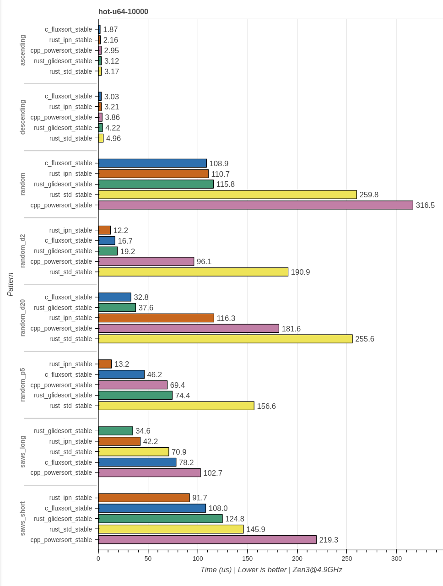

Starting with the fully ascending and descending patterns. Both rust_ipn_stable and c_fluxsort_stable can sort these by doing a forward scan, and reversing the input if necessary. rust_std_stable will also scan them in one go, but does so starting at the end of the input. Effectively scannings backwards. A mix of code-gen and hardware prefetchers may be responsible for the observed differences. Curiously gcc seems able to generate better code for the simple act of scanning forward.

The bread and butter of sort algorithms is their performance, or viewed differently their power efficiency, when sorting random inputs. Here rust_ipn_stable, c_fluxsort_stable and rust_glidesort_stable are very closely matched, even though they have completely different implementations. All of them are more than 2.2x faster than the existing Rust standard implementation. The slowest and least energy efficient out of the tested implementations in this scenario is cpp_powersort_stable.

Both random_d2 and random_d20 simulate low cardinality inputs. Meaning the inputs consists exclusively of a limited set of distinct values. random_d2 has only two unique values, while random_d20 has 20. Partitioning sort implementations that remember the previous pivot and use that information to filter out equal values, as pioneered by pdqsort, are exceptionally good at this. c_fluxsort_stable and rust_glidesort_stable use this approach. rust_ipn_stable in contrast uses a different approach that is good at filtering out few common values, but is very limited in the amount of distinct values it can efficiently remove. Plotting this behavior yields:

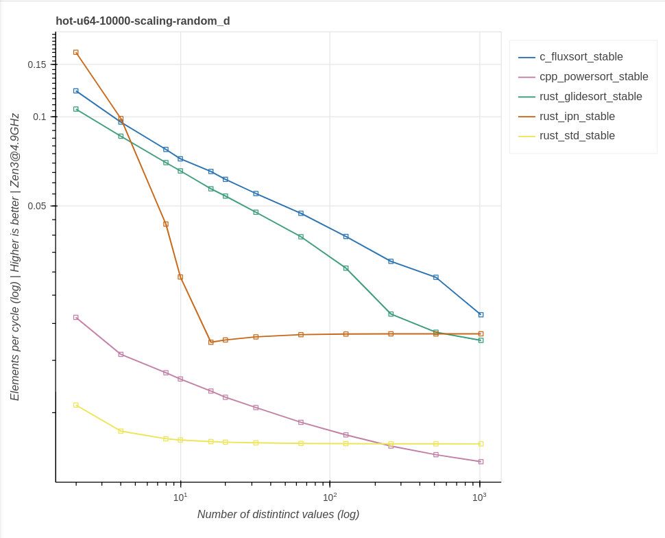

Keeping the input at 10k `u64` and varying the number of distinct values, shows rust_glidesort_stable, cpp_powersort_stable and c_fluxsort_stable with near-linear scaling, approaching fully random performance. In contrast rust_ipn_stable is limited to 16 distinct values it can filter out. Showing a sharp decline in performance improvement over fully random performance. rust_std_stable which is based on Timsort can also exploit this pattern, but only to a limited degree. As part of its main loop, it tries to find a streak, and if the number of distinct values is very low, the chances rise for short natural streaks in the input. In absolute terms, rust_ipn_stable is ~15.6x faster than rust_std_stable for random_d2. And c_fluxsort_stable completes the random_d20 scenario ~7.8x faster, or viewed differently more energy efficient, than rust_std_stable.

rust_ipn_stable is uniquely good at sorting inputs with one common value. Plotting this behavior and how it scales with different percentages of random values, starting at 1% and going up to 99%, yields:

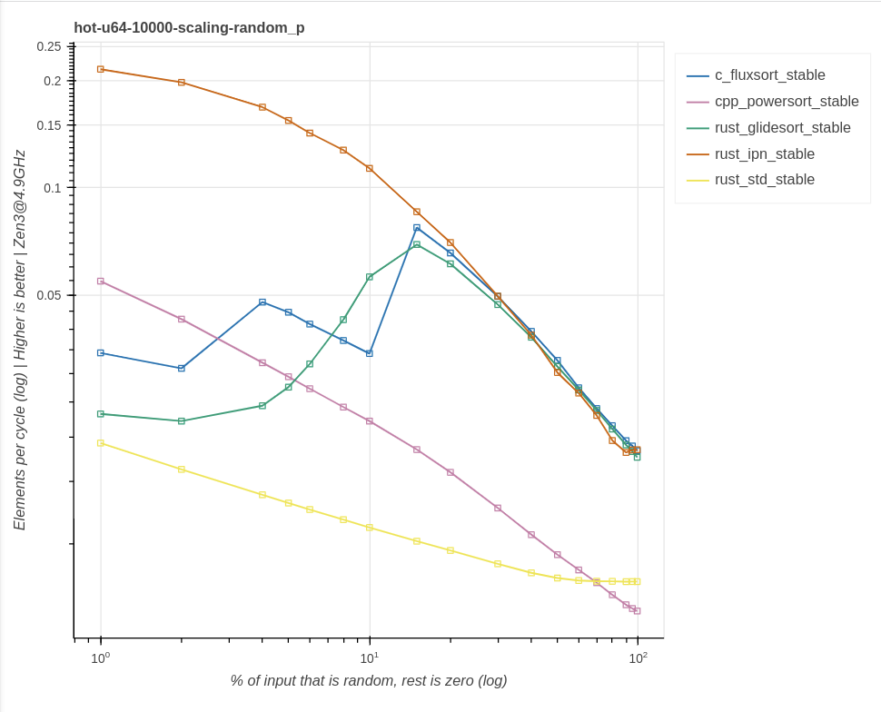

All tested implementations can leverage this property, rust_ipn_stable, rust_std_stable and cpp_powersort_stable do so proportionally better the lower the amount of random values present in the input. The two partitioning implementations rust_glidesort_stable and c_fluxsort_stable see peek performance if ~15% of the input is random. c_fluxsort_stable does an upfront analysis and mis-classifies the input as having many streaks, if the percentage of random values is very low. Using a merge based approach even, though partitioning would yield better performance.

Long existing streaks in saws_long are perfect for rust_glidesort_stable, it uses a strategy that allows it to simultaneously merge multiple found streaks. In second place comes rust_ipn_stable ~1.2x slower than rust_glidesort_stable. Then rust_std_stable at ~2x, then c_fluxsort_stable at ~2.3x and in last place cpp_powersort_stable at ~3x slower than rust_glidesort_stable.

saws_short test the ability of a sort to leverage short existing streaks and its unbalanced merging capabilities. rust_ipn_stable does the best, improving on random performance by ~1.2x, c_fluxsort_stable exhibits nearly exactly its random performance. rust_glidesort_stable regresses over random performance by ~1.07x. While rust_std_stable sees the largest improvement over random performance, with ~1.78x. It does so, by spending less time in insertion sort, which it uses to generate small sorted batches if it didn't find a long enough streak. While the more advanced sorts use other mechanisms to generate small sorted batches, eg. rust_ipn_stable uses an 8 element transposition sorting network. Which makes them spend relatively less time in that part of the sort implementation.

Plotting random pattern throughput across different sizes yields:

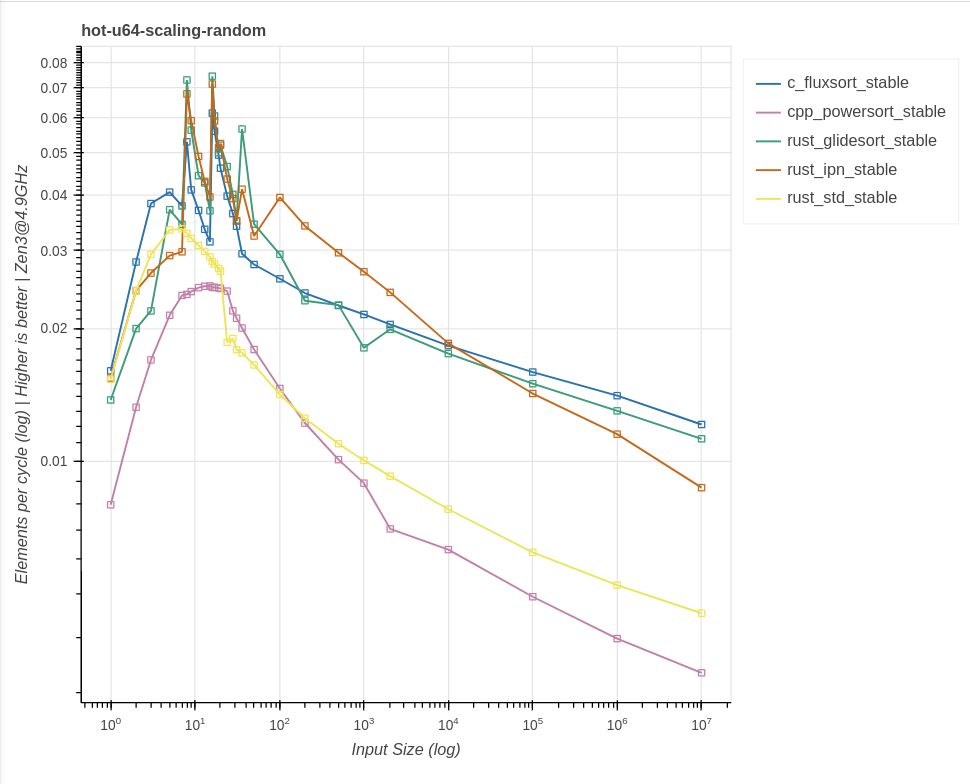

The graph measures throughput for fully random inputs, in elements per cycle. For such inputs, math dictates a N*log(N) scaling. Larger inputs will require more comparisons to complete, and as a consequence have lower throughput measured in elements per cycle. For example rust_std_stable will do on average ~19.8m comparisons to sort 1m elements, where sorting 10k elements only takes ~128.2k comparisons. rust_glidesort_stable and c_fluxsort_stable show similar scaling, both with excellent performance even outside the range of the L3 cache. rust_std_stable uses an in-place insertion sort up to 20 elements and then switches to the main Timsort loop. This can be seen as a large drop of off in throughput. rust_ipn_stable sees similar small-sort performance to c_fluxsort_stable and rust_glidesort_stable. Starting to distinguish itself at ~60 elements and keeps a shrinking lead down to ~50k elements. At which point it lags progressively behind.


### Results `i32`

Signed 32-bit integers are a very common type used to benchmark sort implementations.

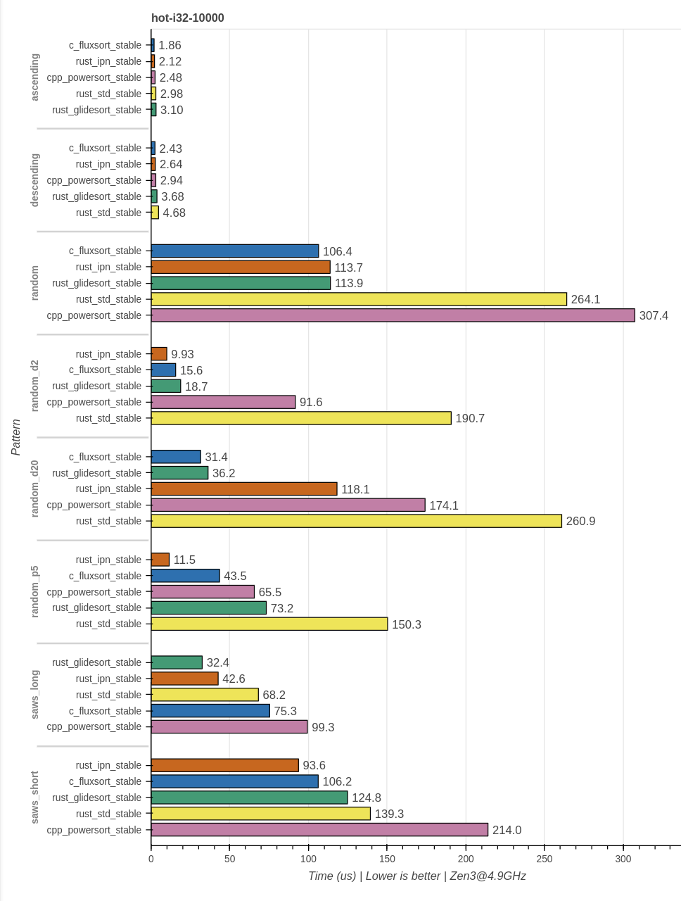

Overall similar results to `u64`, c_fluxsort_stable and rust_glidesort_stable benefit more from the smaller type than rust_ipn_stable.

### Results `String`

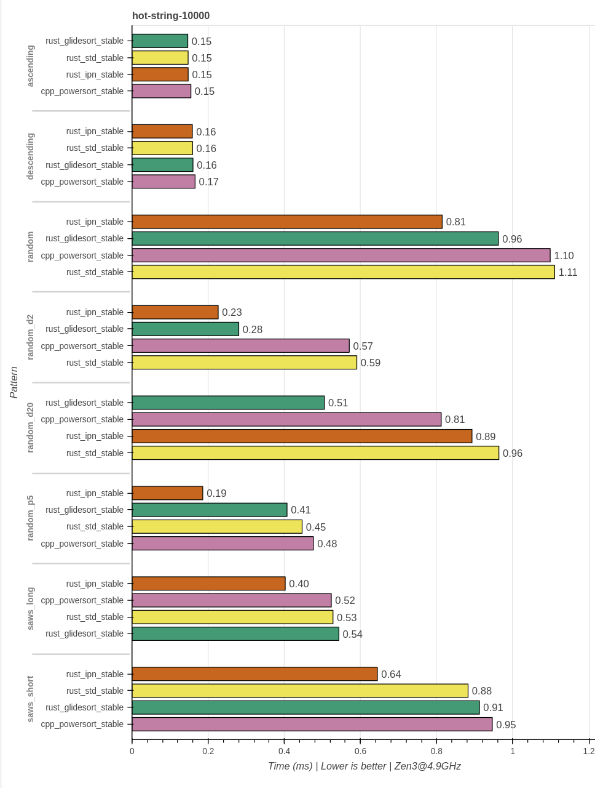


For strings `format!("{:010}", val.saturating_abs())`, not supported without source level modification or pointer indirection by c_fluxsort_stable, rust_ipn_stable is ahead for random inputs.

### Results `1k`

An extreme case, a type that is one kilobyte in size. This type will stress test any sort implementation that performs many copies of the type.

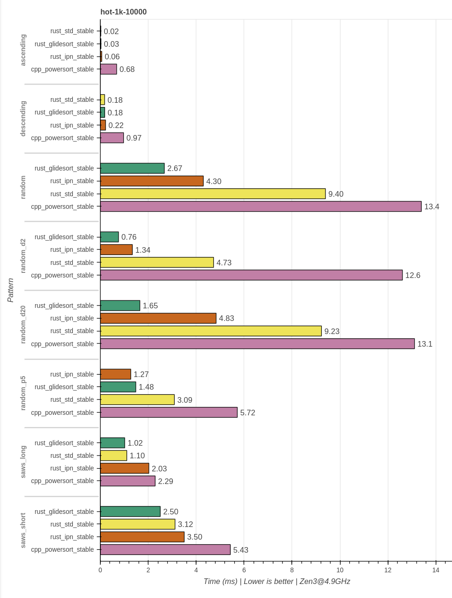

Overall rust_glidesort_stable is by far the best in such a scenario.

### Results `f128`

F128 is not a builtin type. It is relatively cheap to access and copy, but has a relatively expensive comparison function:

```rust
#[repr(C)]
#[derive(PartialEq, Debug, Clone, Copy)]
pub struct F128 {
    x: f64,
    y: f64,
}

fn partial_cmp(&self, other: &Self) -> Option<std::cmp::Ordering> {
    // Simulate expensive comparison function.
    let this_div = self.x / self.y;
    let other_div = other.x / other.y;

    // SAFETY: We checked in the ctor that both are normal.
    let cmp_result = unsafe { this_div.partial_cmp(&other_div).unwrap_unchecked() };

    Some(cmp_result)
}
```

This benchmark rewards a mix of exploiting ILP and reducing the total amount of comparisons performed:

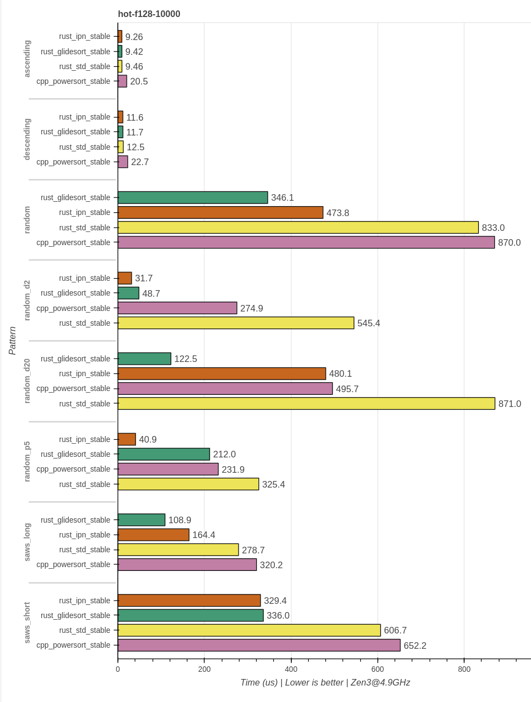

rust_glidesort_stable seems better than rust_ipn_stable at completing the sort with fewer calls to the comparison function, with the exception of inputs with common values that can be filtered out. Both eclipse rust_std_stable and cpp_powersort_stable in terms of runtime and energy efficiency.

## Relative performance

A comprehensive look at performance for a single type can be achieved by comparing two implementations and plotting their symmetric relative speedup and slowdown on the Y-axis and the test size on the X-axis. Each line representing a pattern. Eg. a-vs-b, 1% means a is 1.01x faster than b, 100% means a is 2x faster than b, and 200% means a is 3x faster than b, and 300% means 4x. The same works in reverse where -1% means b is 1.01x faster than a, -100% means b 2x a, and -200% means b 3x a. The graphs are fixed to the Y-range -200,200 to allow comparison between graphs.

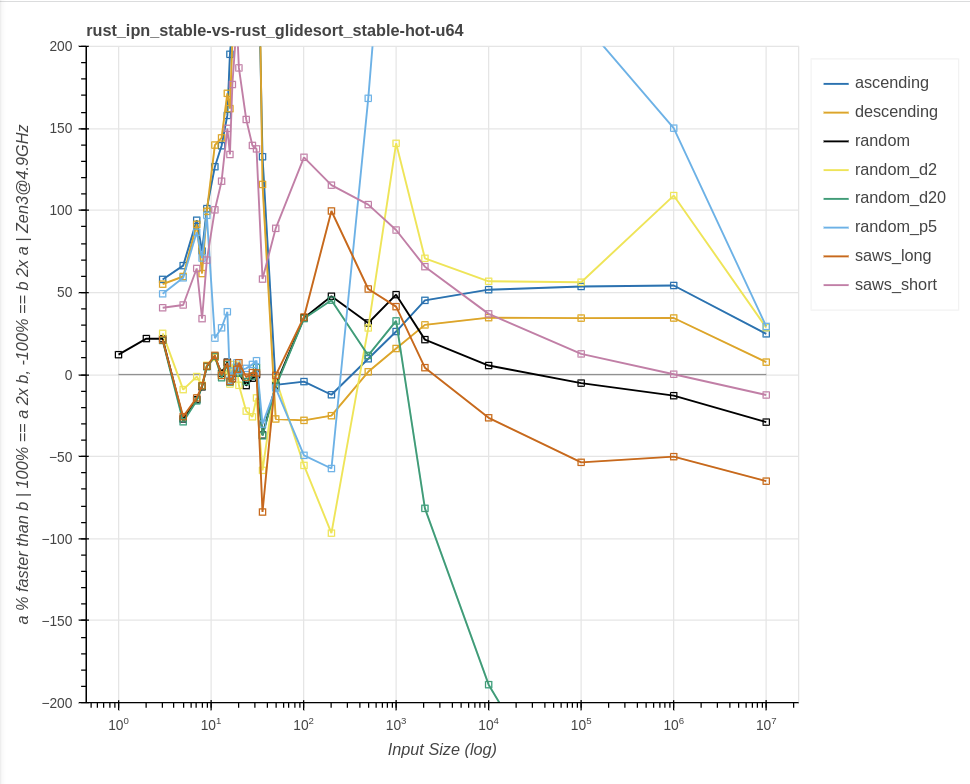

Comparing rust_ipn_stable to rust_glidesort_stable, yields a mixed result. Both have one pattern they excel at, random_p5 and random_d20 respectively. rust_ipn_stable has a lead in most patterns up to ~1m elements. Whether these patterns are representative will depend on your workload. These are fundamentally synthetic benchmarks exploring sort performance in isolation. Especially small sizes are likely not representative of real world performance, where CPU branch, instruction and data caches may be cold. These numbers should be interpreted as best case performance under laboratory conditions. The scaling seen before for random inputs, shows up again, with a break even point between 10k and 100k elements.

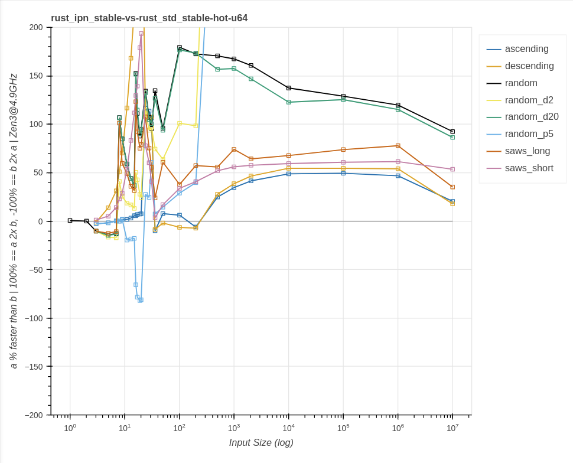

Comparing rust_ipn_stable to rust_std_stable, shows near universal improvements across patterns and sizes. Random performance improvements stays at ~2x for most sizes. random_d2 and random_p5 shoot up to ~22x and ~16x respectively at 1m.

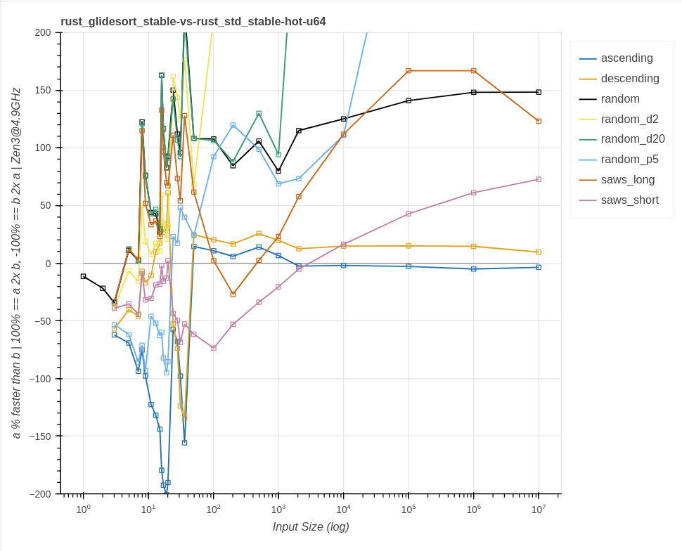

Comparing rust_glidesort_stable to rust_std_stable, shows a more mixed result especially at smaller sizes. rust_glidesort_stable's small sort implementation is not capable of efficiently leveraging existing streaks in small inputs. Random performance improvement grows to ~2.5x at 1m. 3 patterns leave the plotted area, at 1m random_d2 sits at ~11x, random_d20 at ~7.9x and random_p5 at ~6.6x.


## Debug performance

All the benchmarks above have been performed using highly optimized builds. And while performance of optimized builds is crucial. Performance of debug builds has a widespread effect, from developer experience to test iteration time, CI test times and more. As such this property should not be neglected. Running the sort-research-rs test suite as debug build via hyperfine yields:

```
rust_std_stable:
  Time (mean ± σ):      2.958 s ±  0.063 s    [User: 24.083 s, System: 0.282 s]
  Range (min … max):    2.798 s …  3.027 s    10 runs

rust_ipn_stable:
  Time (mean ± σ):      3.061 s ±  0.051 s    [User: 24.992 s, System: 0.304 s]
  Range (min … max):    2.975 s …  3.133 s    10 runs

rust_glidesort_stable:
  Time (mean ± σ):      3.311 s ±  0.092 s    [User: 26.025 s, System: 0.298 s]
  Range (min … max):    3.179 s …  3.497 s    10 runs
```

Running the hot-u64-10k benchmark with `opt-level = 0` to simulate debug conditions yields:

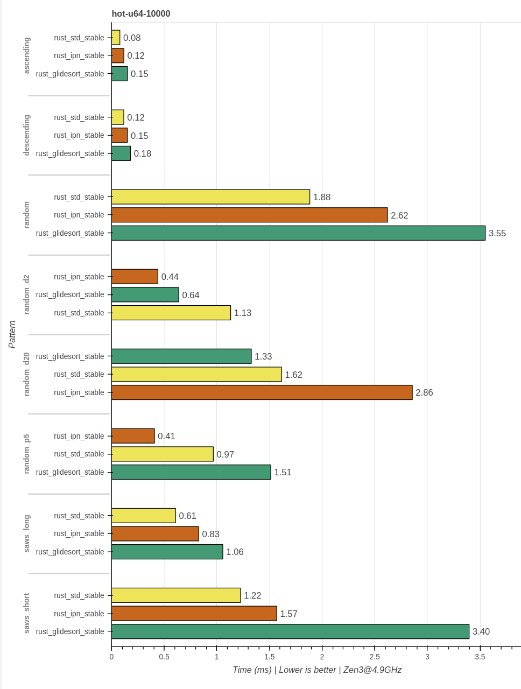

rust_ipn_stable sees a regression over the existing standard library implementation, rust_glidesort_stable even more so.

## Code complexity

A crude measurement of code complexity is lines of code as measured with tokei. Non sort related code subtracted:

```
- rust_std_stable ~220 LoC
- rust_ipn_stable ~910 LoC
- rust_glidesort_stable ~2300 LoC
```

rust_std_stable is by far the simplest implementation. An source of complexity can be complex state invariants. rust_glidesort_stable introduces 20+ structs, some with complex state invariants like `BranchlessMergeState` and `BidirPartitionState`. In contrast rust_ipn_stable mostly introduces faster versions of the existing building blocks of rust_std_stable eg. `parity_merge_plus` which implements the same interface as the existing `merge` function, readable as straight line code. An unknown amount of complexity in rust_glidesort_stable stems from handling inputs with interior mutability. rust_ipn_stable picks the simpler strategy of limiting it's fast merge optimizations to types with no direct interior mutability to reduce code complexity and size. It's not clear how many types this affects on average if the respective implementations were used instead of the standard library sort implementation. One hint could be, this excerpt from the vqsort paper [[4](https://arxiv.org/pdf/2205.05982.pdf)]:

> Our methodology starts by searching in Google’s entire source code depot for occurrences of std::sort and the wrapper function absl::c_sort. A small fraction of these are excluded based on their filename (e.g. nonsource files) or path (e.g. compiler test suites). We then exclude the vast majority whose directories do not account for a relevant number of samples in Google-wide CPU usage measurements. This leaves several hundred occurrences, which are still too numerous for manual inspection. We further filter out calls (about half) which have an extra comparator argument. Note that some of them may define a lexicographical ordering within 128 or fewer bits of data, which could be supported by vqsort. However, this would be laborious to prove, so we exclude them from our analysis. We then manually inspect the code, finding that the total CPU time for sort calls with up to 128-bit keys outnumbers the total for other sorts (e.g. strings and tuples) by a factor of two.

A worst case scenario for rust_ipn_stable would be such a type, relatively small, and the comparison is done using an integer.

```rust
struct ValWithMutex {
  val: u64,
  mutex: Mutex<u64>,
}

sort_by(|a, b| a.val.cmp(&b.val))
```

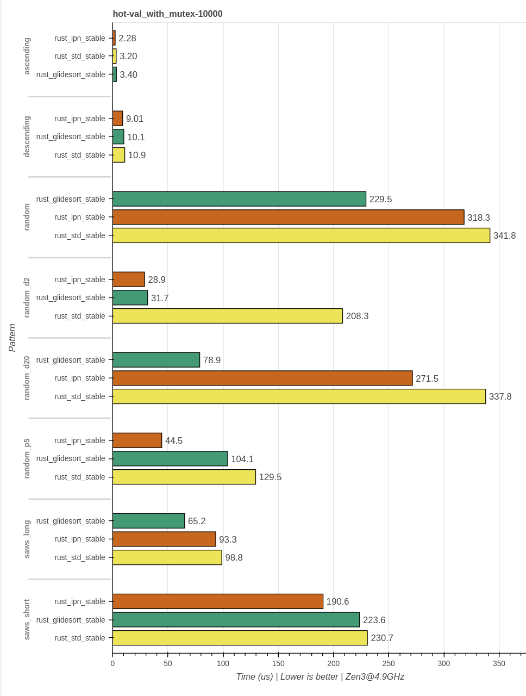

## Binary size

Instantiating the sort for a selection of types (`u64`, `u32`, `i32`, `i16`, `i64`, `i128` and `String`) yields:

Release build `lto = "thin"` and strip:

```
- baseline no sort 312kb
- rust_std_stable 336kb
- rust_ipn_stable 400kb
- rust_glidesort_stable 551kb
```

Code size seems to scale similar to LoC.

Release build `lto = "thin"`, `opt-level = "s"` and strip:

```
- baseline no sort 307kb
- rust_std_stable 324kb
- rust_ipn_stable 371kb
- rust_glidesort_stable 490kb
```

Optimizing for code-size yields similar results.


## Performance on different hardware

Modern CPUs are incredibly complex and can exhibit non-intuitive performance behavior. To broaden the picture, tests on other machines are performed.

### Firestorm

The Firestorm micro-architecture first introduced in the A14 iPhone SoC (2020), and then used in the M1 family of chips, is arguably the most capable architecture at extracting instruction-level parallelism, that is widely available.

```
rustc 1.67.0-nightly (1286ee23e 2022-11-05) (forgot to update)
Apple clang version 14.0.0
Darwin Kernel Version 22.1.0
M1 Pro 8-Core Processor (Firestorm P-core micro-architecture)
```

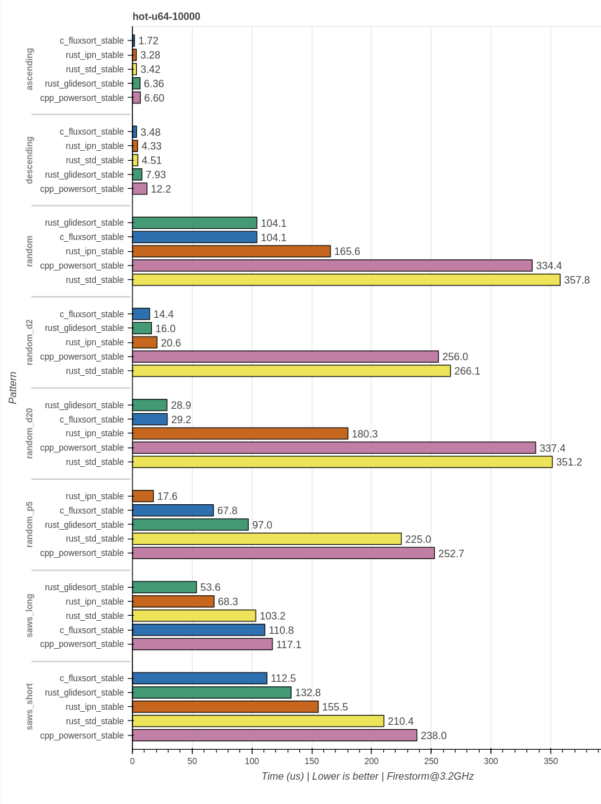

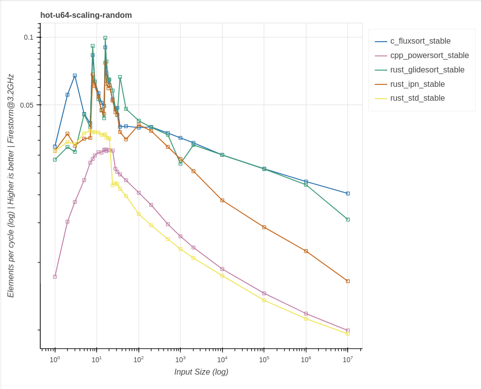

Out of all the tested micro-architectures it reaches the highest random throughput peak, of ~0.1 elements per cycle (elem/cycle) for size 16 inputs. Assuming ~80 comparisons required for such an input, would mean one compare and swap every second cycle for rust_glidesort_stable. rust_std_stable in contrast that uses insertion sort, only manages ~0.037 (aka 3.7e-2) elem/cycle for the same input. rust_ipn_stable shows throughput very close to that on Zen3, eg. 10k 1.85e-2 elem/cycle vs 0.188e-2 elem/cycle, 1m 1.15e-2 elem/cycle vs 1.12e-2 elem/cycle. In contrast rust_glidesort_stable, c_fluxsort_stable and cpp_powersort_stable see large improvements in throughput. Eg. rust_glidesort_stable 10k 1.75e-2 elem/cycle vs 3e-2 elem/cycle, 1m 1.3e-2 elem/cycle vs 2.21e-2 elem/cycle. Clearly their implementations allow the Firestorm micro-architecture to exploit more ILP.

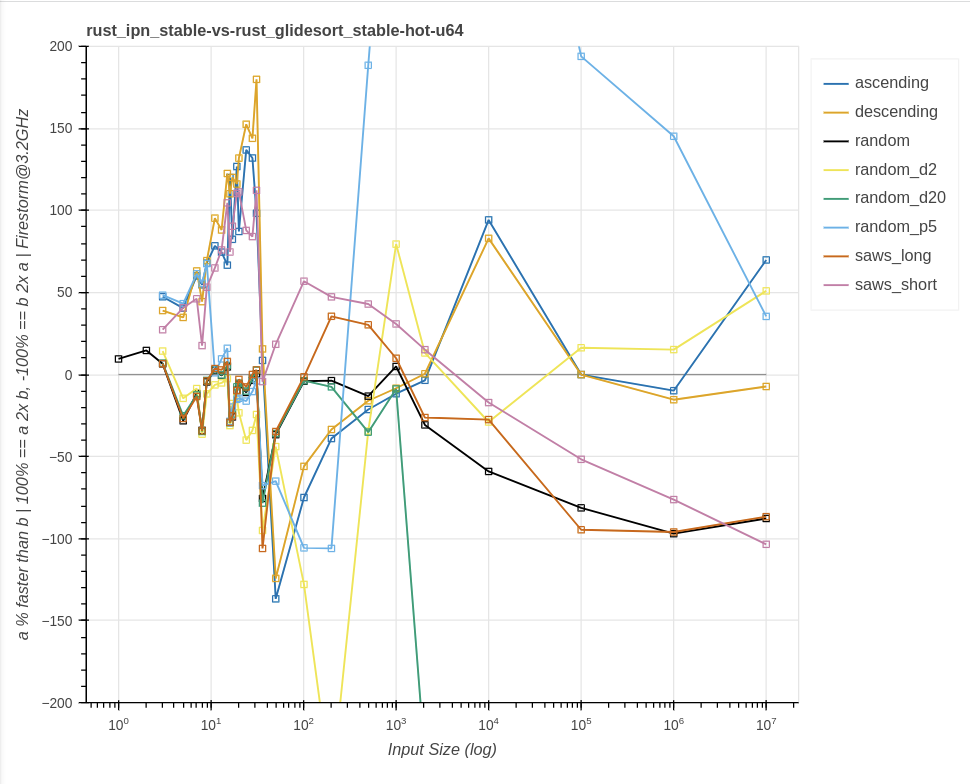

Comparing the relative speedups across different patterns, paints a similar picture, with rust_glidesort_stable showing performance gains across the board, compared to Zen3.

### Broadwell

To also test older and less capable architectures, the same benchmarks were performed on an older Intel Broadwell machine from 2015. With only 4MB of shared L3, the 8MB 1m input is already outside the L3 cache, hitting main memory. This is alleviated by prefetchers and the TLB, but only to some degree. For larger data sets the dominant factor will generally be memory bandwidth.

```
rustc 1.69.0-nightly (d7948c843 2023-01-26)
clang version 14.0.6
gcc (GCC) 12.2.0
Linux 5.19.2
Intel i7-5500U 2-Core Processor (Broadwell micro-architecture)
```

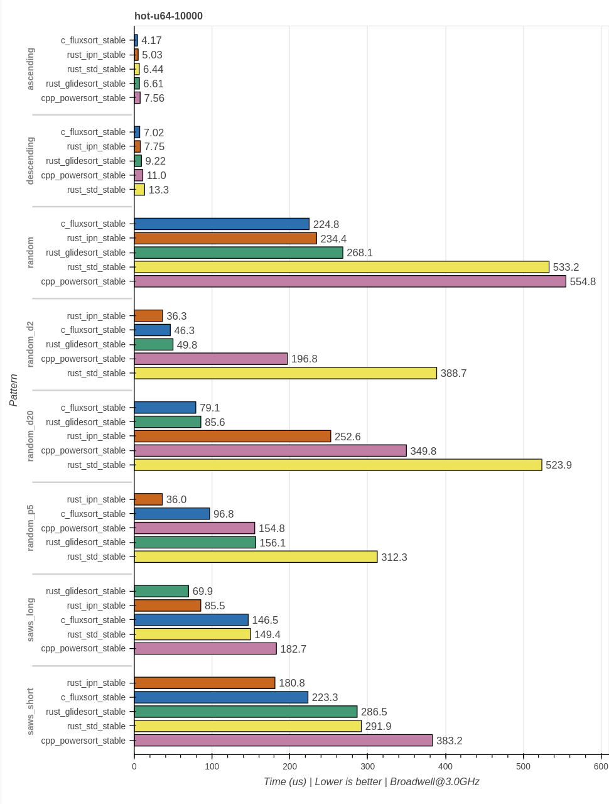

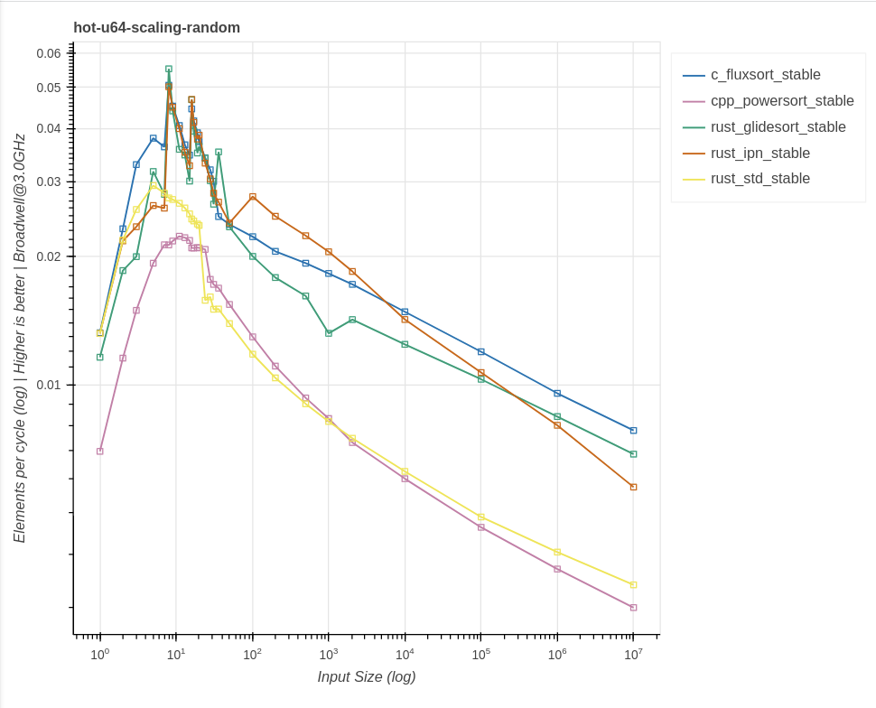

The architecture shows its age, peeking at 4.68e-2 elem/cycle for 16 element inputs by rust_ipn_stable. About half as fast as Firestorm. Comparing rust_ipn_stable scaling on Zen3 to Broadwell, shows similar behavior where rust_ipn_stable starts strong at ~60 elements and gradually looses its lead over rust_glidesort_stable. Here it takes significantly longer for this to happen compared to Zen3. In contrast c_fluxsort_stable overtakes rust_ipn_stable at ~10k, same as on Zen3. This could have various reasons, one of them being different code-gen by gcc versus rustc.

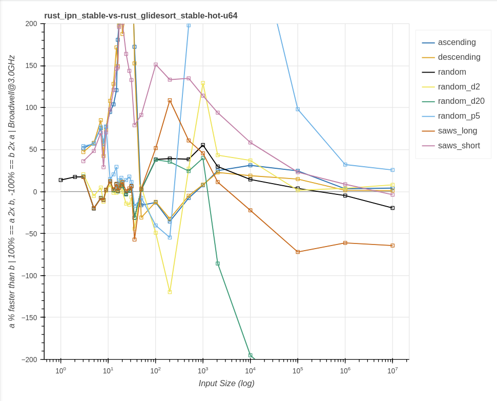

In a head to head comparison, rust_ipn_stable performs better than rust_glidesort_stable on Broadwell for most patterns. Eg. saws_short being ~2.1x faster at 1k elements, and random ~1.6x faster at 1k. For very large data sets 1m+ rust_glidesort_stable pulls ahead.

## Author's conclusion and opinion

Glidesort is an impressive sort implementation! Even more so, given it passes the sort-research-rs test suite. Something none of the tested cpp and c based sort implementations do, not even all the tested Rust ones [[5](https://github.com/emilk/drop-merge-sort/issues/23)]. It tries to be good in all scenarios, and given large enough inputs, will outperform all tested implementations except fluxsort. It is particularly good when running on the Arm based M1 Pro chip. At the same time it is very complex, which shows on older hardware where it needs very large inputs to outperform ipn_stable. One stated goal of glidesort's author Orson Peters, is adoption as the Rust standard library `slice::sort` implementation. I'm pursuing the same goal with my ipn family of sort implementations, for both `slice::sort` and `slice::sort_unstable`. Our approaches are quite different, glidesort is a ground up novel implementation, while ipn_stable and ipn_unstable take the existing standard library implementations as base and tweak or replace components. With the explicit goal of improving performance with very little performance regression across the wider Rust ecosystem. The major limiting factor in getting things into the Rust standard library is reviewer bandwidth. At the time of writing, there are a total 4 people doing all the reviews for the Rust standard library. Sort implementations are particularly difficult to review, as it combines lots of unsafe code with user provided logic in the user-provided comparison function. The core performance of ipn_stable can be achieved with ~500 LoC, with the rest responsible for low cardinality exploitation. In addition the formally verified Timsort algorithm stays the same in ipn_stable. The graphs comparing rust_ipn_stable to rust_std_stable shows near universal improvements. In contrast rust_glidesort_stable is unable to efficiently sort small inputs with existing streaks. This could be fixed relatively simply, but even then some patterns remain where it is a performance regression up to ~2k elements. A standard library implementation should be good in the widest imaginable set of circumstances, or at least not bad. And what looks good in a benchmark like a 4 element sorting network for size 4 inputs, is worse than insertion sort when tested with cold CPU caches. Not to be ignored is binary size. All of the complexity in glidesort comes with a hefty binary size overhead. ipn_stable also incurs a large binary size increase compared to the existing implementation, but significantly less than glidesort. As noted before, debug performance can have wide ranging developer experience impacts. Here both glidesort and ipn_stable show performance regressions, but again ipn_stable significantly less so. Where glidesort really shines is very large inputs, yet if your program spends several milliseconds or more inside a single `slice::sort` call, you should probably consider using a multi-threaded sort implementation like ips4o [[6](https://github.com/ips4o/ips4o)] that can use your hardware resources more efficiently. The standard library implementation should also work well on a wide range of hardware, ipn_stable seems to better utilize weaker and older designs, but the data is not sufficient to say this with any confidence. Another issue with the current implementation of glidesort is, it always requires a stack array of 48 elements. The elements can have nearly arbitrary sizes, as they are user-defined types. Certain types could overflow the stack, especially on embedded devices. ipn_stable also uses a stack array of 32 elements, but only if the user-defined type is ` mem::size_of::<T>() <= mem::size_of::<[usize; 4]>()`, otherwise falling back to slower code. As a potential standard library implementation, I think the advantages glidesort has over ipn_stable are too narrow to justify the added complexity, potential embedded problems, additional binary size and debug performance regression.

That said, this analysis looks at the current state of the respective implementations. Both may change in the future, and there is a possible future where the best of glidesort and ipn_stable is combined. Most modern sort implementations have a long lineage of ideas and concepts they incorporate from earlier implementations and designs.

If you as a reader have access to small embedded chips that could be used for benchmarking, please contact me. I'd love to see those results. Also if you have an application that spends a non-trivial overall amount of time in `sort`, please contact me, it would be great to get some real world performance numbers.

## Thanks

I want to thank Orson Peters for the detailed feedback and help.
