# 10~17x faster than what? A performance analysis of Intel's x86-simd-sort (AVX-512)

Author: Lukas Bergdoll @Voultapher  
Date: 10-06-2023 (DD-MM-YYYY)

This is a performance analysis of the recently popularized [[1](https://www.phoronix.com/news/Intel-AVX-512-Quicksort-Numpy)] Intel AVX-512 sort implementation.

> Intel Publishes Blazing Fast AVX-512 Sorting Library, Numpy Switching To It For 10~17x Faster Sorts

This analysis will look at the performance of Intel' x86-simd-sort and how it compares to various other generic sort implementations such as the C++ standard library `std::sort` and vqsort another high-performance manually vectorized sort implementation. Breaking down complex performance characteristics into a single number is tricky and might have little predictive power. This analysis aims to put that '10~17x' number into perspective and how it relates to other high-performance implementations.

TL;DR: Benchmarking is tricky. If you are using x86-simd-sort, you can get better overall performance and avoid catastrophic scaling for certain input patterns by using vqsort + Clang. In addition it is shown that hardware specific manual vectorization with wide AVX-512 SIMD is not the only way to write efficient software. ipnsort demonstrates comparable performance to x86-simd-sort while being generic, optimized for more than only peak performance and only using up to SSE2 instructions.

---

Bias disclaimer. The author of this analysis is the author of ipnsort.

The words sort implementation and sort algorithm, are expressly *not* used interchangeably. Practically all high-performance implementations are hybrids, using multiple sort algorithms. As such, the words 'sort algorithm' will only be used to talk about the algorithmic nature of specific building blocks.

Graphs with logarithmic axis are marked as such, these are primarily useful to examine the change of a property, *not* its absolute values.

## Benchmarks

### Benchmark setup

Benchmarking is notoriously tricky, and especially synthetic benchmarks may not be representative. An incomplete list of relevant factors:

- Input size
- Input type (price to move and price to compare)
- Input pattern (already sorted, random, cardinality, streaks, mixed etc.)
- Hardware prediction and cache effects

Hardware prediction and cache effects in hot benchmarks that do nothing but run a fixed input size, type and pattern combination in a loop may be misleading in their predictive power for real world performance. Especially for small input sizes. The later section "Hot benchmarks" looks at hot results and explains in more detail why they might not be as useful in this context.

#### Windows test machine

```
Windows 10.0.19044
rustc 1.69.0-nightly (0416b1a6f 2023-02-14)
clang version 15.0.1
Microsoft (R) C/C++ Optimizing Compiler Version 19.31.31104 for x86
Intel Core i9-10980XE 18-Core Processor (Skylake micro-architecture)
CPU boost enabled.
```

#### Linux test machine

```
Linux 5.19
rustc 1.69.0-nightly (7aa413d59 2023-02-19)
clang version 14.0.6
Intel Xeon Gold 6154 18-Core Processor (Skylake micro-architecture)
CPU boost disabled.
```

Some sort implementations are adaptive, they will try to exploit existing patterns in the data to do less work. A breakdown of the benchmark patterns:

- `ascending`, numbers `0..size`
- `random`, random numbers generated by rand `StdRng::gen` [[2](https://github.com/rust-random/rand)]
- `random_d20`, uniform random numbers in the range `0..=20`
- `random_p5`, 95% 0 and 5% random data, not uniform
- `random_z1`, Zipfian distribution with characterizing exponent s == 1.0 [[3](https://en.wikipedia.org/wiki/Zipf%27s_law)]
- `saws_long`, `(size as f64).log2().round()` number of randomly selected ascending and descending streaks
- `saws_short`, randomly selected ascending and descending streaks in the range of `20..70`

Whether these patterns are representative will depend on your workload. These are fundamentally synthetic benchmarks exploring sort performance in isolation.

### Contestants

A selection of high-performance in-place sort implementations.

#### Generic comparison based

```
- rust_std_unstable          | `slice::sort_unstable` https://github.com/rust-lang/rust (1)
- rust_ipnsort_unstable      | https://github.com/Voultapher/sort-research-rs/blob/main/src/unstable/rust_ipnsort.rs (2) (3)
- cpp_std_msvc_unstable      | MSVC `std::sort` (4)
- cpp_std_gnu_unstable       | libstdc++ `std::sort` (8)
- cpp_std_libcxx_unstable    | libc++ `std::sort` (9)
- cpp_pdqsort_unstable       | https://github.com/orlp/pdqsort (4)
- c_crumsort_unstable        | https://github.com/scandum/crumsort (5) (6)
```

#### Manually vectorized 

```
- cpp_vqsort                 | https://github.com/google/highway/tree/master/hwy/contrib/sort (7) (10)
- cpp_intel_avx512           | https://github.com/intel/x86-simd-sort (7)
```

Footnotes:

1. Vendored ca. mid 2022.
2. Still WIP and these are only preliminary results.
3. This sort was previously known as ipn_unstable, the previously presented ipn_stable is defunct now, and work on a stable sort implementation continuous under another name.
4. Built with msvc.
5. Compiled with `#define cmp(a, b) (*(a) > *(b))`. This is required to be competitive, the regular way of providing a comparison function is problematic because of C language limitations. In effect this means that the results are only applicable to primitive types, and anything using a custom comparison function for user defined types will have a steep perf penalty.
6. crumsort does an initial analysis and switches to quadsort a merge sort that uses up to N memory making it not in-place ⚠️, it can fall back to in-place merging if the allocation fails. These tests were performed with allocations possible.
7. Built with clang and `-march=native`. Compiled with static dispatch, this would not be portable. Any CPU without AVX-512 support would fail to run the binary. It's unknown what the overhead of dynamic dispatch would be.
8. Built with gcc.
9. Built with clang.
10. Allocates fixed size memory buffer, not dependent on size of input. This blurs the line of in-place.

### Results `u64`

A good benchmark to shine light into the ability of the sort to exploit instruction-level parallelism (ILP) is hot-u64-10000. The input are 10k `u64` values, which fits into the core private L2 data cache for the used test machines. The upper limit should be in the order of 4-5 instructions per cycle for such a dataset. 10k elements is enough to reliably exploit existing patterns in the input data. This can be reproduced by running `cargo bench hot-u64-<pattern>-10000`

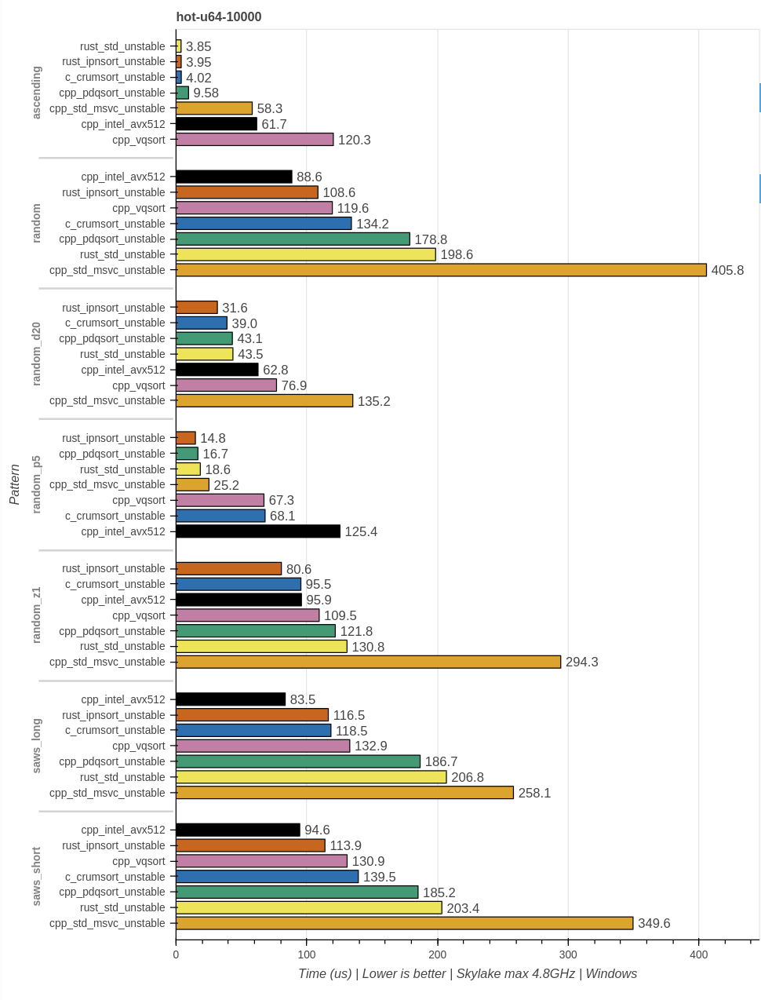

Using this data to write a headline like:

> Rust std sort is 15x faster than C++ std sort

Is not an honest representation. And it seems questionable to compress so much information into a single number, while still remaining representative. Looking at this one input size, on one specific micro-architecture, using this specific set of compilers, and testing these synthetic patterns, yields:

- intel_avx512 is generally faster than vqsort at this input size.
- The two manually vectorized sort implementations intel_avx512 and vqsort, are not good at exploiting existing patterns in the input.
- intel_avx512 struggles if there is one very common value in the input (random_p5).
- cpp_std_msvc is generally the slowest of the comparison based sort implementations.
- rust_std which is based on pdqsort performs similar to pdqsort, with the exception of fully ascending inputs.
- ascending shows the largest variance with the fastest sort being ~31x faster han the slowest.
- More natural random distributions like random_z1 close the gap between manually vectorized code and pdqsort derived designs, rust_std, ipnsort and crumsort.

Measuring random pattern performance across different sizes:
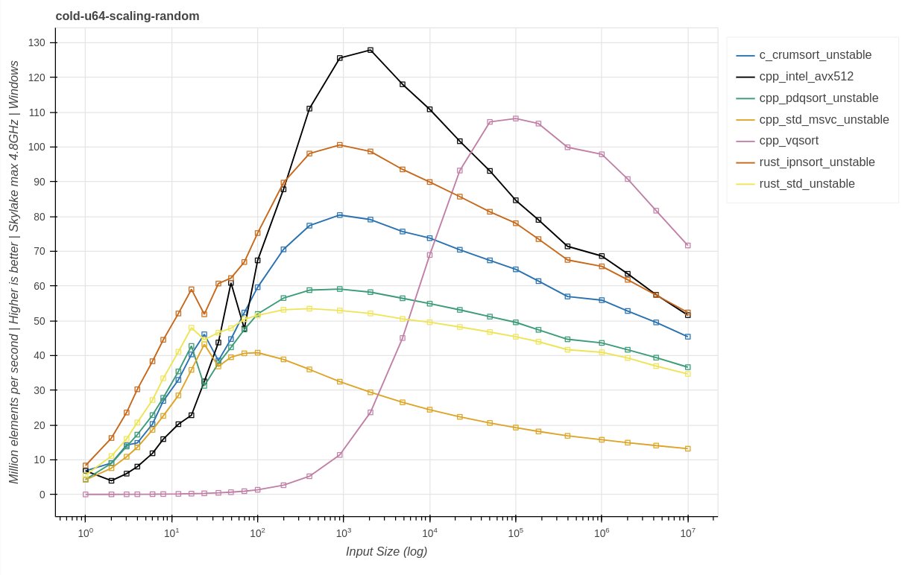

Observations:

- Classically bound by the Big-O complexity of O(N * log(N)) for random inputs, one could expect peak throughput to occur for the smallest inputs. However in reality for tiny input sizes the function call overhead, cold code, cache- and branch-prediction misses will limit throughput. And at very large sizes the main limit tends to be main-memory bandwidth, paired with the increased amount of work required per element. The peak throughput across most high-performance implementations, balancing these aforementioned factors, sits at input size ~1k.
- vqsort as tested is exceedingly slow for small inputs. More on that below.
- Starting at input size ~50k vqsort is the fastest.
- ipnsort catches up to intel_avx512 at ~1m, despite only using SSE2 instructions and using no hardware specific code, and while caring about binary-size and compile-times, sometimes at the cost of performance.

#### Linux vs Windows

Normally I would not expect any meaningful change between Linux and Windows, for code that with the exception of allocations and stack layout doesn't have any OS specific logic in it. Further, the two test machines use the same Skylake micro-architecture. Looking at the same cold-u64-random benchmark yields:

Windows:


Linux:

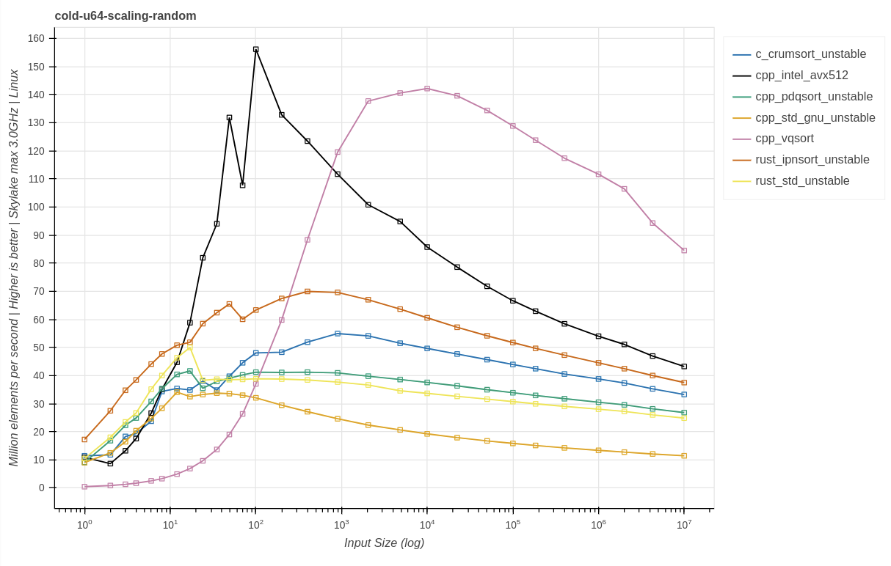

Observations:

- intel_avx512, pdqsort, rust_std and ipnsort all lose performance
- libstdc++ `std::sort` seems to perform better than the `msvc` version in this test. Showing significantly less regression than would be expected due to the CPU frequency difference.
- The relative performance loss compared to Windows machine of ipnsort is larger than the one of intel_avx512. This is likely caused by the disabled CPU boost and overall conservative frequency cap of 3 GHz. The Linux machine is more indicative of a server environment. Where in contrast on the Windows machine ipnsort can boost higher than intel_avx512.
- For larger inputs intel_avx512 shows better throughput on Windows with a measured sustained frequency of ~3.8GHz. E.g. at input size 1m on Windows ~67m elem/s vs ~54m elem/s on Linux. Which neatly matches the frequency difference.
- vqsort however is a lot faster on Linux. Both in terms of peak performance and min input size to outperform the rest. This is an unexpected result, and considerable effort was spent to analyze the root cause of this. In the test vqsort used the same compiler and flags as intel_avx512. A different benchmark suite yields the same results, a different pre-built Clang version yields the same results. On a dual-booted Zen3 machine vqsort in AVX2 mode shows the same ~2x regression when going from Linux to Windows at input size 10k. In addition the higher frequency as shown by intel_avx512 on Windows should give it yet another boost above Linux which doesn't manifest. All this while the other sort implementations remain largely the same. The root cause for this was identified in collaboration with the vqsort authors [[4](https://github.com/google/highway/tree/master/hwy/contrib/sort#optimizations-for-small-arrays)]. The tested vqsort version acquired randomness from the OS, for each call to vqsort in an attempt to mitigate a potential performance denial-of-service (DOS). This idea is similar to the use of SipHash as the default hasher in the Rust standard library. This explains why we see significantly different results on Windows and Linux. See the linked explanation for more details.
- Another unexpected result is the peak throughput for intel_avx512 is lower than on Linux, despite higher frequencies. And the peak is reached earlier on Linux.

Measuring a more natural zipfian distribution random_z1 across different sizes:

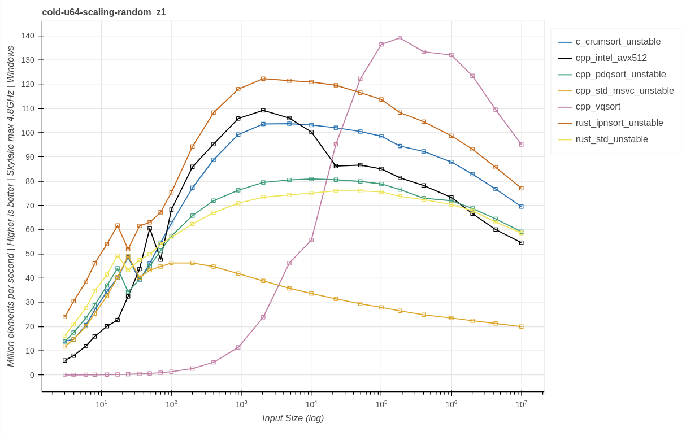

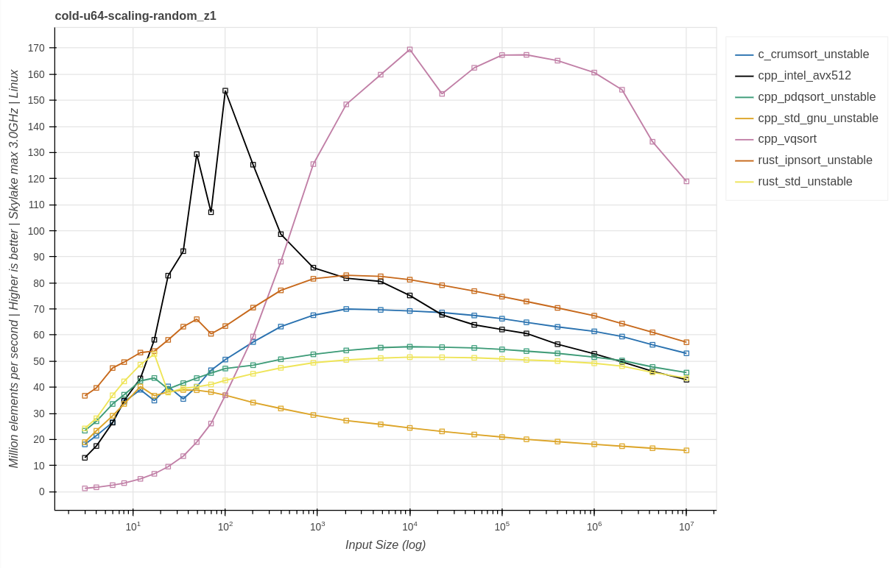

Observations:

- Generally similar to random pattern performance scaling.
- intel_avx512 shows less uniform scaling, with overall worse performance compared to random. 
- The pdqsort derived implementations and vqsort see a performance uplift compared to random, by being able to efficiently filter out common values.


Measuring a random distribution where most (95%) values are the same value:
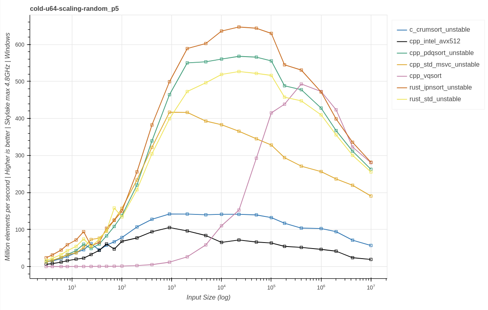

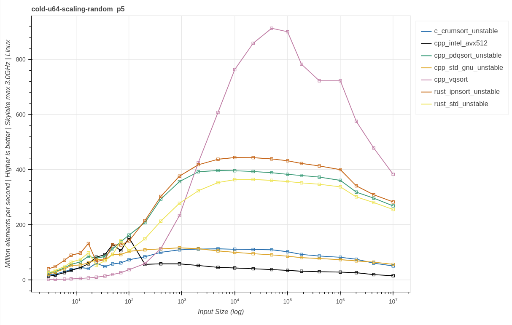

Observations:

- The pdqsort derived implementations, and rust_std_msvc on Windows and vqsort on Linux show excellent performance, several times faster than random pattern performance.
- intel_avx512 shows worse than random pattern performance, yielding the overall worst performance in this scenario.

### Results `i32`

#### i32-10k

The main difference between `i32` and `u64` is that `i32` is only 4 bytes compared to the 8 bytes of `u64`. Practically all high performance sort implementations are sensitive to the bandwidth of the CPUs memory subsystems. In theory this should allow higher cache throughput, better cache utilization and higher vector ALU throughput.

Windows:

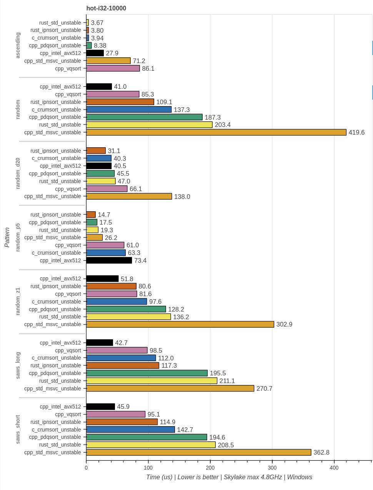

Linux:

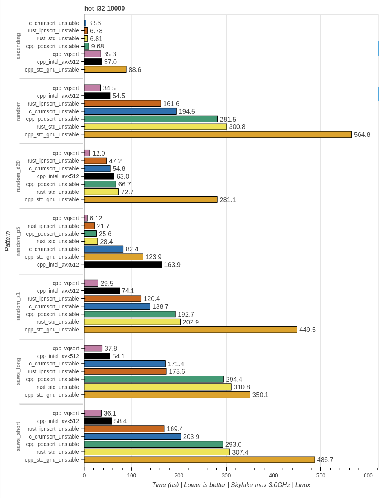

Observations:

- Both manually vectorized implementations can nearly double their throughput. vqsort only demonstrates this on Linux for this size. Showing a smaller relative gain on Windows.
- All comparison based sort implementations only see a small change compared to `u64`.

#### i32-scaling

Windows:

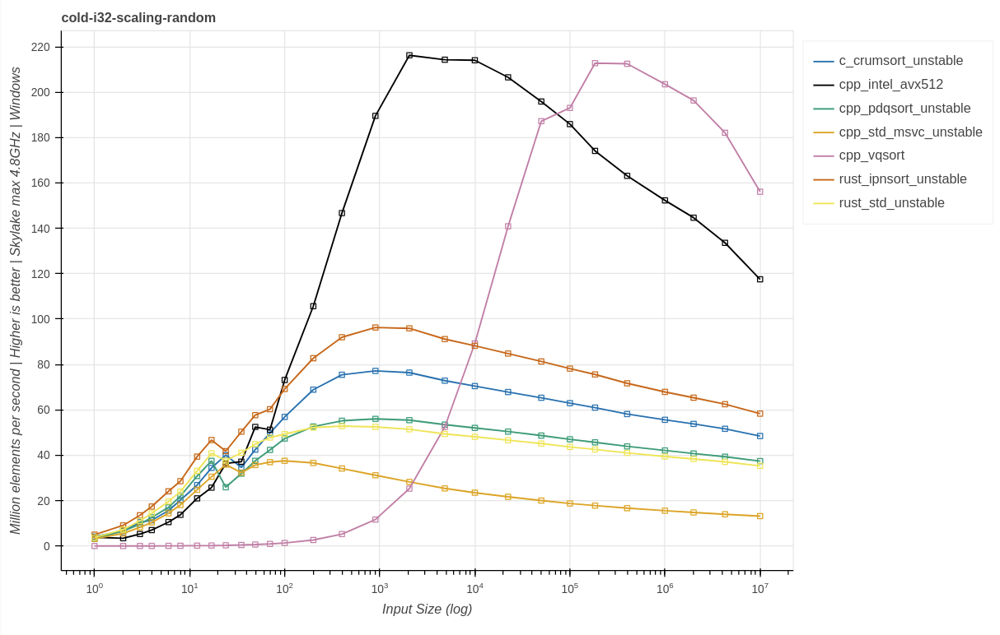

Linux:

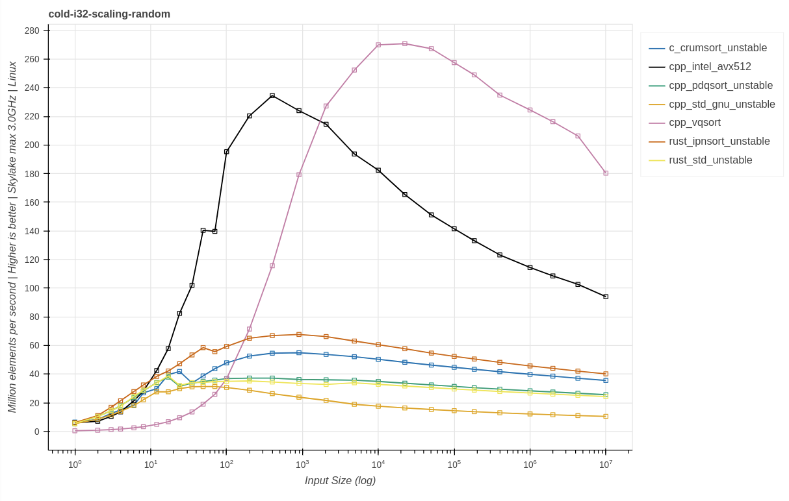

Observations:

- The manually vectorized implementations are a lot better at leveraging the increased potential throughput, than the generic comparison based implementations.
- Very similar scaling to `u64` for the non manually vectorized implementations.


### Direct comparison

A comprehensive look at performance for a single type can be achieved by comparing two implementations and plotting their symmetric relative speedup and slowdown on the Y-axis and the test size on the X-axis. Each line representing a pattern. Eg. a-vs-b, 1.7x means a is 1.7x faster than b, and -1.7x means b is 1.7x faster than a. The first name in the title is sort a, and the second name is b. The graphs are fixed to the Y-range -3x  to 3x to allow comparison between graphs.

Comparing the two manually vectorized implementations `u64`:

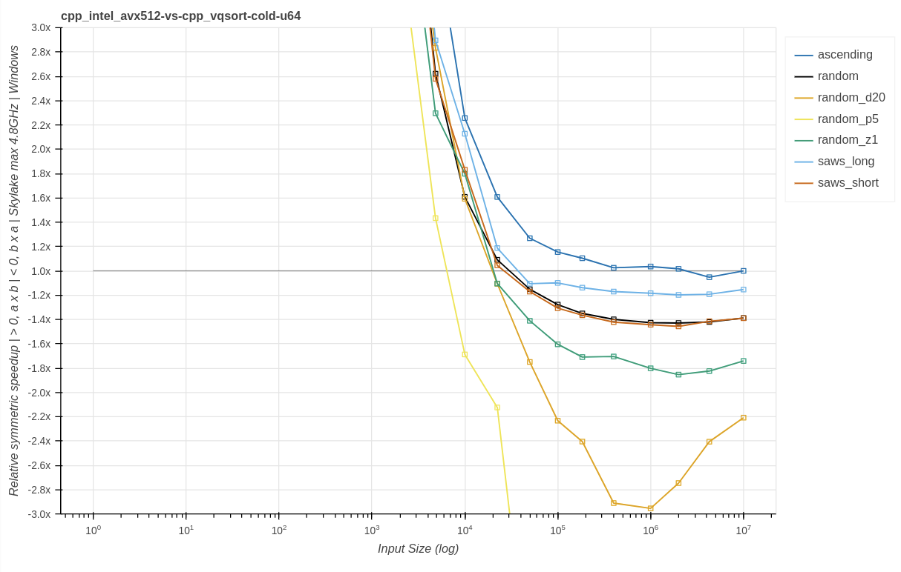

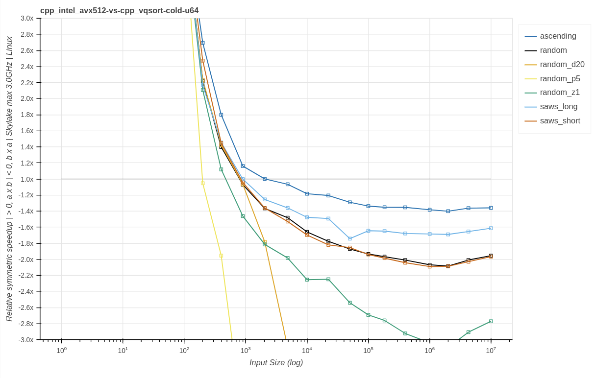

Observations:

- There is stark difference between Linux and Windows. All lines move to the left, meaning vqsort overtakes intel_avx512 at smaller input sizes. And the graph moves down, in the size range of 100k to 10m vqsort is ~2x faster on Linux while only ~1.4x faster on Windows for random inputs.
- On Windows below 10k and 200 on Linux, intel_avx512 is faster in every pattern than vqsort.
- The random_5p pattern triggers bad partitions in intel_avx512 which does not safe-guard against it, making vqsort ~14x faster than intel_avx512 for `len == 10m` on Windows, and ~26x on Linux. This seems to indicate that intel_avx512 has worse than `O(N * log(N))` worst-case scaling, likely caused by poor pivot selection and no mitigation strategies.

Comparing the two manually vectorized implementations `i32`:

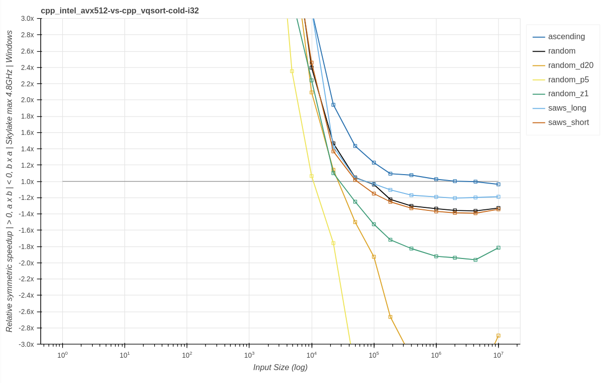

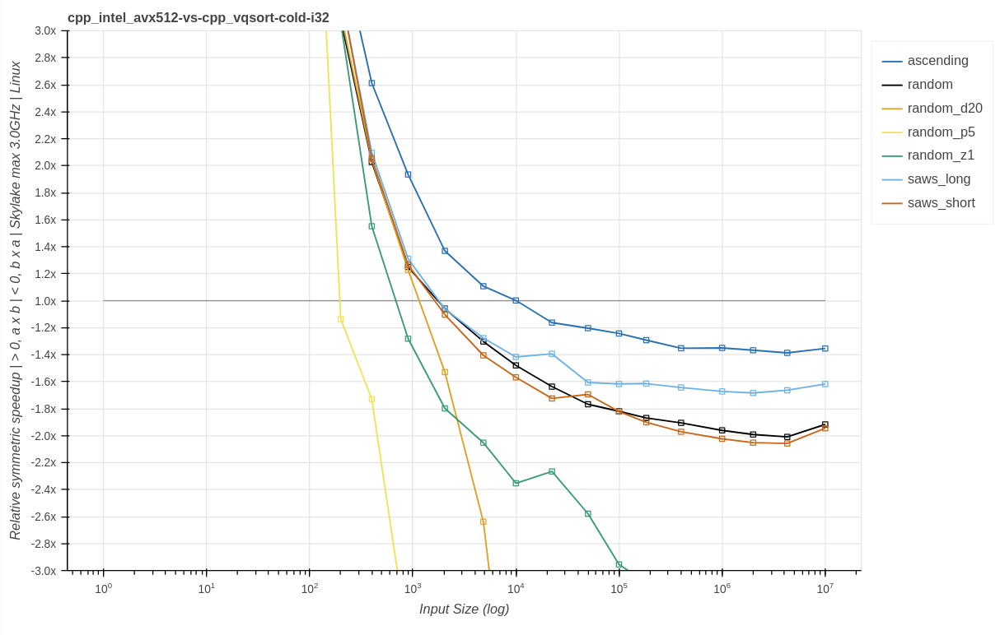

Observations:

- `i32` performs very similar to `u64` with the exception of random_z1 on Linux showing a larger advantage for vqsort.

Compared to the fastest generic comparison based implementation ipnsort:

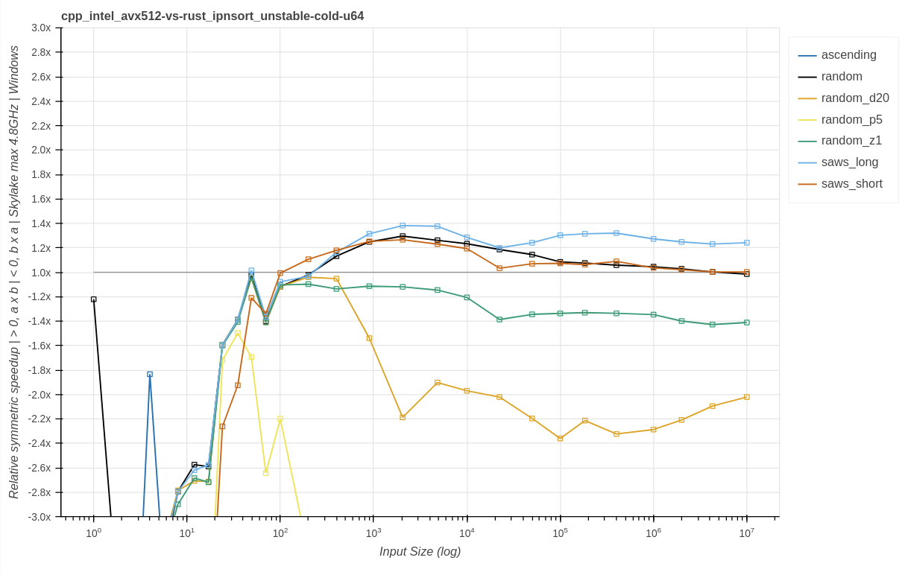

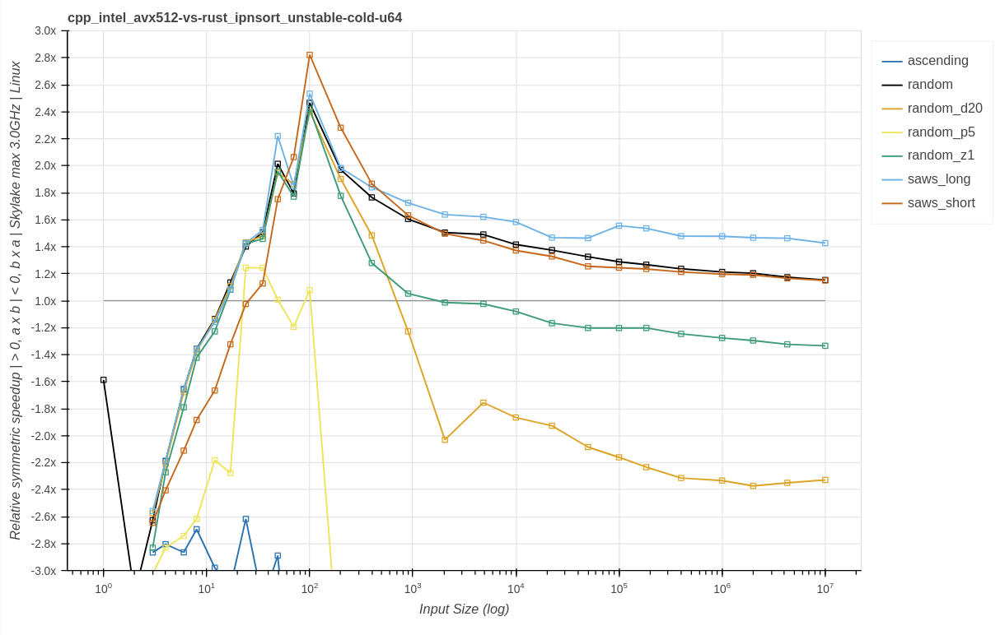

Observations:

- Between input size 36 and 1k, intel_avx512 is faster in nearly every pattern on Linux. Between 1k and 100k intel_avx512 is faster for fully random and saw like patterns.
- ipnsort is faster for low- cardinality and zipfian patterns, where it can leverage the pdqsort derived ability to filter out common values.
- On Linux and with a max frequency of 3 GHz intel_avx512 is faster for fully random and saw like patterns.
- As noted earlier, intel_avx512 shows worse than `O(N * log(N))` scaling for random_p5, making ipnsort ~15x times faster on Windows and ~19x Linux for input size 10m.
- Both intel_avx512 and vqsort are unable to leverage already sorted inputs. While the pdqsort derived implementations can handle this case in `O(N)`. At input size 100k ipnsort is ~20x faster on Windows and ~15x on Linux. And at input size 10m ~10x faster on Windows and ~16x on Linux. Where the 10m case will be mostly limited by main memory bandwidth, of which the Server Skylake implementation has more.

### Non AVX-512 results

The overwhelming majority of consumer devices does not support AVX-512. intel_avx512 only supports AVX-512 devices, however vqsort is written on top of highway [[5](https://github.com/google/highway)], a SIMD abstraction that supports various platforms and hardware capabilities. For example it can be used on machines that only support AVX2, as well as Arm chips with Neon support.

#### AVX2 test machine

```
Linux 6.2
rustc 1.70.0-nightly (17c116721 2023-03-29)
clang version 15.0.7
AMD Ryzen 9 5900X 12-Core Processor (Zen3 micro-architecture)
CPU boost enabled.
```

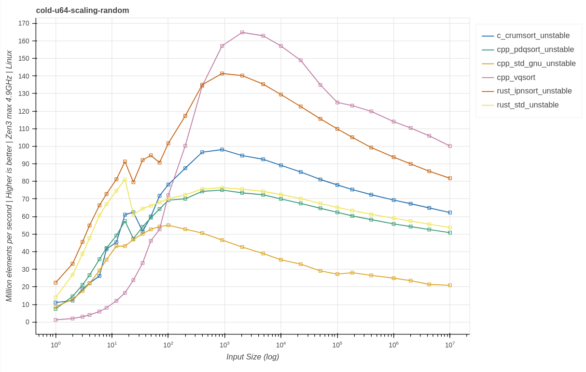

Observations:

- vqsort shows the same exceptionally poor small size performance.
- All generic comparison based implementations see a large performance uplift compared to Skylake.
- ipnsort is much closer to vqsort for large inputs compared to the Skylake Linux machine.
- crumsort shows smaller gains compared to pdqsort and rust_std than on the Skylake machines.
- vqsort hits its peak throughput earlier than on the Skylake Linux machine. 

#### Neon test machine

```
Darwin Kernel Version 22.1.0
rustc rustc 1.70.0-nightly (f15f0ea73 2023-03-04)
Apple clang version 14.0.0
M1 Pro 8-Core Processor (Firestorm P-core micro-architecture)
CPU boost enabled.
```

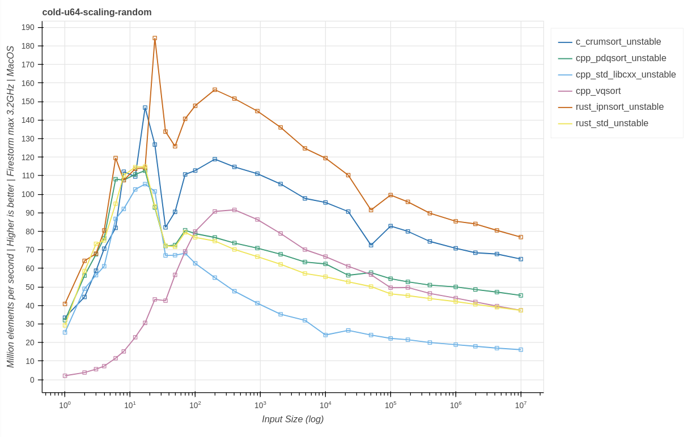

Observations:

- vqsort shows the same exceptionally poor small size performance.
- For most sort implementations, throughput is nearly doubled compared to the Skylake chip at similar clock speeds. Showcasing Firestorm's micro-architecture capabilities, leveraging a wide out-of-order (OoO) design.
- Compared to the Skylake and Zen3 results, Firestorm can hit peak throughput earlier. Indicative of an excellent branch prediction implementation with smaller miss penalities, fast learning and overall an excellent cache setup.
- cpp_std_libcxx performs the worst in general.
- vqsort shows performance similar to pdqsort, limited by the Neon instruction set and 128-bit vector width.
- The two implementations heavily exploiting ILP, crumsort and ipnsort, see larger uplifts compared to pdqsort as their baseline, with ipnsort showing ~1.9x the performance compared to ~1.6x on Skylake.
- At input size 50k there is a performance valley that is reproducible and seems to affect both crumsort and ipnsort.
- Power measurements indicate that ipnsort uses ~1.4x less power than vqsort while being nearly twice as fast. Which would imply ~2.7x better power efficiency. This indicates that in some scenarios code that focuses on exploiting ILP can be more energy efficient than vectorized code. With the additional benefit of not being hardware specific.

### C sort interface

crumsort mirrors the C standard library `qsort` interface. Which asks for a comparison function `int (*comp)(const void *, const void *)`. And while a lot of code implement this with `return a - b;`, such code leads to UB for some integers and is not generic. A simple implementation as presented on the cppreference website is this:

```c
int compare_ints(const void* a, const void* b)
{
    int arg1 = *(const int*)a;
    int arg2 = *(const int*)b;
 
    if (arg1 < arg2) return -1;
    if (arg1 > arg2) return 1;
    return 0;
 
    // return (arg1 > arg2) - (arg1 < arg2); // possible shortcut
    // return arg1 - arg2; // erroneous shortcut (fails if INT_MIN is present)
}
```

However depending on your compiler, this will generate branches. Which in turn cause branch miss-prediction which is undesirable, especially for code that wants to exploit ILP. Another alternative to write this in a way that generates good branchless code-gen, especially with Clang is this:

```c
int compare_ints(const void* a_ptr, const void* b_ptr)
{
    const int a = *(const int*)a_ptr;
    const int b = *(const int*)b_ptr;

    const bool is_less = a < b;
    const bool is_more = a > b;
    return (is_less * -1) + (is_more * 1);
}
```

This can avoid the issue with branch miss-prediction, however another issue remains. C abstracts over user-defined logic with function pointers. In contrast to C++ and Rust closures these can't be inlined without profile-guided optimizations (PGO). crumsort until recently required a custom define which disables a custom comparison globally via a define `#define cmp(a, b) (*(a) > *(b))` before the header only implementation is parsed. This is what is required for best performance, and what all benchmarks here used. However this makes crumsort more akin to the manually vectorized implementations in terms of supported types. User defined types that don't fit in a `long long` will require source level modifications. And for best performance with such interface a unique version of crumsort would have to be compiled for every type, via the build system. Fundamentally this is a C issue and only a crumsort issue, because it is implemented in C and mirrors the `qsort` interface.

Comparing the results of crumsort to crumsort using the branchless comparison function (c_crumsort_generic) on the Skylake Linux machine gives:

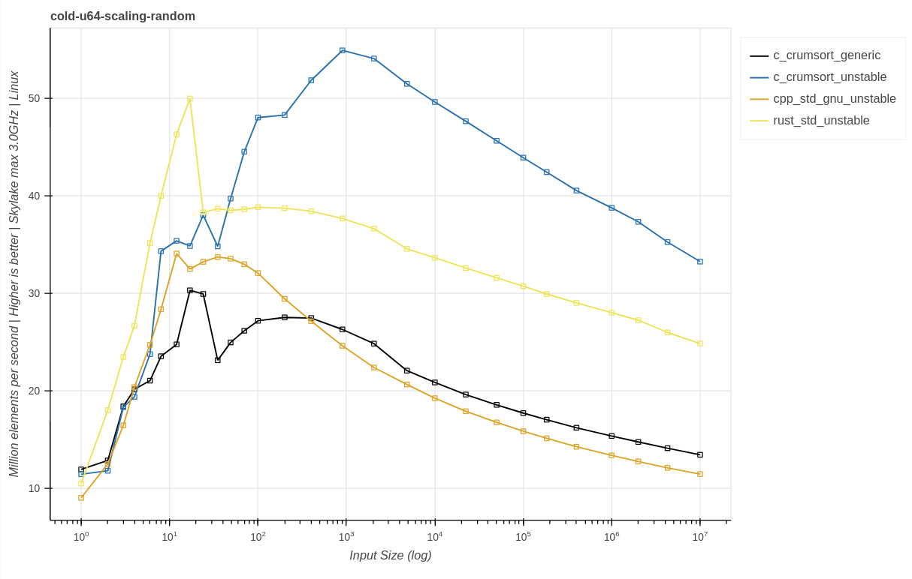

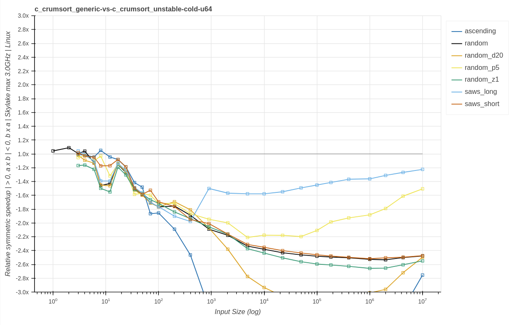

Observations:

- When used in a generic fashion crumsort shows significantly worse performance, ~2.4x slower for larger sizes and most random patterns.
- c_crumsort_generic shows performance close to cpp_std_gnu.
- Patterns such as ascending and random_d20 which perform fewer total comparisons, are affected more.

### Hot benchmarks

Running a sort implementation several million times in a loop, as is the standard for tools like google benchmark and criterion, with new unique inputs of the same size and pattern is not representative of real world application performance. To simulate a program that calls sort occasionally with varying sizes, and a cold CPU prediction state, the benchmarks are also run in a mode where between each sort call, the CPU prediction state is trashed [[6](https://github.com/Voultapher/sort-research-rs/blob/b7bcd199e861d6f8b265164242f3c34d5c36c75f/benches/trash_prediction.rs#L7)]. These benchmarks are marked `cold-*`. And they for the basis for the above scaling graphs. Benchmarks using the default hot loop logic are marked `hot-*`. **hot benchmark numbers should be interpreted as best case performance under laboratory conditions.**

#### u64-scaling

Measuring random pattern performance across different sizes:
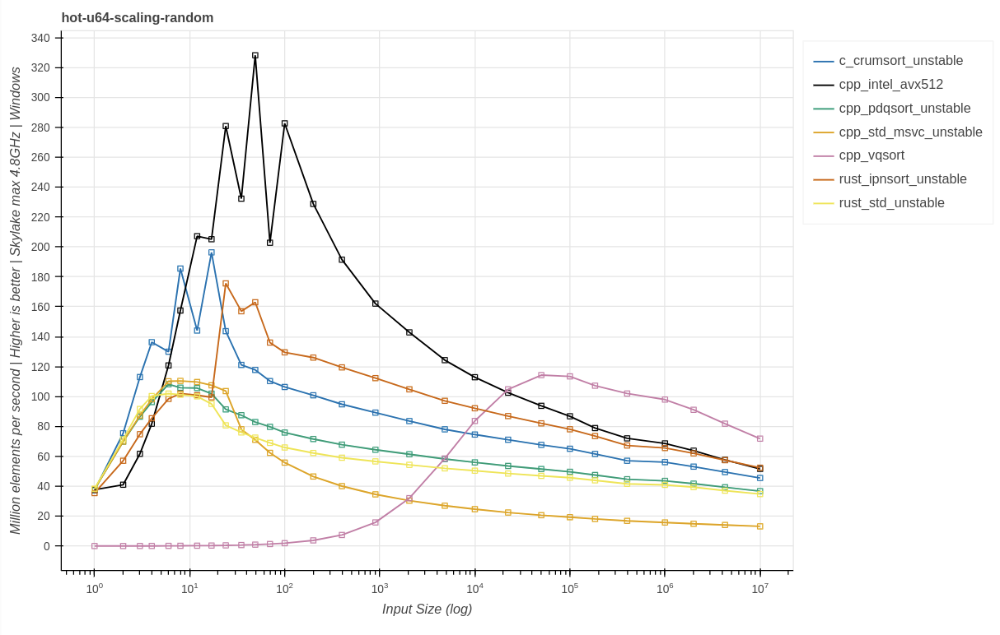

Observations:

- Even in a hot loop vqsort as tested is exceedingly slow for small inputs.
- intel_avx512 is fast across all sizes, when benchmarked in a hot loop.
- intel_avx512 and crumsort, differentiate themselves from the other implementations by not using insertion sort for such inputs.
- Starting at ~50k vqsort is the fastest.
- ipnsort catches up to intel_avx512 at ~1m, despite only using SSE2 instructions and using no hardware specific code.
- Starting at inputs size ~10k hot and cold results are largely the same.


Instrumenting the Rust standard library and building a custom version of rustc that logs the input size and time spent in `slice::sort` [[7](https://github.com/rust-lang/rust/pull/108005#issuecomment-1440360350)], which is the stable sort of the Rust standard library, yielded these insights clean compiling 60 crates:

Out of the ~500k calls to `slice::sort` 71.6% were `len == 0`, 22.8% were `len == 1` and in total 99+% were `len <= 20` and together they account for ~50% of the time spent in `slice::sort`.

Looking at that important `len <= 20` range:

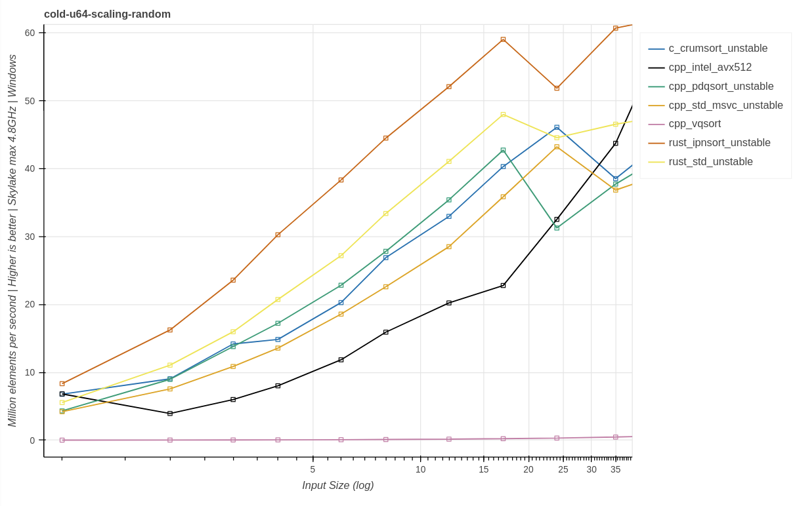

Observations:

- ipnsort leads the chart, in contrast to the hot results.
- Peak throughput for `len <= 20` drops by 5x compared to hot results.

Another aspect that should be mentioned, is frequency scaling. With the exception of the latest generations of Intel and AMD  micro-architectures, Golden Cove and Zen4, previous Intel AVX-512 implementations scaled down the CPU boost frequency when certain AVX-512 instructions were executed [[8](https://travisdowns.github.io/blog/2020/08/19/icl-avx512-freq.html)]. This may affect real world usage and performance. Another aspect potentially affected by cold code is the AVX-512 startup, a phenomenon limited to the arguably poor Skylake AVX-512 implementation.

The shown cold and hot benchmarks, model the two extremes of the likely range of possible results.

#### Further hot results

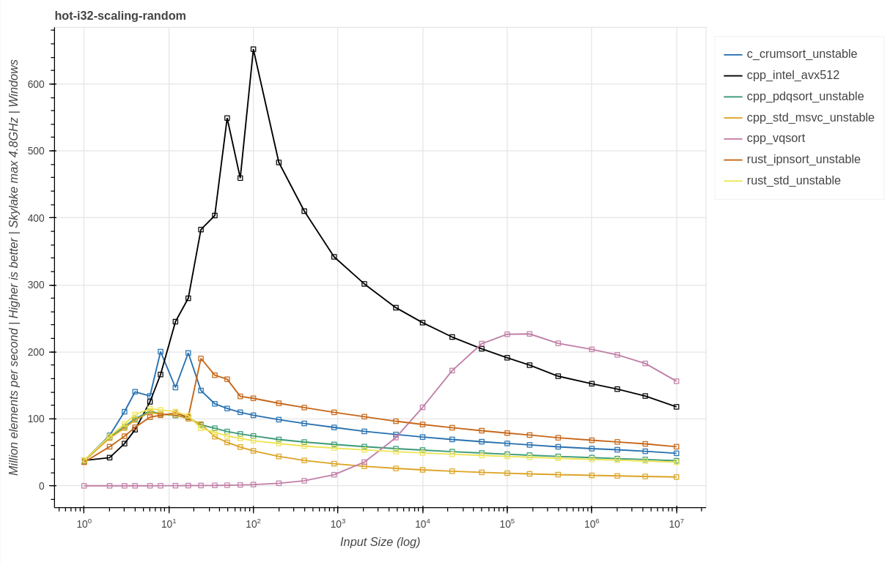

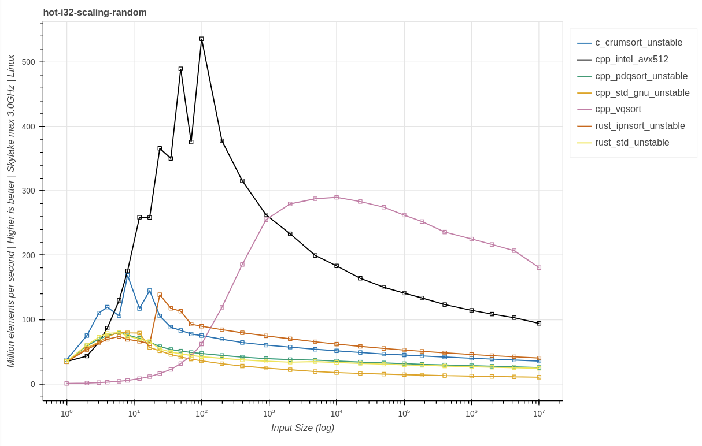

## Author's conclusion and opinion

intel_avx512 is a very fast sort implementation, especially for random inputs, and it shows nice scaling across different input sizes. However it shows worse than `O(N * log(N))` scaling in simple patterns, and suffers from poor pivot selection without a fallback. For types that are smaller than 8 bytes, such as `u8`, or `i32` both manually vectorized implementations showcase far higher performance than generic comparison based implementations. This analysis did not look into the overhead of runtime dispatch, which would be required to use it in code that is not uniquely compiled for a specific platform. Looking at some scenarios:

#### Specialized sort in a library

intel_avx512 can be a great choice, if the input consists of plain integers or floats, of varying sizes, assumed mostly random, not very small, not of low-cardinality and the appropriate hardware supporting AVX-512 is available. At the same time it can be problematic to use it as the sole replacement for calls to sort because of cold performance, worst case performance and potential frequency scaling issues.

#### Specialized HPC code

If you need the best possible throughput, and know you only have large inputs of supported types, vqsort is the faster option. Best vqsort performance requires Linux and clang. Other compilers should not be used and yield code several times slower.

#### Language standard library

A standard library implementation should be good in most scenarios, with bad performance in as few scenarios as possible. There are many glaring issues with intel_avx512 for such a use case. It would only support a small fraction of devices, would increase binary size for all x86 targets. It is not good at exploiting existing patterns in the input. It can't support user-defined comparisons, which would potentially mean that `v.sort_unstable()` and `v.sort_unstable_by(|a, b| a.cmp(b))` could have a surprising difference in performance. It can't support user-defined types without additional code by the user, eg. `#[derive(Copy, Clone)]struct X(i32)` could have a surprising difference in performance to just `i32`. On top of that, there are issues with cold performance and frequency scaling.

All the results are a snapshot of the respective implementations. After performing these measurements, there have been changes to crumsort and ipnsort, and the people behind vqsort are looking into small input performance. I specifically chose not to re-run the benchmarks with newer versions to avoid a bias of fixing certain things such as poor saws_long performance in ipnsort, without giving all the implementations the chance to do such improvements.

## Thanks

Thank you Jan Wassenberg for your detailed feedback, extensive help in running benchmarks and helping me understand some of the observations. Thank you Roland Bock for your detailed feedback and ideas how to make this writeup more readable.

## Addendum

### Updated vqsort results

New vqsort version fe85fdf. Same graphs as above, with cpp_vqsort_new added. Only vqsort was re-tested here.

Skylake (AVX-512):

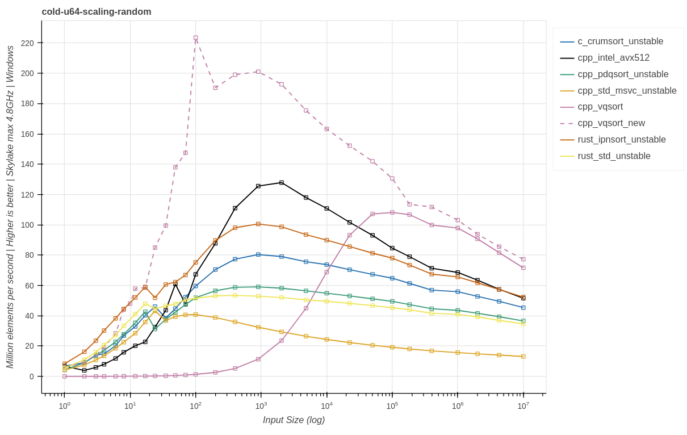

Zen3 (AVX2):

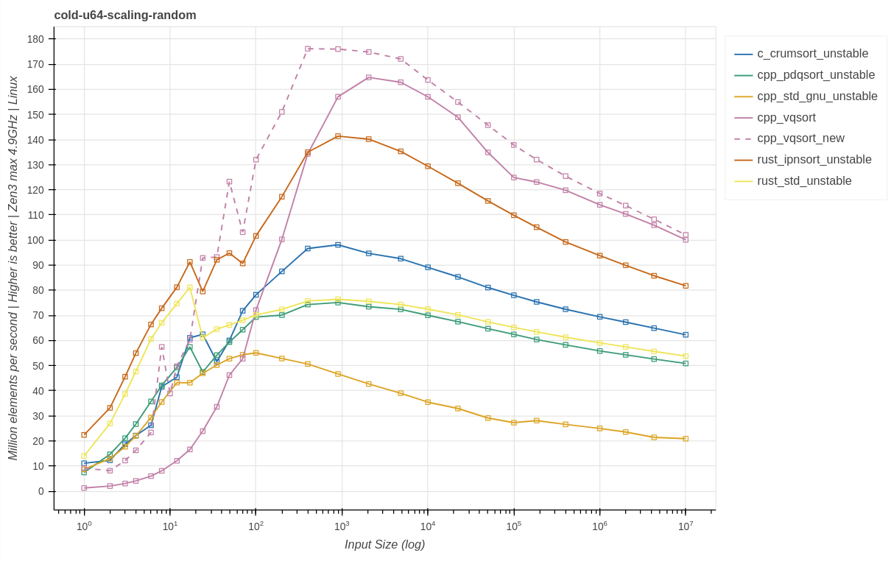

Observations:

- The new version of vqsort addresses the main issue of very poor performance for smaller inputs, and even manages to improve overall performance for larger inputs. With this it is now undoubtedly the fastest sort implementation in my testing, when AVX2 or AVX-512 are available for random-like patterns. 
