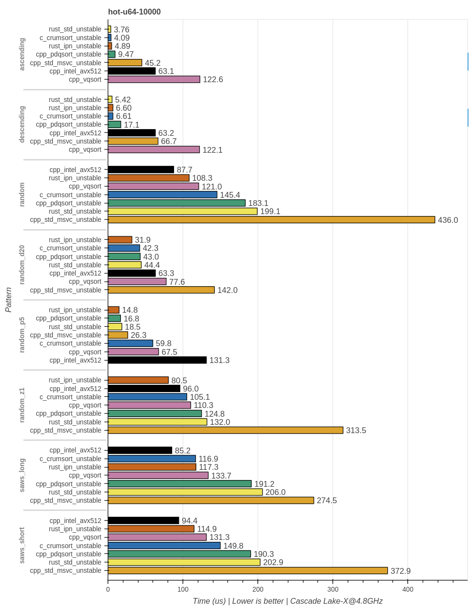
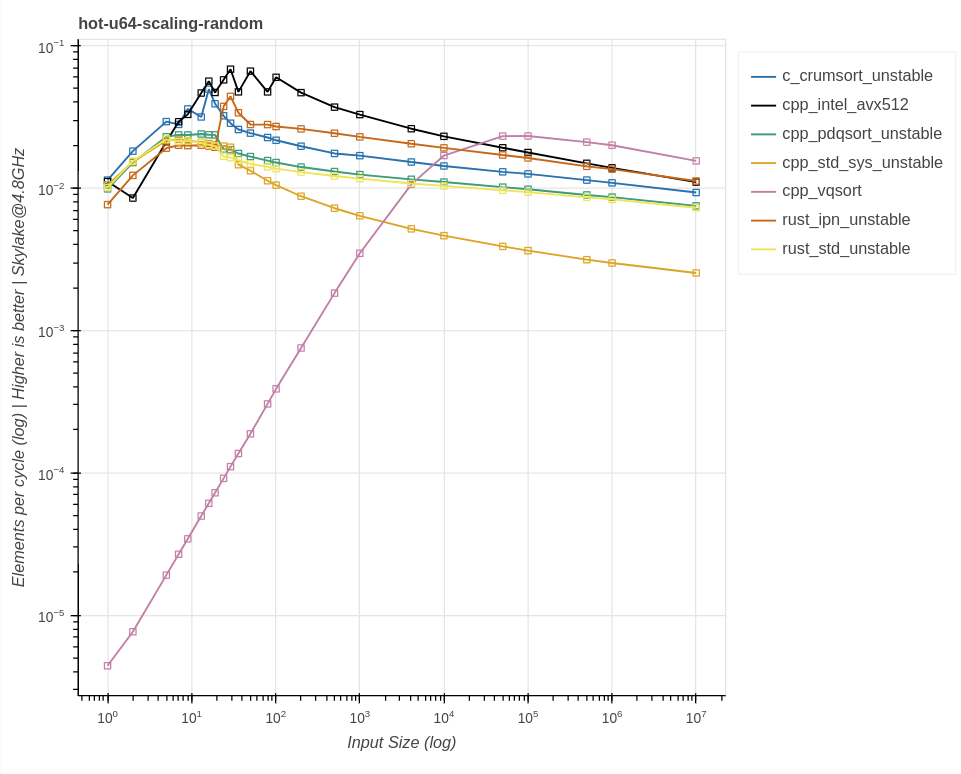
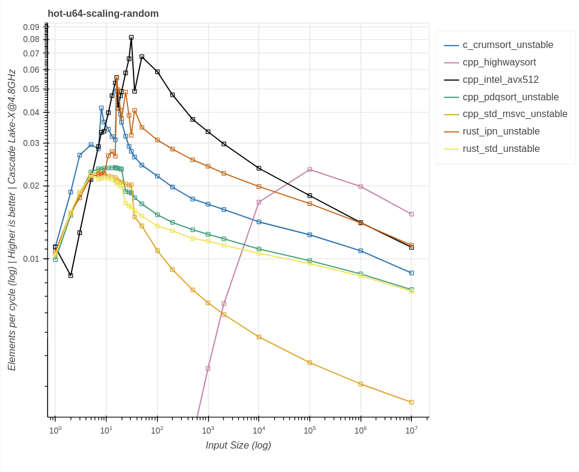
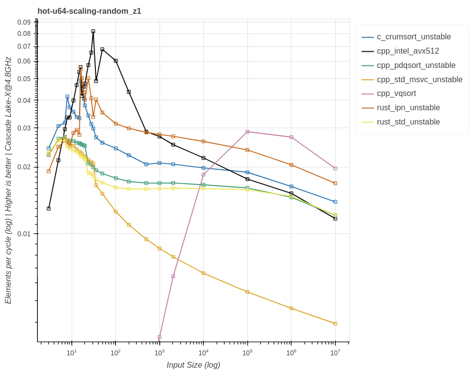
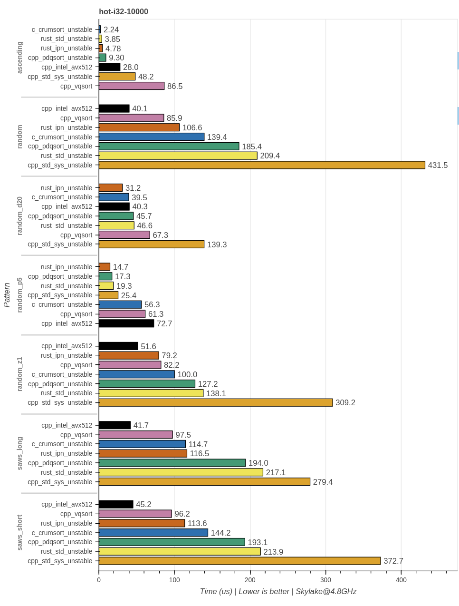
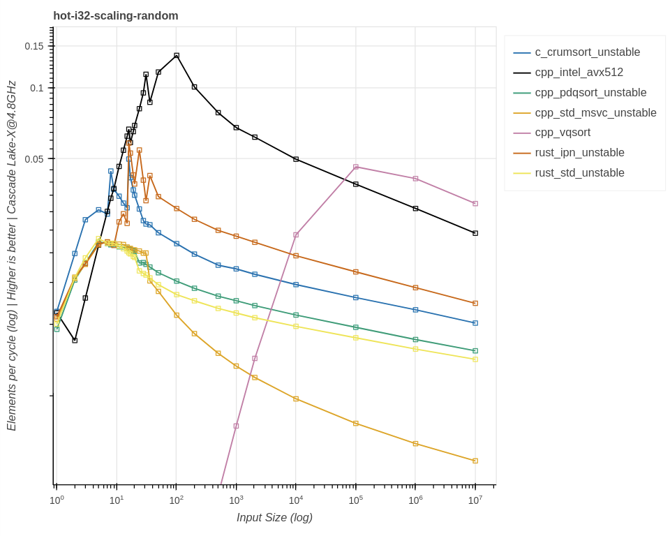

# 10~17x faster than what? A performance analysis of Intel' x86-simd-sort (AVX-512)

**WIP: Please do not publish.**

Author: Lukas Bergdoll @Voultapher  
Date: TODO (DD-MM-YYYY)

This is a limited performance analysis of the recently popularized [[1](https://www.phoronix.com/news/Intel-AVX-512-Quicksort-Numpy)] Intel AVX-512 sort implementation.

Bias disclaimer. The author of this analysis is the author of the ipn family of sort implementations.

The words sort implementation and sort algorithm, are expressly *not* used interchangeably. Practically all modern implementations are hybrids, using multiple sort algorithms. As such, the words 'sort algorithm' will only be used to talk about the algorithmic nature of specific building blocks.

Graphs with logarithmic axis are marked as such, these are primarily useful to examine the change of a property, *not* it's absolute values.

## Benchmarks

### Benchmark setup

Benchmarking is notoriously tricky, and especially synthetic benchmarks may not be representative. An incomplete list of relevant factors:

- Input size
- Input type (price to move and price to compare)
- Input pattern (already sorted, random, cardinality, streaks, mixed etc.)
- Hardware prediction and cache effects

```
rustc 1.69.0-nightly (0416b1a6f 2023-02-14)
clang version 15.0.1
Microsoft (R) C/C++ Optimizing Compiler Version 19.31.31104 for x86
Intel Core i9-10980XE 18-Core Processor (Skylake micro-architecture)
```

Modern sort implementations are adaptive, they will try to exploit existing patterns in the data to do less work. A breakdown of the benchmark patterns:

- `ascending`, numbers `0..size`
- `descending`, numbers `0..size` reversed
- `random`, random numbers generated by rand `StdRng::gen` [[2](https://github.com/rust-random/rand)]
- `random_d20`, uniform random numbers in the range `0..=20`
- `random_p5`, 95% 0 and 5% random data, not uniform
- `random_z1`, Zipfian distribution with characterizing exponent s == 1.0 [[3](https://en.wikipedia.org/wiki/Zipf%27s_law)]
- `saws_long`, `(size as f64).log2().round()` number of randomly selected ascending and descending streaks
- `saws_short`, randomly selected ascending and descending streaks in the range of `20..70`

### Contestants

A selection of high-performance in-place sort implementations.

#### Generic comparison based

```
- rust_std_unstable          | `slice::sort_unstable` https://github.com/rust-lang/rust (1)
- rust_ipn_unstable          | https://github.com/Voultapher/sort-research-rs (2)
- cpp_std_msvc_unstable      | MSVC `std::sort` (3)
- cpp_pdqsort_unstable       | https://github.com/orlp/pdqsort (3)
- c_crumsort_unstable        | https://github.com/scandum/crumsort (4)
```

#### Manually vectorized 

```
- cpp_vqsort                 | https://github.com/google/highway/tree/master/hwy/contrib/sort (5)
- cpp_intel_avx512           | https://github.com/intel/x86-simd-sort (5)
```

1. Vendored ca. mid 2022.
2. Still WIP and these are only preliminary results.
3. Build with msvc.
4. Compiled with `#define cmp(a, b) (*(a) > *(b))`. This is required to be competitive, the regular way of providing a comparison function is problematic because of C language limitations.
5. Build with clang and `-march=native`. Compiled with static dispatch, this would not be portable. Any CPU without AVX-512 support would fail to run the binary. It's unknown what the overhead of dynamic dispatch would be. 

### Results `u64`

#### hot-u64-10k

A good benchmark to shine light into the ability of the sort to exploit instruction-level parallelism (ILP) is hot-u64-10000. The input are 10k `u64` values, which fits into the core private L2 data cache for the used Zen3 test machine. The upper limit should be in the order of 4-5 instructions per cycle for such a dataset. 10k elements is enough to reliably exploit existing patterns in the input data. This can be reproduced by running `cargo bench hot-u64-<pattern>-10000`



Using this data to write a headline like:

> Rust std sort is 12x faster than C++ std sort

Is not an honest representation. And it's generally very difficult to compress so much information into a single number, while still remaining representative. Looking at this one input size, on one specific micro-architecture, using this specific set of compilers, and testing these synthetic patterns, yields:

- cpp_intel_avx512 is generally faster than cpp_vqsort at this input size.
- The two manually vectorized sort implementations cpp_intel_avx512 and cpp_vqsort, are not good at exploiting existing patterns in the input.
- cpp_intel_avx512 struggles if there is one very common value in the input (random_p5).
- cpp_std_msvc_unstable is generally the slowest of the comparison based sort implementations.
- rust_std_unstable which is based on cpp_pdqsort_unstable performs similar, with the exception of fully ascending or descending inputs.
- ascending and descending show the largest variance with the fastest sort being ~33x and ~23x faster respectively than the slowest.
- More natural random distributions like random_z1 close the gap between manually vectorized code and pdqsort derived designs, rust_std_unstable, rust_ipn_unstable and c_crumsort_unstable.

Whether these patterns are representative will depend on your workload. These are fundamentally synthetic benchmarks exploring sort performance in isolation. Especially small sizes are likely not representative of real world performance, where CPU branch, instruction and data caches may be cold. **These numbers should be interpreted as best case performance under laboratory conditions.**

#### hot-u64-scaling

Measuring random pattern performance across different sizes:


Zoomed in:


Observations:

- cpp_vqsort is exceedingly slow for small inputs.
- cpp_intel_avx512 is fast across all sizes, when benchmarked in a hot loop.
- cpp_intel_avx512, rust_ipn_unstable and c_crumsort_unstable, differentiate themselves from implementations using insertion sort for small inputs, rust_std_unstable, cpp_pdqsort_unstable and cpp_std_msvc_unstable.
- cpp_std_msvc_unstable shows sub-log scaling.
- Starting at ~50k cpp_vqsort is the fastest.
- rust_ipn_unstable catches up to cpp_intel_avx512 at ~1m, despite only using SSE2 instructions and using no hardware specific code.

Measuring a more natural zipfian distribution random_z1 across different sizes:


Observations:

- Generally similar to random pattern performance scaling.
- cpp_intel_avx512 shows less uniform scaling, with overall worse performance compared to random. 
- The pdqsort derived implementations see a performance uplift compared to random.

### Results `i32`

#### hot-i32-10k

The main difference between `i32` and `u64` is that `i32` is only 4 bytes compared to the 8 bytes of `u64`. In theory this should allow higher bandwidth from the CPUs memory subsystems. Better cache utilization and potentially higher ALU throughput.



Observations:
- Compared to `u64` cpp_intel_avx512 manages to cut it's runtime in half.
- cpp_vqsort only sees a ~1.37x speedup compared to `u64` at this input size.
- All comparison based sort implementations only see a small change compared to `u64`.

#### hot-i32-scaling



Observations:

- Very similar scaling to `u64`.
- It takes a bit longer, but eventually cpp_vqsort overtakes cpp_intel_avx512.
- The manually vectorized implementations are a lot better at leveraging the increased potential throughput, than the generic comparison based implementations.

## Author's conclusion and opinion

cpp_intel_avx512 is a very fast sort implementation, especially for random inputs, and it shows nice scaling across different input sizes. This analysis did not look into the overhead of runtime dispatch, which would be required to use it in code that is not uniquely compiled for a specific platform. Looking at some scenarios:

#### Specialized sort in a library

cpp_intel_avx512 can be a great choice, if the input is assumed mostly random, and not of low-cardinality. When inputs of varying sizes have to be sorted and the appropriate hardware supporting AVX-512 is available.

#### Specialized HPC code

If you need the best possible throughput, and know you only have large inputs with high-cardinality, cpp_vqsort is the faster option.

#### Language standard library

A standard library implementation should be good in most scenarios, with bad performance in as few scenarios as possible. There are many glaring issues with cpp_intel_avx512 for such a use case. It would only support a small fraction of devices, would increase binary size for all x86 targets. It is not good at exploiting existing patterns in the input. It can't support custom comparisons, which would potentially mean that `v.sort()` and `v.sort_by(|a, b| a.cmp(b))` could have a surprising difference in performance. It can't support user defined types without additional code by the user, eg. `#[derive(Copy, Clone)]struct X(i32)` could have a surprising difference in performance to just `i32`.
