# An introduction to ipnsort

# Work in progress please do not publish!

Author: Lukas Bergdoll @Voultapher  
Date: TODO (YYYY-MM-DD)

This is an introduction and overview of an efficient, generic and robust unstable sort implementation called ipnsort (instruction-parallel-network sort) by Lukas Bergdoll [source code](https://github.com/Voultapher/sort-research-rs/tree/main/ipnsort).

TL;DR: ipnsort improves upon `slice::sort_unstable` in a variety of ways.

---

Bias disclosure. The author of this analysis is the author of ipnsort.

## Design goals

The primary goal was to develop a replacement for the current Rust standard library `slice::sort_unstable`.

- **Correct**: Correct ordered output if the user-defined comparison function implements a strict weak ordering.
- **Safe**: panic- observation- and Ord-violation-safe for any input. Zero UB regardless of input and user-defined comparison function.
- **Deterministic**: Same output, every time, on every machine and ISA.
- **Hardware agnostic**: No architecture specific code.
- **Efficient**: Race to sleep and focus on instruction-level-parallelism (ILP) over SIMD.
  - Optimized and tested along these dimensions, ~6k data points:
    - Input length (0-1e7)
    - Input type (integer like, medium sized, large sized)
    - Input pattern (fully random, Zipfian distributions, low cardinality, presorted + append, and more)
    - CPU prediction state (hot loop only doing sort, cold code with i-cache misses)
- **Generic**: Works the same way for builtin types and user-defined types. Supports arbitrary comparison functions.
- **Robust**:
  - Guaranteed O(N * log(N)) worst case comparisons.
  - Guaranteed O(N) comparisons for fully ascending and descending inputs.
  - Smooth run-time scaling with input length.
- **Binary-size**: Relatively small binary-size for types like `u64` and `String`. i-cache is a shared resource and the program will likely do more than just sort.
- **Compile-time**: At least as fast to compile as the current `slice::sort_unstable` if hardware-parallelism is available and not much worse if not. Both debug and release configurations.
- **In-place**: No heap allocations. And explicit stack usage should be limited to a couple kB.
- **Debug performance**: Performance of un-optimized binaries should not be much worse than the current `slice::sort_unstable`.

## Design non-goals

- **Fastest non-generic integer sort**: The staked design goals in combination are incompatible with this goal. The author is aware of simple ways to improve integer performance by 10-20% if some of the design goals are ignored. For best in-class performance [vqsort](https://github.com/google/highway/tree/master/hwy/contrib/sort) by Mark Blacher, Joachim Giesen, Peter Sanders and Jan Wassenberg, can be used, assuming AVX2+ and Clang. For very small types `mem::size_of::<T>() <= mem::size_of::<16>()` a good counting or radix sort is almost certainly faster. More info here [10~17x faster than what? A performance analysis of Intel's x86-simd-sort (AVX-512)](https://github.com/Voultapher/sort-research-rs/blob/main/writeup/intel_avx512/text.md). In addition, once the sort implementation has a run-time of multiple milliseconds or more, using multithreading becomes beneficial, which is out of the scope of `slice::sort_unstable`.
- **Tiny binary-size**: Implementation complexity and binary-size are related, for projects that care about binary-size and or compile-time above everything else [tiny_sort](https://github.com/Voultapher/tiny-sort-rs) is a better fit.
- **Varied compilers**: Only rustc using LLVM was tested and designed for.

## High level overview

The starting point for this journey was the source code of `slice::sort_unstable`. Which itself is mostly a port of [pdqsort](https://github.com/orlp/pdqsort) by Orson Peters.

Modern high-performance sort implementations combine various strategies to exploit input patterns and hardware capabilities. In effect this makes all of them hybrid algorithms. For this reason it is more appropriate to talk about sort implementations and their components instead of a "sort algorithm".

### pdqsort

To better understand ipnsort, we start with a component level overview of pdqsort:

- **Partial insertion sort**: Up to 5 out-of-order elements are handled by insertion sort if everything else is already sorted.
- **Quicksort**: Top level loop and algorithm.
- **Pivot selection**: Median of 3 or pseudo median of 9 depending on sub-slice length.
- **Insertion sort**: Recursion stopper small-sort.
- **Ancestor pivot tracking**: Common element filtering allowing for O(K * log(N)) total comparisons where K is the number of distinct elements. Also great for Zipfian distributions.
- **Partition**: Hoare partition with branchless block offset computation and cyclic permutation element swapping derived from [BlockQuicksort](https://arxiv.org/pdf/1604.06697.pdf) by Stefan Edelkamp and Armin Weiß.
- **Equal partition**: Branchy Hoare partition for filtering out common elements.
- **Pattern breaker**: Xorshift RNG element shuffling to avoid fallback.
- **Heapsort**: Branchy Heapsort fallback triggered by excess number of ineffective partitions.

### Current `slice::sort_unstable`

The current `slice::sort_unstable` does some minor changes to pdqsort:

- **Partial insertion sort**: Is changed to allow fully ascending and descending inputs to be sorted with only N comparisons, instead of N*2 like in pdqsort. However in doing so it creates a worst case with significantly more comparisons for append + sort use cases. More on that later.
- **Quicksort**: Instead of always recursing into the left side, it recurses into the shorter side. This idea was first introduced in the 1993 paper [Engineering a Sort Function](https://cs.fit.edu/~pkc/classes/writing/samples/bentley93engineering.pdf) by Jon L. Bentley and M. Douglas Mcilroy. While predicting the exact point when the current `slice::sort_unstable` will switch from Quicksort recursion to heapsort is difficult to predict, because of the pattern breaker and ineffective partition counter interplay, it still enforces a recursion depth limit. Jon L. Bentley and M. Douglas Mcilroy introduce the shorter side recursion idea to counteract the worst case behavior of repeated ineffective partitioning. In essence this change makes no sense given the heapsort fallback.

### ipnsort

Component level overview of ipnsort and how and why it differs from the current `slice::sort_unstable`:

- **Small input insertion sort**: Dedicated sort for N <= 20. Profiling shows that 95+% of inputs are of len <= 20. In such scenarios i-cache misses are often the most important factor. A dedicated and inlined insertion sort shows best overall performance across patterns and CPU prediction state.
- **Already sorted detection**: Single pass scan with early exit for fully ascending and descending inputs. Maintains the ~N comparisons property for such inputs, without the performance worst case for append + sort scenarios.
- **Quicksort**: Top level loop and algorithm. Shorter side recursion is reverted back to left side recursion.
- **Pivot selection**: Recursive median approximating sqrt(N) sampling taken from [glidesort](https://github.com/orlp/glidesort) by Orson Peters.
- **Hybrid small-sorts**: Three different recursion stopper small-sort implementations, chosen from at compile time based on type characteristics. Insertion sort as fallback for non `Freeze` types. Novel hybrid sorting network, bidirectional merging and insertion sort implementations with different network sizes for int like types and medium sized `Freeze` types.
- **Ancestor pivot tracking**: Common element filtering allowing for O(K * log(N)) total comparisons where K is the number of distinct elements. Also great for Zipfian distributions.
- **Partition**: Two partition implementations. A [novel branchless Lomuto partition implementation](https://github.com/Voultapher/sort-research-rs/blob/main/writeup/lomcyc_partition/text.md) for small to medium sized types. And a branchy Hoare implementation for large expensive to copy types.
- **Equal partition**: Same as regular partition with flipped comparison. Allows equal element filtering with efficient branchless partition scheme. Greatly improves performance for low cardinality and Zipfian distribution inputs.
- **Heapsort**: Branchless Heapsort fallback triggered by simple recursion depth limit. By making the heapsort used as fallback [branchless](https://github.com/rust-lang/rust/pull/107894) worst case performance is significantly improved. Tracking wether a partition was effective adds additional complexity and branch miss opportunities. By switching to a simple 2 * log2(N) depth limit, both the effectiveness tracking as well as the pattern breaker can be avoided. The improved pivot selection as well reduced heapsort penalty compensate the loss of pattern breaking.

## Verification

### Correct

As part of the tailor made [test suite](https://github.com/Voultapher/sort-research-rs/blob/main/sort_test_tools/src/tests.rs) are test that compare the resulting output order to the output of `slice::sort`. All tests are done for a range of input lengths between 0 and 1_000_000. There are tests specifically for different input types as well as for different input patterns. As well as tests that test a specific property along two dimensions, input length and pattern. In addition the existing Rust standard library test suite also contains tests specifically for `slice::sort_unstable`. ipnsort is a hybrid sort algorithm, and the individual components can more easily be reasoned about which reduces the risk of hidden correctness bugs. In addition none of the components employ novel algorithmic ideas, further reducing the risk of unforeseen correctness bugs.

Result: The test suits pass.

### Safe

Like the current `slice::sort_unstable` the ipnsort implementation contains significant amounts of `unsafe` for reasons of reliable code-gen, as well as run-time, compile-time, and binary-size efficiency. `slice::sort_unstable` allows for arbitrary logic in the user-defined comparison function. Which may do any combination of: returning correct results, violating strict weak ordering, modify values as they are being compared via interior mutability and or panic. In combination with use of auxiliary memory an implementation can easily invoke UB, hang forever, and or return the input in a dangerous and unintuitive state. Even implementation written using purely safe abstractions are only guaranteed to avoid direct UB, and still susceptible to the other issues. More information about the different safety categories and effects, as well as comparison to C and C++ implementation can be found [here](https://github.com/Voultapher/sort-research-rs/blob/main/writeup/sort_safety/text.md). The bespoke test suite involves tests that trigger all these scenarios for various types, pattern and input sizes. In addition, carful care was taken to isolate `unsafe` abstractions where possible, localize `unsafe` invariants to small scopes, with each `unsafe` block accompanied by a `SAFETY:` comment explaining the assumptions. In addition some components were model checked with [kani](https://github.com/model-checking/kani), checking the full gamut of possible comparison result and input combinations. The implementations have also been fuzzed with libfuzzer and AFL, however the employed harnesses did assume simple comparisons. In addition the test suite is also run with [miri](https://github.com/rust-lang/miri) both under Stacked borrows and Tree borrows.

Result: The test suits pass both normally and when run with miri.

### Deterministic

To the extent of the author's knowledge no construct was used that would produce non-deterministic results. And there is a test that checks that the implementation produces the same output within a reduced key space. Which can catch inter-run non-determinism. In addition a manual test was performed to verify that it produces the same output in a reduced key space on x86_64 Zen 3 and Armv8 Firestorm.

Result: Both automatic and manual tests pass.

### Hardware agnostic

No arch specific code was used, and the implementation relies on branchless ILP instead of auto-vectorization to saturate wide out-of-order (OoO) CPU micro-architectures.

Result: (rip)grepping the source code for "arch" yields no relevant match.

### Efficient

Smartphone and server CPUs alike can execute billions of instructions each second. For a variety of reasons many programs spend most of their time waiting. Predominantly waiting for memory and cache loads and stores. More than 30 years of CPU design have been invested into doing things while the CPU would otherwise wait. These optimizations such as [pipelining](https://en.wikipedia.org/wiki/Instruction_pipelining) cause new bottlenecks such as [pipeline control hazards](https://en.wikipedia.org/wiki/Hazard_(computer_architecture)#Control_hazards_(branch_hazards_or_instruction_hazards)), which then again are addressed by further optimizations like [predictive execution](https://en.wikipedia.org/wiki/Speculative_execution#Predictive_execution). This stack of hardware optimizations, implemented with [shared mutable state](https://raw.githubusercontent.com/Voultapher/Presentations/master/retpoline/assets/shared-mutable-cpu-state-all.jpg) in the CPU, make predicting performance very complex. Measuring performance comes with its own laundry list of pitfalls, spanning the gamut from poor experimental setups, to bad analysis to faulty assumptions about relevance. Performance and efficiency are usually correlated, in that taking half the time to do the same work, means the CPU can go back to sleep after only half the time, using less power overall. That said, improving efficiency has its own set of [conceptual pitfalls](https://solar.lowtechmagazine.com/2018/01/bedazzled-by-energy-efficiency).

Sort implementations can leverage existing patterns in the input to perform less work. The following synthetic patterns represent a limited set of use cases. Their applicability to real world situations will vary from use case to use case. In the domain of databases, low cardinality distributions like random_d20, random_p5 and random_z1 have been found to be quite common in real world data. Zipfian distributions also known as 80/20 distributions are found in many real world data sets. Without prior distribution knowledge nor domain knowledge, a generic sort implementation has to exploit the gained information, without spending too much effort looking for an algorithmic optimization that won't be applicable or pay off.

- `ascending`, numbers `0..size`
- `descending`, numbers `0..size` reversed
- `random`, random numbers generated by the [rand crate](https://github.com/rust-random/rand) `StdRng::gen`
- `random_d20`, uniform random numbers in the range `0..=20`
- `random_p5`, 95% 0 and 5% random values mixed in, not uniform
- `random_s95`, 95% sorted followed by 5% unsorted, simulates append + sort
- `random_z1`, [Zipfian distribution](https://en.wikipedia.org/wiki/Zipf%27s_law) with characterizing exponent s == 1.0

The cold benchmarks perform a step before each measurement that [overwrites](https://github.com/Voultapher/sort-research-rs/blob/lomcyc-partition-bench/benches/modules/util.rs#L128) the first level instruction cache and branch-prediction caches with unrelated values. This measures a scenario where prior parts of a hypothetical larger program already loaded or generated the data that will be sorted into the suitable data caches. In this scenario the first level instruction cache and branch predictor caches are trained on other work than the sort implementation. "Hot" benchmarks are also possible but arguably [of little value](https://github.com/Voultapher/sort-research-rs/blob/main/writeup/intel_avx512/text.md#hot-benchmarks), as they measure a scenario where a program does nothing but sort inputs, which is unlikely to be a realistic use case.

One common way to improve the performance of sort implementations is to use explicit vectorization. However doing so limits the applicability to a narrow set of built-in types and doesn't support user-defined comparison functions. A generic implementation has to handle user-defined types of various shapes, paired with user-defined comparison functions. For these reasons the implementation focuses on instruction-level parallelism (ILP) instead of SIMD. While there is an unlimited amount of possible combinations, it is possible to pick certain types that demonstrate possible properties and their effects. In the benchmarks the input length range is limited to 1e5 for practical resource reasons, except for `u64` and `i32`.

#### Results Zen 3

The micro-architecture called Zen 3 released in the year 2020 by AMD, is in the year 2024 a widely used choice for cloud computing, gaming and more.

```
Linux 6.6
rustc 1.77.0-nightly (6ae4cfbbb 2024-01-17)
AMD Ryzen 9 5900X 12-Core Processor (Zen 3 micro-architecture)
CPU boost enabled.
```

##### u64 10k single size

Comparing the run-time for a single input length (10_000) across patterns.

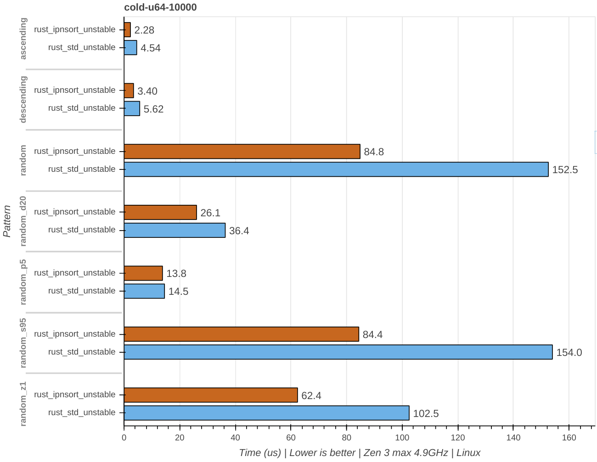

Observations:

- There is a large difference in total time between the cheapest pattern, ascending, and the most expensive pattern, random. ~63.6x for std_unstable and ~35.9x for ipnsort. This is caused by the implementations doing substantially fewer comparisons.
- Across all patterns there are no major algorithmic differences at this input length, as expected. The only significant difference is the run-time cost of the partition and small-sort.
- On this micro-architecture the majority of the speedup is gained by a more sophisticated small-sort that leverages sorting-networks to avoid branch misprediction.
- Patterns like random_d20 that spend their time exclusively doing partitions, benefit from using the same branchless partition implementation instead of using a branchy Hoare based partition implementation like std_unstable does.
- ipnsort is slower for random_s95 than pure random, because it does a in this scenario useless 95% scan, until it realizes the input is not fully ascending. std_unstable in contrast has a partition implementation that benefits from having to swap fewer elements.

##### u64 random scaling

Comparing the run-time for a single pattern (random) across input lengths.

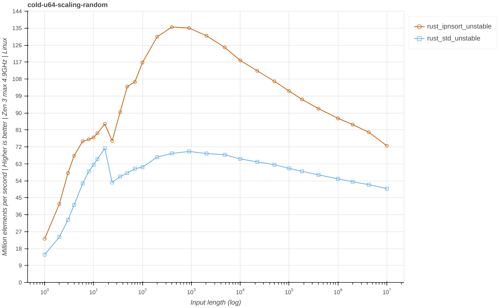

Observations:

- The curve shapes are similar.
- Both implementations regress throughput between length 17 and 24. This can be explained by them using an insertion sort for inputs length <= 20.
- ipnsort is faster across all tested input length, including length <= 20. This effect has to do with i-cache misses. ipnsort tries to inline the small-input insertion sort and nothing else, outlining the core Quicksort loop. In contrast std_unstable has to load significantly more code to reach the small-sort inside the Quicksort loop, also incurring more branch misprediction along the way.
- Both implementations reach peak throughput for inputs that fit inside the 512kB L2 d-cache. This effect is counteracted by the increased workload because of O(N x log(N)) algorithmic scaling as well as the increasingly dominant effect of main memory bandwidth.
- ipnsort can leverage the significantly higher L1 and L2 d-cache bandwidth to a much higher degree than std_unstable. This is primarily enabled by fewer branch mis-predictions in the small-sort. Allowing it to exploit the instruction-level parallelism (ILP) capabilities of the micro-architecture to a greater degree.

##### u64

Comparing the relative symmetric speedup across all measured input lengths and patterns. This is calculated by taking each measured input length and producing a relative symmetric speedup, where 1.5x means that A is 1.5x faster than B, and -1.5x means B is 1.5x faster than A. This approach avoids biasing one direction over the other, and symmetric effects can cancel each other out.

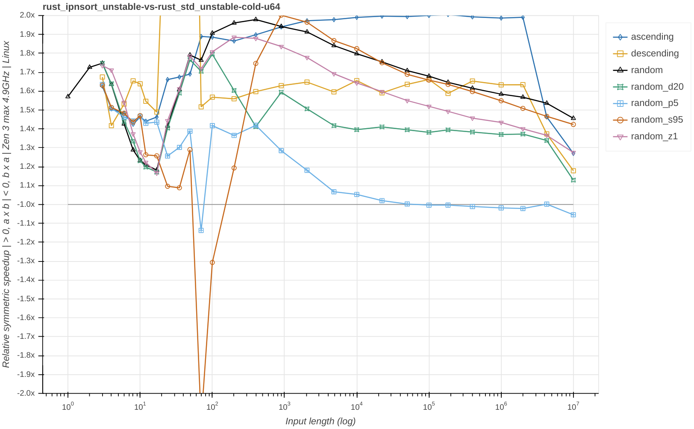

Observations:

- ipnsort improves performance across nearly all pattern and length combinations.
- Despite using the exact same algorithm and nearly identical implementation, ipnsort is considerably faster for N <= 20. This can be explained by the carful inlining and i-cache aware implementation.
- random shows the largest relative improvement. This can be explained by the run-time percentage that is spend in the small-sort. As described [here](https://github.com/Voultapher/sort-research-rs/blob/main/writeup/lomcyc_partition/text.md) in more detail, the new partition implementation contributes a ~1.2x overall improvement for `u64` on Zen 3. While the small-sort is ~2-3x times faster.
- The run-time improvement diminishes with increasing input length, as main memory bandwidth becomes increasingly the dominant factor, which is the same for all implementations.
- random_z1 shows a similar curve shape to random, but with a lower overall improvement. This can be explained by the comparatively larger percentage of the run-time spend in the partition vs small-sort, compared to random.
- For N > 20 and < 1e5, ascending and descending throughput is improved, thanks to a the changes to the already sorted detection.
- random_s95 for N > 20 and < ~200, sees a small to large regression in throughput. This can be explained by the changes to partial insertion sort, which has a hard limit of 5 elements. random_s95 at length 100 is 95 first elements already sorted and the last 5 elements unsorted. This is an ideal situation for the partial insertion sort. Once the the unsorted number of elements at the end exceeds the fixed limit, the throughput curve approaches the shape of random.
- random_p5 for N > 1e4, shows a [~1.2x regression for partition](https://github.com/Voultapher/sort-research-rs/blob/main/writeup/lomcyc_partition/text.md#lomuto_branchless_cyclic_opt-vs-hoare_block) in isolation. Yet in total the small-sort compensates this regression, together with the changes to already sorted detection.

Zooming out to see the full range:

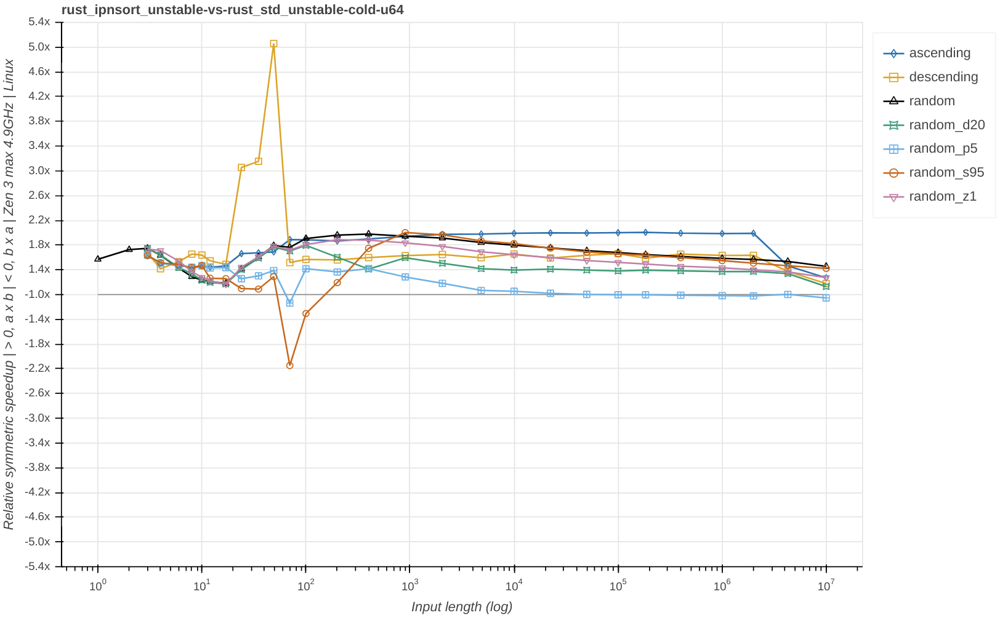

Observations:

- There are two large outliers.
- descending sees a large improvement, peaking at N == 49. This can be explained by the changes to already sorted detection. Running this command `MEASURE_COMP=x BENCH_REGEX="(ipnsort|std_unstable).*-u64-descending-49$" cargo bench` in sort-research-rs repository yields the average number of comparisons. ipnsort requires 48 comparison while std_unstable requires 208. In general comparison count is a poor approximation for performance. However in this case, the difference is so large it plays the primary role.
- random_s95 sees a large regression, peaking at N == 70. This can also be explained by algorithmic differences. The partial insertion sort in std_unstable requires on average 188 comparisons to sort random_s95, while ipnsort requires 521.

##### i32

Signed 32-bit integer with values in full `i32` range.


Observations:

- Overall very similar to `u64`.
- random_p5 sees a minor improvement for N > 1e5, in contrast to `u64` which sees parity in that range. This can be explained by a subtle code-gen difference on x86 in the BlockQuicksort derived partition implementation in std_unstable. LLVM doesn't generate the same efficient `adc` instructions for signed integers, that it will for unsigned integers, in the context of block offset generation. This also explain the overall improvement across all patterns compared to `u64`.

##### string

Heap allocated string that resembles the rustc standard library `String`. All values for the benchmarks are derived from `i32` values. The strings all have the same length and are compared lexicographically, which in this case due to zero padding is the same as comparing the `val.saturating_abs()`. The string results are highly dependent on the allocation distribution, the benchmarks measure a relatively unrealistic scenario where the strings are allocated one after the other with minimal other work in-between.

```rust
#[repr(C)]
pub struct FFIString {
    data: *mut c_char,
    len: usize,
    capacity: usize,
}

fn shift_i32_to_u32(val: i32) -> u32 {
    (val as i64 + (i32::MAX as i64 + 1)) as u32
}

// Construction from i32
FFIString::new(format!("{:010}", shift_i32_to_u32(val)))
```


Observations:

- ipnsort improves performance in the majority of measured pattern and length combinations.
- The improvement is significantly smaller, compared to the measured integers. This can be explained by the comparatively larger amount of time spent for each comparison, including memory indirection and a call to `memcmp`.

##### 1k

The 1k type simulates a type that is expensive to copy at 1KiB, but has a relatively cheap comparison function.

```rust
// Very large stack value.
#[repr(C)]
#[derive(PartialEq, Eq, Debug, Clone)]
pub struct FFIOneKibiByte {
    values: [i64; 128],
}

impl FFIOneKibiByte {
    pub fn new(val: i32) -> Self {
        let mut values = [0i64; 128];
        let mut val_i64 = val as i64;

        for elem in &mut values {
            *elem = val_i64;
            val_i64 = std::hint::black_box(val_i64 + 1);
        }
        Self { values }
    }

    fn as_i64(&self) -> i64 {
        self.values[11] + self.values[55] + self.values[77]
    }
}

impl PartialOrd for FFIOneKibiByte {
    fn partial_cmp(&self, other: &Self) -> Option<std::cmp::Ordering> {
        self.as_i64().partial_cmp(&other.as_i64())
    }
}
```


Observations:

- The 1k type poses a unique to challenge to sort implementations. The most expensive part is, not the control structure like it is for integers, or the comparison as for strings, but rather the act of making copies of the value. Copying the values is a crucial part of swapping elements for any comparison based sort implementation.
- The spikes caused by algorithmic differences, are similarly intense to the results for string.
- random_p5 sees large improvements caused by the minimal move optimized partition implementation, and overall fewer comparisons required, because of the changes to already sorted detection.
- random_s95 see a large improvement for N > 400 and < 2e4, with a roughly flat ~2.2x improvement. For N > 2e4 the throughput keeps rising to ~2.8x. This can be explained by std_unstable waisting main memory bandwidth scanning and insertion sorting 95% of the input 5 times in a row, without yet realizing that doing so is futile.

##### f128

The f128 type simulates a type that is relatively cheap to copy at 16 bytes. Performs no heap access, but performs a relatively expensive math function as part of each comparison.

```rust
// 16 byte stack value, with more expensive comparison.
#[repr(C)]
#[derive(PartialEq, Debug, Clone, Copy)]
pub struct F128 {
    x: f64,
    y: f64,
}

impl F128 {
    pub fn new(val: i32) -> Self {
        let val_f = (val as f64) + (i32::MAX as f64) + 10.0;

        let x = val_f + 0.1;
        let y = val_f.log(4.1);

        assert!(y < x);
        assert!(x.is_normal() && y.is_normal());

        Self { x, y }
    }
}

// Goal is similar code-gen between Rust and C++
// - Rust https://godbolt.org/z/3YM3xenPP
// - C++ https://godbolt.org/z/178M6j1zz
impl PartialOrd for F128 {
    fn partial_cmp(&self, other: &Self) -> Option<std::cmp::Ordering> {
        // Simulate expensive comparison function.
        let this_div = self.x / self.y;
        let other_div = other.x / other.y;

        // SAFETY: We checked in the ctor that both are normal.
        let cmp_result = unsafe { this_div.partial_cmp(&other_div).unwrap_unchecked() };

        Some(cmp_result)
    }
}
```

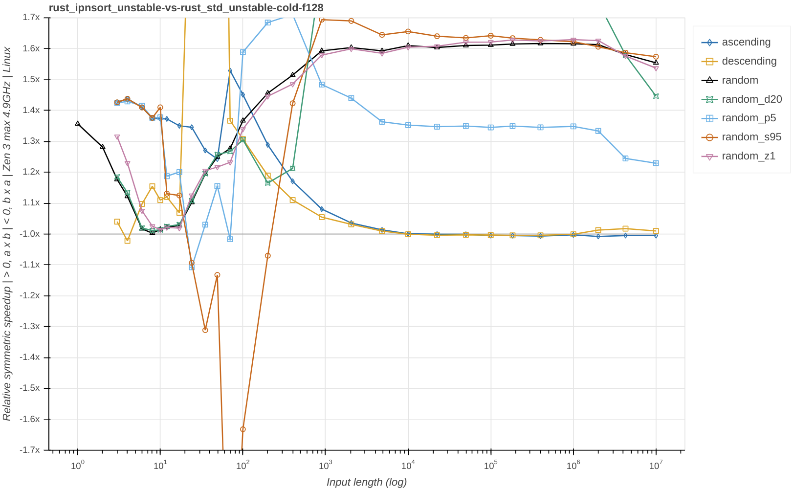

Observations:

- The relative speedup per pattern is distributed differently than `u64` and `i32`. One difference is a different small-sort. But this wouldn't explain why random_d20 shows a similar speedup to random. Given that random_d20 basically doesn't use the small-sort at larger input lengths. One key difference is the comparison function of f128. It generates a 64-bit floating point division, which has a 13.5 cycle latency on Zen 3. The partition and small-sort implementations of ipnsort are implemented in a way that allows it to make more efficient use of the multiple FP ports in the CPU execution engine. By issuing 2 comparisons within one loop iteration that are independent of each other, the effective latency can be cut in half.

#### Results Haswell

The micro-architecture called Haswell released in the year 2013 by Intel, is the successor to the very successful Sandy Bridge micro-architecture released in the year 2011, which then was followed by [Skylake](https://chipsandcheese.com/2022/10/14/skylake-intels-longest-serving-architecture/) in the year 2015. Broadwell is a node shrink of the same micro-architecture, which implies higher frequencies and or better energy efficiency, but the micro-architecture is essentially the same.

```
Linux 5.19
rustc 1.77.0-nightly (6ae4cfbbb 2024-01-17)
Intel i7-5500U 2-Core Processor (Broadwell micro-architecture)
CPU boost enabled.
```

Observations are omitted here to keep the size of this document in check.

##### 10k u64

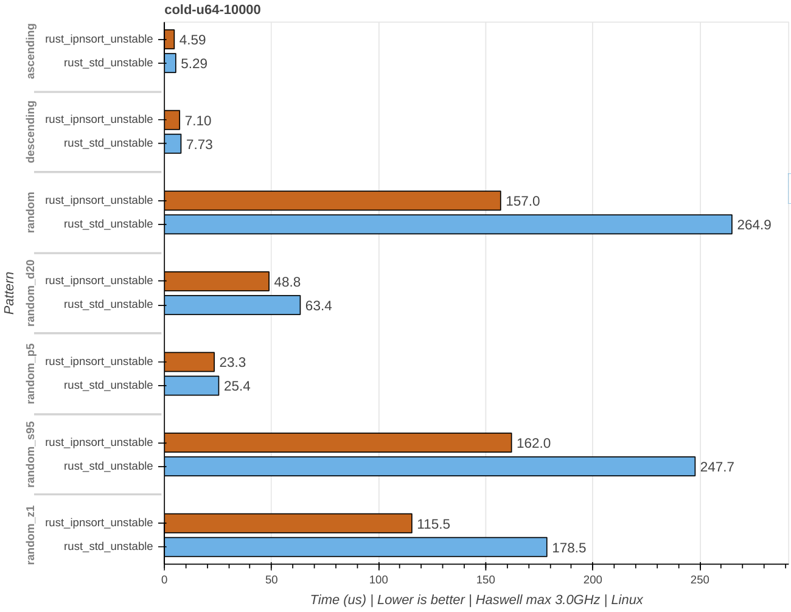

##### u64


##### i32

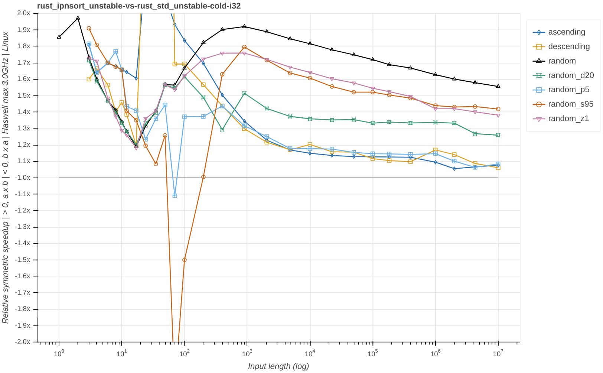

##### string

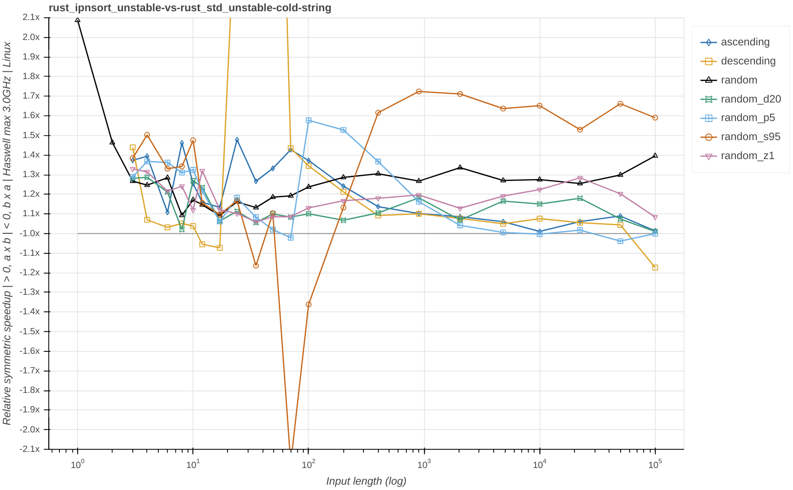

##### 1k


##### f128

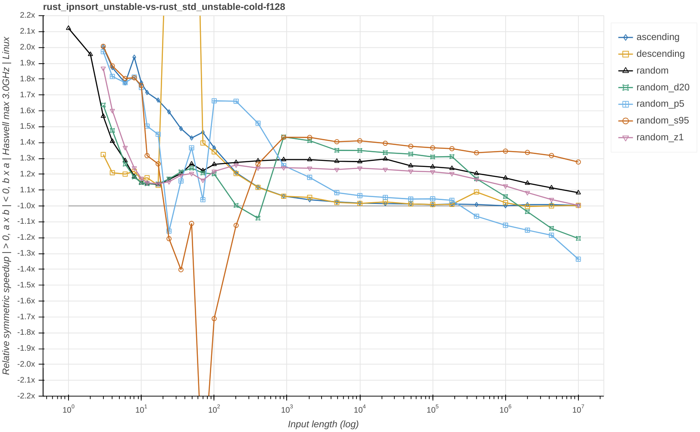

#### Results Firestorm

The P-core micro-architecture called Firestorm released in the year 2020 by Apple and found in the A14 and M1 family of chips, is one of the widest and most capable micro-architectures available to consumers to date. The machine-code generated for the Arm instruction set architecture (ISA) by LLVM is broadly similar to the machine-code generated for the x86 ISA, but there are meaningful differences one has to account for when writing cross-platform high-performance code. Like the aforementioned loop unrolling issue, as described in the second section called "Performance measurement", and more.

```
Darwin Kernel Version 22.6.0
rustc 1.77.0-nightly (6ae4cfbbb 2024-01-17)
Apple M1 Pro 6+2 Core Processor (Firestorm P-core micro-architecture)
CPU boost enabled.
```

Observations are omitted here to keep the size of this document in check.

##### 10k u64


##### u64


##### i32


##### string


##### 1k

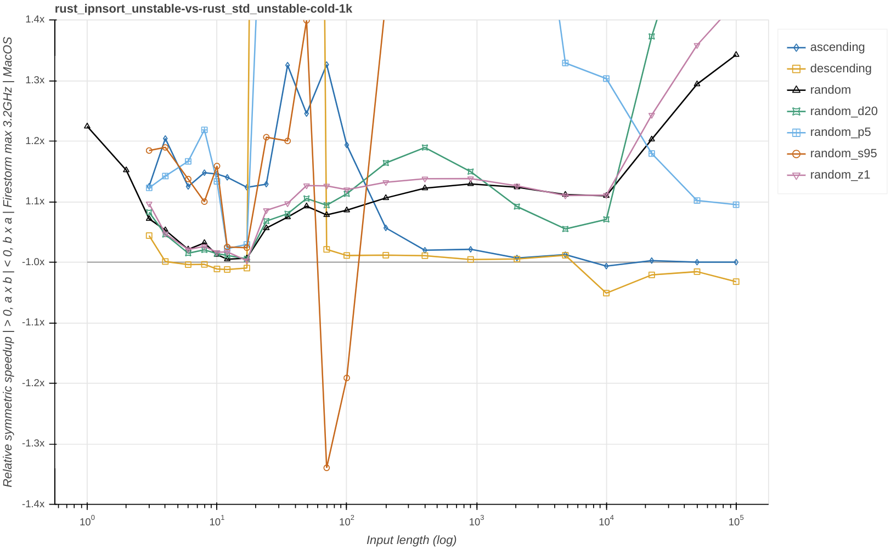

##### f128

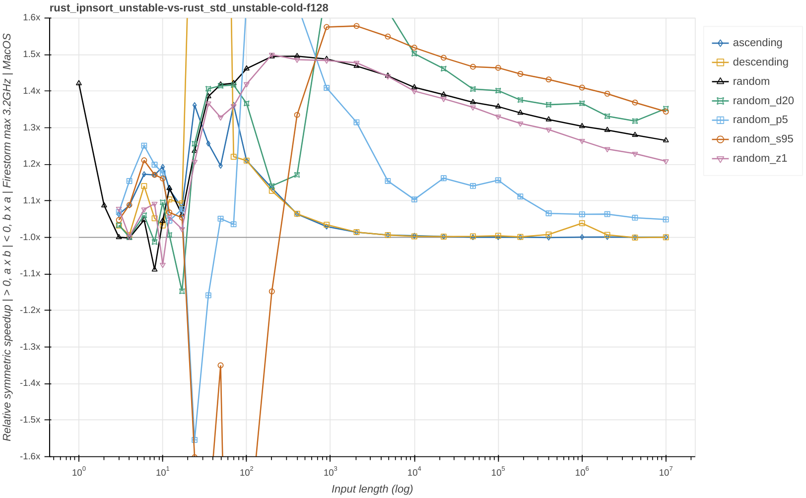

### Generic

The ipnsort implementation places the exact same type system trait bounds on its interface as the current `slice::sort_unstable`. In addition type introspection is performed via `mem::size_of`, and whether a type implements the `Copy` and or `Freeze` trait. None of which are restricted to builtin types, treating user-defined types and builtin types the same way. The fact that the performance characteristics and output order of `u64` vs `Cell<u64>` are noticeably different is novel, and could surprise users. However it's not a case of degrading the performance for `Cell<u64>` but rather improving it for `u64`, `String` and more. All of the current documented properties and more are still upheld. Alternatives would need to sacrifice some of the desired goals.

Result: The interface remains the same.

### Robust

> Guaranteed O(N * log(N)) worst case comparisons.

The same structure as pdqsort is used to guarantee O(N * log(N)) worst case comparisons. Once a recursion depth of 2 * log2(N) is reached, it switches to heapsort, which has a guarantee O(N * log(N)) worst case. This only applies to inputs N > 20. For smaller inputs O(N^2) is the average case because of the insertion sort.

> Guaranteed O(N) comparisons for fully ascending and descending inputs.

The first thing it does for inputs N > 20 is a single pass scan with early exit for fully ascending and descending inputs.

> Smooth run-time scaling with input length.

This point has in part been explored in the section on efficiency.

Plotting mean comparisons performed divided by N - 1 yields:


Observations:

- All three implementations, share hitting a worst case for insertion sort in the descending pattern, with the strongest measured log scaling outlier at length 17.
- random, random_d20 and random_z1 show similar scaling for N <= 20.
- ascending, random_p5 and random_s95 are nearly sorted for N <= 20 and can be handled with a minimal amount of comparison.
- pdqsort requires on average ~2N comparisons to sort fully ascending inputs and ~3N for fully descending inputs. std_unstable improves this to ~1N, however at the cost of greatly raising the number of comparisons performed for the random_s95 pattern. ipnsort performs exactly N - 1 comparisons for N > 20 for both ascending and descending inputs, decreasing the random_s95 penalty.
- ipnsort requires fewer comparisons for the random pattern, ~24.0N at input length 1e7, whereas std_unstable requires ~25.5N and pdqsort ~25.9N. This is caused by using comparison efficient sorting networks and merging in the small sort. This difference has a negligible impact on performance for types like `u64`, but can play a larger role for types that are expensive to compare.
- All pdqsort derived implementations show linear scaling for random_d20, demonstrating the O(K * log(N)) capabilities.

Result: ipnsort retains the existing best, average and worst case comparison characteristics, while avoiding the large penalty for random_s95. It also has a more defined and consistent transition between N <= 20 and N > 20.

### Binary-size

[Measuring](https://github.com/Voultapher/sort-research-rs/tree/9e4e774eec423a53cb82be34c9dc04482a8675e0/util/binary-size-measurement) the binary-size cost of an instantiation with a new type, when the implementation has already been instantiated, in short, monomorphized, with another type, yields:

Configuration                | Type     | Size current (bytes) | Size ipnsort (bytes)
-----------------------------|----------|----------------------|---------------------
release                      | `u64`    | 5088                 | 4496
release                      | `String` | 8600                 | 5616
release_lto_thin             | `u64`    | 5088                 | 4480
release_lto_thin             | `String` | 8584                 | 5712
release_lto_thin_opt_level_s | `u64`    | 4176                 | 3600
release_lto_thin_opt_level_s | `String` | 6232                 | 4736

The instruction cache (i-cache) is a shared resource and most programs do more than just call `slice::sort_unstable`. The actual i-cache usage will depend on the input length, type, pattern and ISA. For example the very common case of N <= 20 has ipnsort only use an inlined insertion sort using < 200 bytes of i-cache. The total size represents the upper limit worst case if everything is being used. Another aspect where binary-size is important, is the impact it has on the size of the final binary. This can be particularly important for embedded and Wasm targets. In cases where binary-size and or compile-time are prioritized above everything else [tiny_sort](https://github.com/Voultapher/tiny-sort-rs) is a better fit.

Result: ipnsort improves the binary-size in every tested scenario, compared to the current `slice::sort_unstable`. With a relatively larger gain for non-integer like types like `String`.

### Compile-time

Compile-times are often cited as one of Rust's issues, and the compiler team has invested considerable effort in improving compile-times. `slice::sort_unstable` is implementation wise one of the largest and most complicated functions in the standard library. As a consequence, the compile-time impact it has on user applications that call it directly or indirectly can be [substantial](https://github.com/rust-lang/rust/pull/108662#issuecomment-1453507495). To measure the impact on compile-time, a [test program](https://github.com/Voultapher/sort-research-rs/blob/main/util/compile_time_impact/src/main.rs) was created that contains a total of 256 sort instantiation, each with a newtype wrapper. 50% `u64`, 45% `String` and 5% `Cell<u64>`. This program is then clean compiled multiple times and wall and user time are evaluated.

Current `slice::sort_unstable`:

```
$ hyperfine --min-runs 5 --prepare 'cargo clean' 'cargo build'
  Time (mean ± σ):      4.013 s ±  0.033 s    [User: 4.751 s, System: 0.351 s]
  Range (min … max):    3.971 s …  4.060 s    5 runs

$ hyperfine --min-runs 5 --prepare 'cargo clean' 'cargo build --release'
  Time (mean ± σ):     16.602 s ±  0.107 s    [User: 16.876 s, System: 0.204 s]
  Range (min … max):   16.495 s … 16.769 s    5 runs
```

ipnsort:

```
$ hyperfine --min-runs 5 --prepare 'cargo clean' 'cargo build'
  Time (mean ± σ):      2.232 s ±  0.025 s    [User: 6.097 s, System: 0.458 s]
  Range (min … max):    2.205 s …  2.258 s    5 runs

$ hyperfine --min-runs 5 --prepare 'cargo clean' 'cargo build --release'
  Time (mean ± σ):      6.258 s ±  0.045 s    [User: 15.319 s, System: 0.248 s]
  Range (min … max):    6.213 s …  6.323 s    5 runs
```

The primary reported time is the wall clock, how much time it took overall. The User time represents the elapsed time across all used threads. And the System time represents the time spent in the kernel. ipnsort carefully splits its implementation into multiple modules, mostly avoiding run-time penalities for intra-module-only LTO builds. Which allows rustc to parallelize and make use of multi-threading capabilities. In contrast the current `slice::sort_unstable` is contained in a single module, and subsequently spends nearly all its time on the same thread, making poor use of multi-threading capabilities.

Result: If the system has multi-threading capabilities and time available during compilation, compiling ipnsort is significantly faster than the current `slice::sort_unstable`. Both for debug and release builds. If not, the time spent is similar, with a small regression for debug builds and a small improvement for release builds.

### In-place

The implementation is `no_std` and doesn't use the `alloc` crate. Stack arrays are used in the two small-sorts that use merging. Such scratch buffers are created with code like this `let mut scratch = MaybeUninit::<[T; LEN]>::uninit();`. The in-place network small-sort with relatively large sorting-networks is limited to types that satisfy `mem::size_of::<T>() <= 8`, which is used as heuristic to guess whether the hardware supports efficient in-place swapping. With a scratch buffer size of 32, this puts an upper limit at 256 bytes. And the other more general small-sort that also uses merging is limited by trait bounds to types where the scratch buffer is at most 4kB. x86_64 Linux defines by default a 8192kB stack size. By limiting the largest stack array to a size 2048 times smaller, they should pose no issues even on small and exotic platforms.

Result: No heap allocations are performed and explicit stack usage is limited to 4kB.

### Debug performance

While the run-time of optimized builds is generally more important than that of debug builds, it too can have significant impacts on users. Many CI systems run tests for debug builds, and a for example 10x regression for debug builds in a foundational component like `slice::sort_unstable` could significantly impact such scenarios. To measure the impact the sort-research-rs test suite execution time is measured.

Current `slice::sort_unstable`:

```
$ hyperfine --min-runs 5 "cargo t -- -Z unstable-options --shuffle-seed 778"
  Time (mean ± σ):      3.675 s ±  0.467 s    [User: 41.149 s, System: 0.439 s]
  Range (min … max):    3.250 s …  4.199 s    5 runs
```

ipnsort:

```
$ hyperfine --min-runs 5 "cargo t -- -Z unstable-options --shuffle-seed 778"
  Time (mean ± σ):      3.310 s ±  0.051 s    [User: 34.305 s, System: 0.402 s]
  Range (min … max):    3.261 s …  3.378 s    5 runs
```

Result: ipnsort improves debug performance both in terms of wall clock and total time across all CPU cores.

## Why should the Rust project adopt ipnsort?

### Reasons that speak against adoption

- The implementation contains significant amounts of new `unsafe` code. Despite extensive testing, fuzzing, partial model checking and code review, it's possible that users could encounter novel UB in their programs.
- On machines without multi-threading capabilities and or lacking free multi-threading resources, debug builds can suffer a small compile-time regression.

### Reasons that speak for adoption

- In addition to the continued [intuitive exception safety](https://github.com/Voultapher/sort-research-rs/blob/main/writeup/sort_safety/text.md#exception-safety) guarantee, ipnsort has a high chance of detecting strict weak ordering violations and reporting them to users via a panic, regardless of build configuration. This surfaces logic bugs earlier and more directly than the current implementation.
- The author went to great length to test and verify the memory safety of the implementation.
- ipnsort greatly improves the run-time performance across nearly every tested micro-architecture, input length, type and pattern combination.
- ipnsort improves binary-size for all tested types, with all tested compiler settings.
- ipnsort improves debug performance in the tested scenario.
- ipnsort greatly improves compile-times in the majority of tested scenarios, especially when multi-threaded resources are available.

## Author's conclusion and opinion

A sort implementation is a bit like a battery. It's relatively easy to be good in one specific property, but being good in most aspects and bad in none is *a lot* harder. The work on ipnsort consumed more than a thousand hours of my personal time in 2022 and 2023, I'm happy to have achieved my ambitious goals and even managed to innovate some aspects.

## Acknowledgements

None of this would have been possible without the work of all those that came before me. I stand on a mountain of research conducted by others. The domain specific contributions of Tony Hoare, Stefan Edelkamp, Armin Weiß and Orson Peters and many others have been invaluable in building ipnsort. The micro-architecture deep-dives by clamchowder were instrumental in analyzing and understanding the performance measurements.

## Thanks

TODO
