# Fast, small, robust: pick three. Introducing a novel branchless partition implementation.

Author: Lukas Bergdoll @Voultapher  
Date: 2023-12-04 (YYYY-MM-DD)

This is an introduction to the concepts of branchless programming and of a novel generic partition implementation, motivated with a gradual refinement of a basic [Lomuto partition](https://en.wikipedia.org/wiki/Quicksort#Lomuto_partition_scheme) implementation.

TL;DR: The widespread belief that Hoare based partition implementations are faster than Lomuto based ones, does not hold true under closer inspection. Improvements to generic unstable sort implementations over the last decade have by and far used Hoare based implementations, with [BlockQuicksort](https://arxiv.org/abs/1604.06697) introducing a mostly branchless version of it. While branchless Lomuto based implementations have been known for some time now, the implementation choices and details play a significant role. The novel aspect of the shown implementation is a combination of branchless Lomuto with a cyclic permutation to swap elements. The result is a runtime and binary-size efficient implementation, that generalizes well over various tested types and CPU micro-architectures.

---

Bias disclosure. The author of this analysis is the author of [ipnsort](https://github.com/Voultapher/sort-research-rs/tree/main/ipnsort).


## Introduction

A fundamental component of a [quicksort](https://en.wikipedia.org/wiki/Quicksort) implementation is the partition. The inputs to a partition usually consist of a list of elements, a comparison function that implements a [strict weak ordering](https://en.wikipedia.org/wiki/Weak_ordering#Strict_weak_orderings) and a pivot element that is used to compare all other elements to. The operation usually returns the number of elements that compared as less-than the pivot element. The returned count of less-than elements is subsequently used to sub-divide the list of elements in the next recursion steps. Two distinct and well known schemes exist that are `O(N)`, [unstable](https://en.wikipedia.org/wiki/Sorting_algorithm#Stability) and [in-place](https://en.wikipedia.org/wiki/In-place_algorithm):

- [Hoare partition](https://en.wikipedia.org/wiki/Quicksort#Hoare_partition_scheme), scans from left-to-right as well as right-to-left to identify two elements that are conceptually on the "wrong side", and swaps them. Once both iterations meet at some point in the input list, the algorithm is done.

- [Lomuto partition](https://en.wikipedia.org/wiki/Quicksort#Lomuto_partition_scheme), scans from left-to-right, conditionally swapping the current element with a remembered element left of the current element if the right element compares less-than the pivot element.

### Visualization

A blue flash means the value was compared to be less than the pivot, while a pink flash means the value was compared to be greater than or equal to the pivot.

#### Hoare

https://github.com/Voultapher/sort-research-rs/assets/6864584/ce292df3-a286-453d-86fc-da3226c11ba2

#### Lomuto

https://github.com/Voultapher/sort-research-rs/assets/6864584/9e77c830-192c-49fe-bff7-6fed29c940e9

## Performance analysis.

While micro-benchmarks exclusively focusing on the partition implementations are possible, a more representative picture can be obtained by slotting them into a high-performance quicksort based sort implementation. This will test them for various input lengths as well as realistic cache access patterns. ipnsort is used as sort implementations to benchmark and compare the partition implementations. ipnsort has a highly optimized small-sort, subsequently the partition has a major impact on overall runtime.

The benchmarks are performed with the [sort-research-rs](https://github.com/Voultapher/sort-research-rs) benchmark suite. It uses [criterion.rs](https://github.com/bheisler/criterion.rs) a statistically rigorous tool for measuring the performance of code. Further relevant details are introduced as they become relevant.

## Branchy Lomuto

The demonstrated code is written in Rust, but all of the concepts can be ported to other native languages like C and C++. A "branchy" implementation of the Lomuto partition scheme:

```rust
fn partition<T, F: FnMut(&T, &T) -> bool>(v: &mut [T], pivot: &T, is_less: &mut F) -> usize {
    let len = v.len();
    let v_base = v.as_mut_ptr();

    // SAFETY: The bounded loop ensures that `right` is always in-bounds. `v` and `pivot` can't
    // alias because of type system rules. The left side element `left` can only be incremented once
    // per iteration, so it is <= `right` which makes it in-bounds as a transitive property. From
    // this also follows that the call to `offset_from_unsigned` at the end is safe.
    unsafe {
        let mut left = v_base;

        for i in 0..len {
            let right = v_base.add(i);
            let right_is_lt = is_less(&*right, pivot);

            if right_is_lt {
                ptr::swap(left, right);
                left = left.add(1);
            }
        }

        left.offset_from_unsigned(v_base)
    }
}
```

Alternative implementations of branchy Lomuto that use no `unsafe` code with similar performance are possible. Later implementations below rely on `unsafe` code to reliably obtain branchless code-gen. The implementation above introduces concepts that will appear again.

### Generated machine-code

The core partition loop generates this machine-code with rustc 1.73 for `T == u64`. Using `opt-level=s` to avoid automatic loop unrolling, to simplify explanation:

```asm
; The register `rdi` holds the value of the pointer `v_base`, `rdx` the value of
; the pointer `left`, `r8` the value of the pointer `right`, `rcx` is the offset
; `i`, `rsi` is the length of the slice and `rax` holds the `u64` value of
; `pivot`.
.LBB0_2:
        ; Calculates the value of the pointer `right` and stores it into the
        ; register `r8`.
        mov     r8, qword ptr [rdi + 8*rcx]
        ; Compares the value of the current element as stored in `r8` with
        ; `pivot`.
        cmp     r8, rax
        ; Conditionally jumps to label .LBB0_3 based on the outcome of the `cmp`
        ; instruction above. This jump is what makes this code branchy. The
        ; result of the comparison depends on the distribution of values in the
        ; input. If it is fully random the chances for taking this branch is
        ; ~50%, which is the worst case for the branch direction predictor. In
        ; such a scenario on average every second time this is executed the
        ; branch predictor will have to re-steer the CPU frontend, which takes
        ; several cycles.
        jae     .LBB0_3
        ; Loads the value pointed to by `left` into the register `r9`. The part
        ; until .LBB0_3 is executed if `is_less(&*right, pivot)` evaluates to
        ; true. The next three mov instructions perform the swap.
        mov     r9, qword ptr [rdx]
        ; Stores a copy of the value pointed to by `right` into `left`.
        mov     qword ptr [rdx], r8
        ; Stores a copy of the value that was saved from `left` into `r9` into
        ; `right`.
        mov     qword ptr [rdi + 8*rcx], r9
        ; Increments the pointer `left`.
        add     rdx, 8
.LBB0_3:
        ; Increments the value `i` by 1.
        inc     rcx
        ; Compares `i` to `len`.
        cmp     rsi, rcx
        ; Conditionally jumps to the start of the loop at label .LBB0_2.
        jne     .LBB0_2
```

### Performance measurement

The benchmarks are performed on the following machine unless specified otherwise:

```
Linux 6.5
rustc 1.75.0-nightly (aa1a71e9e 2023-10-26)
AMD Ryzen 9 5900X 12-Core Processor (Zen 3 micro-architecture)
CPU boost enabled.
```

The micro-architecture called Zen 3 released in the year 2020 by AMD, is in the year 2023 a widely used choice for cloud computing, gaming and more.

High-performance sort implementations tend to exploit patterns in the input to be more efficient. For example ipnsort can sort fully ascending and descending patterns in `O(N)`, and inputs with `K` distinct values in `O(K * log(N))`. What constitutes a representative input for real world scenarios can only be decided on a case by case basis. The used pattern called `random` are random numbers generated by the [rand crate](https://github.com/rust-random/rand) `StdRng::gen`. They are not uniformly distributed, and of cryptographic quality. Based on limited data like the [vqsort paper](https://arxiv.org/pdf/2205.05982.pdf) patterns that follow a [Zipfian distribution](https://en.wikipedia.org/wiki/Zipf%27s_law) are likely more representative of real world data. To simplify reasoning about the results, the initial benchmarks focus on pure random inputs.

The type that is being sorted is an unsigned 64-bit integer `u64`. It has the same layout as `usize` and `size_t` in C and C++ on 64-bit machines. `usize` is a common type used for indices.

The x-axis shows input length, which maps to `len` in the code. And the y-axis denotes throughput for one specific input size. So a value of 13 at input length 1_000 would mean the implementation can sort 13_000 slices in one second, where each slice has `len == 1_000`.

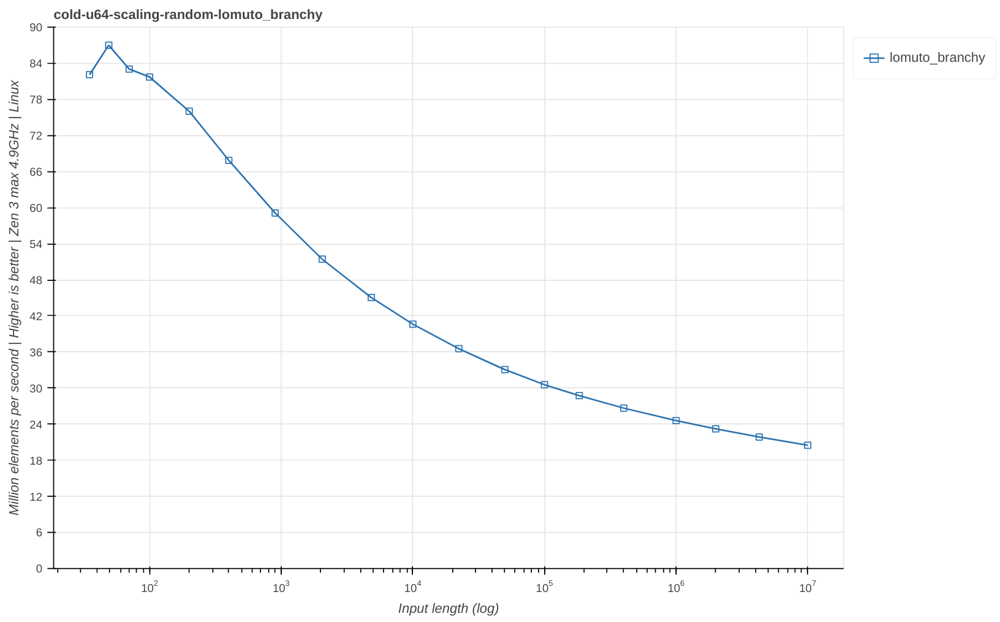

Observations:

- The throughput starts at ~82 million `u64` elements per second for `len == 35`.
- The throughput peaks at ~87 million elements per second for `len == 49`, from there it goes down to eventually ~20 million elements per second for `len == 10_000_000`, or put differently 500ms per slice of `len == 10_000_000`.
- Zen 3 is a relatively complex micro-architecture, with a three level data caching setup. Inputs on the left side easily fit into the L1 data cache. Inputs on the right end go past the capacity of the L3 data cache. While data access latency and bandwidth are major factors, there are other factors at play as well. More on that below.

## Branchless Lomuto

A branchless implementation of the Lomuto partition scheme:

```rust
/// Swap two values pointed to by `x` and `y` if `should_swap` is true.
#[inline(always)]
pub unsafe fn branchless_swap<T>(x: *mut T, y: *mut T, should_swap: bool) {
    // This is a branchless version of swap if.
    // The equivalent code with a branch would be:
    //
    // if should_swap {
    //     ptr::swap(x, y);
    // }

    // SAFETY: the caller must guarantee that `x` and `y` are valid for writes
    // and properly aligned.
    unsafe {
        // The goal is to generate cmov instructions here.
        let x_swap = if should_swap { y } else { x };
        let y_swap = if should_swap { x } else { y };

        let y_swap_copy = ManuallyDrop::new(ptr::read(y_swap));

        ptr::copy(x_swap, x, 1);
        ptr::copy_nonoverlapping(&*y_swap_copy, y, 1);
    }
}

fn partition<T, F: FnMut(&T, &T) -> bool>(v: &mut [T], pivot: &T, is_less: &mut F) -> usize {
    let len = v.len();
    let v_base = v.as_mut_ptr();

    // SAFETY: The bounded loop ensures that `right` is always in-bounds. `v` and `pivot` can't
    // alias because of type system rules. The left side element `left` can only be incremented once
    // per iteration, so it is <= `right` which makes it in-bounds as a transitive property. From
    // this also follows that the call to `offset_from_unsigned` at the end is safe.
    unsafe {
        let mut left = v_base;

        for i in 0..len {
            let right = v_base.add(i);
            let right_is_lt = is_less(&*right, pivot);

            branchless_swap(left, right, right_is_lt);
            left = left.add(right_is_lt as usize);
        }

        left.offset_from_unsigned(v_base)
    }
}
```

The branchy implementation has two operations that are only done if the right element is less-than the pivot `if right_is_lt { .. }`. Branchless can be a confusing name. There is still conditional logic, but it happens every time, instead of being skipped conditionally by a jump. Maybe jumpless is an easier to understand name. The conditional increment can be turned into a branchless conditional increment by always computing a new value for `left`, interpreting the comparison result as a value that is added, which is either 0 or 1, `left = left.add(right_is_lt as usize);`. There are several ways to implement a function with the same semantics as `branchless_swap`. The shown version reliably generates good machine-code with LLVM.

### Visualization

Same as the branchy Lomuto above.

### Generated machine-code

The core partition loop generates this machine-code with rustc 1.73 for `T == u64`. Using `opt-level=s` to avoid automatic loop unrolling, to simplify explanation:

```asm
; The register `rdi` holds the value of the pointer `right`, `rcx` holds the
; value of the pointer `left`, `rsi` starts as the length of the slice and `rax`
; holds the `u64` value of `pivot`.
.LBB0_2:
        ; Zeros the `edx` register.
        xor     edx, edx
        ; Loads the value pointed to by `right` and compares it to `pivot`.
        ; Stores the comparison result into the EFLAGS register.
        cmp     qword ptr [rdi], rax
        ; Stores a copy of the value pointed to by `left` into `r8`.
        mov     r8, rcx
        ; Conditionally stores a copy of the value pointed to by `right` into
        ; `r8`, or does nothing, based on the value of the EFLAGS register.
        cmovb   r8, rdi
        ; Stores a copy of the value pointed to by `right` into `r9`.
        mov     r9, rdi
        ; Conditionally stores a copy of the value pointed to by `left` into
        ; `r9`, or does nothing, based on the value of the EFLAGS register.
        cmovb   r9, rcx
        ; Conditionally stores a 0 or 1 into the `dl` register, based on the
        ; value of the EFLAGS register.
        setb    dl
        ; Loads the value pointed to by `y_swap` in the register `r9` into `r9`.
        mov     r9, qword ptr [r9]
        ; Loads the value pointed to by `x_swap` in the register `r8` into `r8`.
        mov     r8, qword ptr [r8]
        ; Stores a copy of the value in `r8` into `left`.
        mov     qword ptr [rcx], r8
        ; Stores a copy of the value in `r9` into `right`.
        mov     qword ptr [rdi], r9
        ; Computes the new value of `left`. The registers dl/dx/edx/rdx alias
        ; 8/16/32/64 bit regions of the same underlying register. The only
        ; information used is a single bit, the comparison result. In essence
        ; setb together with lea (load effective address) perform the
        ; conditional increment. new = old + (8 * 0/1)
        lea     rcx, [rcx + 8*rdx]
        ; Sets `right` to the next value in `v`.
        add     rdi, 8
        ; Decrements the inverted loop counter by 1.
        dec     rsi
        ; Checks if the decrement has reached zero, if not, the loop continues.
        jne     .LBB0_2
```

### Performance simulation

One way to analyze and understand the performance of a small piece of code is to simulate it. There are tools like [uiCA](https://uica.uops.info/) and [llvm-mca](https://www.llvm.org/docs/CommandGuide/llvm-mca.html) that specialize in doing so. The result is the estimated number of cycles to execute one loop iteration on average, when running the loop many times in a row. Modern CPUs are [superscalar](https://en.wikipedia.org/wiki/Superscalar_processor), [out-of-order](https://en.wikipedia.org/wiki/Out-of-order_execution) and [speculative](https://en.wikipedia.org/wiki/Speculative_execution). This means under the right circumstances they can execute multiple instructions in parallel each cycle, re-order the sequence in which the instructions are executed and speculatively execute instructions while dependencies are still missing. What these tools typically do not account for is the effects of memory latency. For example in this context `qword ptr [rdi]` loads the value `right`, and depending on a variety of factors the CPU might or might not be able to hide the latency it takes to load this value. The ability of the out-of-order engine to hide latency also depends on the quantity of latency it is trying to hide. Memory access latency on Zen 3 can go from 4 cycles for L1d to millions of cycles if the memory page has been swapped to disk by the operating system. Despite their limitations, these tools can help gain more insights into small blocks of code, by providing information on inter-instruction dependencies. The following tool output is limited to the predicted block throughput.

| Tool     | Skylake | Sunny Cove |
|----------|---------|------------|
| uiCA     | 3.5     | 2.96       |
| llvm-mca | 2.82    | 2.82       |

### Performance measurement

The benchmarked branchless versions are not exactly the same as the ones analyzed here. The benchmarked versions perform manual loop unrolling because LLVM 16 as used by the tested rustc auto-unrolls the partition loop on x86 but not on Arm. In addition they also workaround [sub-optimal code-gen](https://github.com/rust-lang/rust/issues/117128) for branchless pointer increments. The tested versions are found [here](https://github.com/Voultapher/sort-research-rs/tree/lomcyc-partition-bench/src/other/partition).

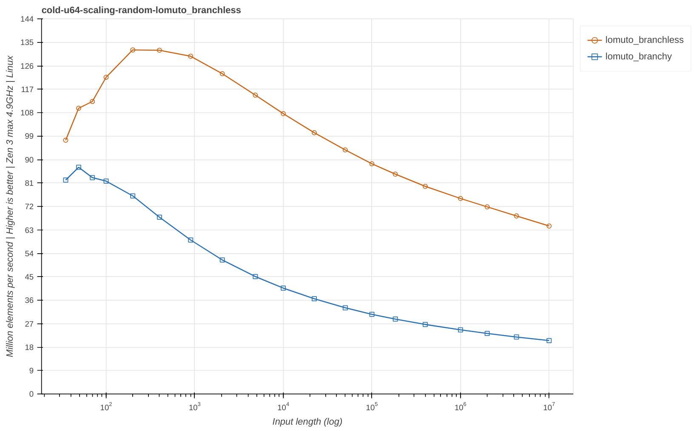

Observations:

- Even though the loop body of lomuto_branchless consists of significantly more instructions than lomuto_branchy, lomuto_branchless is 2-3x more efficient for this kind of input pattern over the total runtime of the sort implementation. It achieves this mainly by avoiding costly CPU re-steers caused by mispredicted branches. The partition makes up only one part of the total ipnsort runtime. Sub-partitions with `len <= 32` are handled by a dedicated [small-sort](https://github.com/Voultapher/sort-research-rs/blob/lomcyc-partition-bench/ipnsort/src/smallsort.rs#L414). The speedup for the partition in isolation is ~3.7-3.9x.
- lomuto_branchless reaches peek measured throughput at input length 200. There are two opposing factors at play. The total amount of work that needs to be performed grows by `O(N x log(N))` where `N` is the input length. As well as the CPU caches, which have an inverse effect on throughput. The more similar work is performed the better the relevant caches will help in completing the work as fast as possible. The equilibrium point for these two factors will depend on the kind of work performed as well as micro-architectural details. The cold benchmarks perform a step before each measurement that [overwrites](https://github.com/Voultapher/sort-research-rs/blob/lomcyc-partition-bench/benches/modules/util.rs#L128) the first level instruction cache and branch-prediction caches with unrelated values. This measures a scenario where prior parts of a hypothetical larger program already loaded or generated the data that will be sorted into the suitable data caches. In this scenario the first level instruction cache and branch predictor caches are trained on other work than the sort implementation. "Hot" benchmarks are also possible but arguably [of little value](https://github.com/Voultapher/sort-research-rs/blob/main/writeup/intel_avx512/text.md#hot-benchmarks), as they measure a scenario where a program does nothing but sort inputs, which is unlikely to be a realistic use case.

### Efficiency of branchless code

If a CPU fetches an instruction from memory, decodes said instruction, executes it and then writes the result back to memory one step after the other, without performing any other work in parallel on the same core, branch prediction is pointless. The need for branch prediction only arises because starting in the 1970s CPUs became [pipelined](https://en.wikipedia.org/wiki/Instruction_pipelining). In the year 2023 they commonly have 10 or more pipeline stages that each instruction must pass through. The information whether or not a branch will be taken, is a required input for the execution phase of the pipeline. A pipelined CPU has to solve the issue of fetching the instructions that follow the ones further down the pipeline, while they are still passing through the steps and haven't completed yet. This creates a dependency within the pipeline. The information about which instructions need to be fetched at the start of the pipeline may depend on the outcome of instructions still inside the pipeline. Looking at a yet un-decoded instruction the CPU frontend doesn't know if this instruction will be a taken branch. The efficiency gained by pipelining depends on being able to "feed" the CPU frontend the correct location of upcoming instructions.

> Where will a yet un-decoded instruction jump to?

This crucial question at the start of a CPU pipeline is the core of branch prediction. The most common answer is nowhere, because the instruction isn't a jump. But it could also be nowhere, because it is a conditional branch and the condition is not met. Most contemporary designs choose a form of [predictive execution](https://en.wikipedia.org/wiki/Speculative_execution#Predictive_execution). Where the CPU performs an educated guess and uses that as basis for speculative execution, discarding work that turns out to be based on an incorrect guess and redoing the work with the now known correct jump target. Branch misprediction is a kind of [pipeline control hazard](https://en.wikipedia.org/wiki/Hazard_(computer_architecture)#Control_hazards_(branch_hazards_or_instruction_hazards)). The prediction is usually history and correlation based. lomuto_branchy hits the worst case for the branch direction predictor, where the likelihood of taking the `if right_is_lt` branch is ~50%, rendering educated guesses based on previous history by the branch predictor useless. The only thing worse for the Zen 3 branch predictor would be so many branches at play that it can't answer the question without creating a large pipeline bubble by missing both the L1 and L2 branch target buffer ([BTB](http://www-ee.eng.hawaii.edu/~tep/EE461/Notes/ILP/buffer.html)), and then still answering the question wrong 50% of the time. The details and tradeoffs of branch prediction depend on the micro-architectural details. Many modern branch predictors treat jumps with static target locations, like the jump to the start of a loop, and jumps with dynamic target locations, as for example generated by a `match`, mostly the same way. The benefits of stalling the CPU pipeline until an instruction is known to be a jump and what the static target address of it is, are often [not worth it](https://stackoverflow.com/a/51848422).

A theoretical micro-architecture could combine predictive execution and [eager execution](https://en.wikipedia.org/wiki/Speculative_execution#Eager_execution) capabilities. Employing prediction for the loop jump, and eager execution for the difficult to predict jump in the loop body of lomuto_branchy. Such a design could possibly execute the instructions for lomuto_branchy more efficiently than lomuto_branchless.

## Branchless Lomuto with cyclic permutation

A novel branchless implementation of the Lomuto partition scheme paired with a
cyclic permutation, invented by the author Lukas Bergdoll:

```rust
struct GapGuard<T> {
    pos: *mut T,
    value: ManuallyDrop<T>,
}

impl<T> Drop for GapGuard<T> {
    fn drop(&mut self) {
        unsafe {
            ptr::copy_nonoverlapping(&*self.value, self.pos, 1);
        }
    }
}

fn partition<T, F: FnMut(&T, &T) -> bool>(v: &mut [T], pivot: &T, is_less: &mut F) -> usize
{
    let len = v.len();
    let v_base = v.as_mut_ptr();

    if len == 0 {
        return 0;
    }

    // SAFETY: We checked that `len` is more than zero, which means that reading `v_base` is safe to
    // do. From there we have a bounded loop where `v_base.add(i)` is guaranteed in-bounds. `v` and
    // `pivot` can't alias because of type system rules. The drop-guard `gap` ensures that should
    // `is_less` panic we always overwrite the duplicate in the input. The left side element
    // `gap.pos` can only be incremented once per iteration, so it is <= `right` which makes it
    // in-bounds as a transitive property.
    unsafe {
        let mut lt_count = is_less(&*v_base, pivot) as usize;

        // We need to create the duplicate of the first element as pointed to by `v_base` only
        // *after* it has been observed by `is_less`, this is important for types that are not
        // `Freeze`.
        let mut gap = GapGuard {
            pos: v_base,
            value: ManuallyDrop::new(ptr::read(v_base)),
        };

        for i in 1..len {
            let right = v_base.add(i);
            let right_is_lt = is_less(&*right, pivot);

            ptr::copy_nonoverlapping(right, gap.pos, 1);
            gap.pos = gap.pos.add(right_is_lt as usize);

            let new_left_dst = if right_is_lt { right } else { gap.pos };
            ptr::copy(gap.pos, new_left_dst, 1);
        }

        lt_count += gap.pos.offset_from_unsigned(v_base);

        lt_count

        // `gap` goes out of scope and copies the temporary on-top of the last duplicate value.
    }
}
```

A [cyclic permutation](https://en.wikipedia.org/wiki/Cyclic_permutation) is a way to swap two sets of elements, amortizing the use of a temporary. The idea to use a cyclic permutation instead of a swap in a partition implementation was popularized by BlockQuicksort in a branchless context, but the idea goes all the way back to Tony Hoare the inventor of quicksort in his 1962 paper [Quicksort](https://academic.oup.com/comjnl/article/5/1/10/395338). A visualized example:

```
// Example cyclic permutation to swap A,B,C,D with W,X,Y,Z
//
// A -> TMP
// Z -> A   | Z,B,C,D ___ W,X,Y,Z
//
// Loop iter 1
// B -> Z   | Z,B,C,D ___ W,X,Y,B
// Y -> B   | Z,Y,C,D ___ W,X,Y,B
//
// Loop iter 2
// C -> Y   | Z,Y,C,D ___ W,X,C,B
// X -> C   | Z,Y,X,D ___ W,X,C,B
//
// Loop iter 3
// D -> X   | Z,Y,X,D ___ W,D,C,B
// W -> D   | Z,Y,X,W ___ W,D,C,B
//
// TMP -> W | Z,Y,X,W ___ A,D,C,B
```

A swap requires three operations, and the amortized cost of a cyclic permutation is two operations. While this sounds like it would be more efficient by virtue of performing less work, the picture is more complicated when considering the actual generated machine code.

```rust
type TestT = u64;

unsafe fn swap(a: *mut TestT, b: *mut TestT) {
    ptr::swap(a, b);
}

unsafe fn cyclic_permute_swap(a: *mut TestT, b: *mut TestT) {
    ptr::copy(a, b, 1);
    ptr::copy_nonoverlapping(b.add(1), a, 1);
}
```

Machine-code generated by rustc 1.73 for x86_64:

```asm
example::swap:
        mov     rax, qword ptr [rdi]
        mov     rcx, qword ptr [rsi]
        mov     qword ptr [rdi], rcx
        mov     qword ptr [rsi], rax
        ret

example::cyclic_permute_swap:
        mov     rax, qword ptr [rdi]
        mov     qword ptr [rsi], rax
        mov     rax, qword ptr [rsi + 8]
        mov     qword ptr [rdi], rax
        ret
```

Both functions perform two loads from memory into registers and two stores from registers back into memory locations. In a loop both versions take ~2 cycles, assuming memory latency is hidden. The improvements in efficiency for `TestT = u64` stem from a change in logic that allows the implementation to perform only one branchless pointer select instead of two. Further improvements are gained for types larger than 8 bytes, in such cases `cyclic_permute_swap` produces more efficient machine-code. For example with `TestT = [u64; 2]` it uses four instead of six `movups` instructions.

### Visualization

https://github.com/Voultapher/sort-research-rs/assets/6864584/30fcdc58-b863-4538-ad72-6a773c07e9fa

### Generated machine-code

The core partition loop generates this machine-code with rustc 1.73 for `T == u64`. Using `opt-level=s` to avoid automatic loop unrolling, to simplify explanation:

```asm
; The register `rdx` holds the value of the pointer `right`, `rdi` holds the
; value of the pointer `gap.pos`, `rsi` starts as the length of the slice and
; `rcx` holds the `u64` value of `pivot`.
.LBB1_3:
        ; Loads the value pointed to by `right` into `r8`.
        mov     r8, qword ptr [rdx]
        ; Zeros the `r9d` register.
        xor     r9d, r9d
        ; Compares the value of the current element as stored in `r8` with
        ; `pivot`.
        cmp     r8, rcx
        ; Conditionally stores a 0 or 1 into the `r9b` register.
        setb    r9b
        ; Stores the `u64` value in `r8` into the value pointed to by `gap.pos`.
        mov     qword ptr [rdi], r8
        ; Computes the new value of `gap.pos`, in essence a conditional
        ; increment.
        lea     rdi, [rdi + 8*r9]
        ; Stores a copy of the value pointed to by `gap.pos` into `r8`.
        mov     r8, rdi
        ; Conditionally stores a copy of the value pointed to by `right` into
        ; `r8`, or does nothing.
        cmovb   r8, rdx
        ; Loads the value pointed to by `gap.pos` into `r9`.
        mov     r9, qword ptr [rdi]
        ; Stores the value pointed to by `gap.pos` in register `r9` into the
        ; value pointed to by `new_left_dst` in register `r8`.
        mov     qword ptr [r8], r9
        ; Sets `right` to the next value in `v`.
        add     rdx, 8
        ; Decrements the inverted loop counter by 1.
        dec     rsi
        ; Checks if the decrement has reached zero, if not, the loop continues.
        jne     .LBB1_3
```

### Performance simulation

| Tool     | Skylake | Sunny Cove |
|----------|---------|------------|
| uiCA     | 3.0     | 2.64       |
| llvm-mca | 6.11    | 6.11       |

llvm-mca claims the loop iteration will take ~6 cycles, which is much higher than before. As before it doesn't seem to have different models for Skylake and Sunny Cove, treating the two micro-architectures the same, even though Sunny Cove is [arguably](https://chipsandcheese.com/2022/06/07/sunny-cove-intels-lost-generation/) one of the largest architectural advances for Intel in recent times. Testing the partition implementation in isolation shows it takes in the range of two to three cycles per element, which matches the simulation of uiCA here.

### Performance measurement

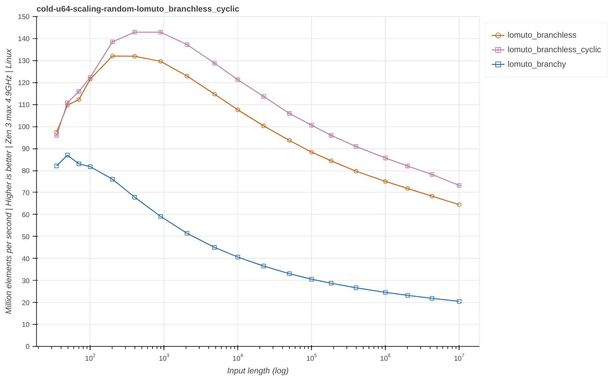

Observations:

- Up to input length 100 the two branchless implementations perform relatively similar to each other, after which lomuto_branchless_cyclic shows better throughput. This is mainly caused by performing the same task in fewer instructions, as backed by the performance simulation.
- The median relative symmetric speedup for lomuto_branchless_cyclic vs lomuto_branchless is 1.13x for the `random` pattern across the tested range of input lengths. This is calculated by taking each measured input length and producing a relative symmetric speedup, where 1.5x means that A is 1.5x faster than B, and -1.5x means B is 1.5x faster than A. This approach avoids biasing one direction over the other, and symmetric effects can cancel each other out.

## Branchless Lomuto with cyclic permutation optimized

In the course of a conversation regarding lomuto_branchless_cyclic, [Orson Peters](https://orlp.net/) discovered a way to further optimize the code, removing the need for cmov style pointer selects. A detailed description of the algorithmic side of things can be found in his [blog post](https://orlp.net/blog/branchless-lomuto-partitioning/).

### Rust implementation

```rust
fn partition<T, F: FnMut(&T, &T) -> bool>(v: &mut [T], pivot: &T, is_less: &mut F) -> usize {
    let len = v.len();
    if len == 0 {
        return 0;
    }

    // SAFETY: We checked that `len` is more than zero, which means that reading `v_base` is safe to
    // do. From there we have a bounded loop where `v_base.add(i)` is guaranteed in-bounds. `v` and
    // `pivot` can't alias because of type system rules. The drop-guard `gap` ensures that should
    // `is_less` panic we always overwrite the duplicate in the input. `gap.pos` stores the previous
    // value of `right` and starts at `v_base` and so it too is in-bounds. We never pass the saved
    // `gap.value` to `is_less` while it is inside the `GapGuard` thus any changes via interior
    // mutability will be observed.
    unsafe {
        let v_base = v.as_mut_ptr();
        let mut left = v_base;

        let mut gap = GapGuard {
            pos: v_base,
            value: ManuallyDrop::new(ptr::read(v_base)),
        };

        for i in 1..len {
            let right = v_base.add(i);
            let right_is_lt = is_less(&*right, pivot);

            ptr::copy(left, gap.pos, 1);
            ptr::copy_nonoverlapping(right, left, 1);

            gap.pos = right;
            left = left.add(right_is_lt as usize);
        }

        ptr::copy(left, gap.pos, 1);
        ptr::copy_nonoverlapping(&*gap.value, left, 1);
        mem::forget(gap);

        let gap_value_is_lt = is_less(&*left, pivot);
        left = left.add(gap_value_is_lt as usize);

        let lt_count = left.offset_from_unsigned(v_base);
        lt_count
    }
}
```

Conceptually lomuto_branchless_cyclic_opt is similar to lomuto_branchless_cyclic, but it avoids the pointer select in lomuto_branchless_cyclic by performing the gap overwrite from left to right instead of the other way around. What remains is a partition loop containing the comparison with the pivot, two unconditional copies, and one branchless pointer increment.

### Visualization

https://github.com/Voultapher/sort-research-rs/assets/6864584/3a27dc45-6a39-4736-8d97-7c665c61208f

### Generated machine-code

The core partition loop generates this machine-code with rustc 1.73 for `T == u64`. Using `opt-level=s` to avoid automatic loop unrolling, to simplify explanation:

```asm
; The register `rdi` holds the value of the pointer `right.sub(1)` which aliases
; with `gap.pos`, `rcx` holds the value of the pointer `left`, `rsi` starts as
; the length of the slice minus one and `rdx` holds the `u64` value of `pivot`.
.LBB1_7:
        ; Loads the value pointed to by `right` into `r8`.
        mov     r8, qword ptr [rdi + 8]
        ; Loads the value pointed to by `left` into `r9`.
        mov     r9, qword ptr [rcx]
        ; Stores the value pointed to by `left` in register `r9` into the
        ; value pointed to by `gap.pos` in register `rdi`.
        mov     qword ptr [rdi], r9
        ; Sets `right` to the next value in `v`.
        add     rdi, 8
        ; Zeros the `r9d` register.
        xor     r9d, r9d
        ; Compares the value of the current element as stored in `r8` with
        ; `pivot`.
        cmp     r8, rdx
        ; Conditionally stores a 0 or 1 into the `r9b` register.
        setb    r9b
        ; Stores the `u64` value in `r8` into the value pointed to by `left`.
        mov     qword ptr [rcx], r8
        ; Computes the new value of `left`, in essence a conditional increment.
        lea     rcx, [rcx + 8*r9]
        ; Decrements the inverted loop counter by 1.
        dec     rsi
        ; Checks if the decrement has reached zero, if not, the loop continues.
        jne     .LBB1_7
```

### Performance simulation

| Tool     | Skylake | Sunny Cove |
|----------|---------|------------|
| uiCA     | 2.97    | 2.02       |
| llvm-mca | 6.06    | 6.06       |

Again llvm-mca yields nonsense performance predictions. Slight changes to the code can make llvm-mca go from un-reasonable to reasonable and vice-versa.

### Performance measurement

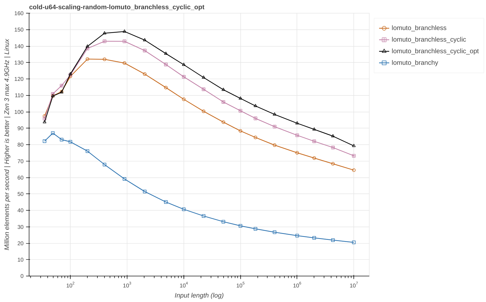

Observations:

- Once again, the reduction in work performed leads to an improvement of overall efficiency.
- The median relative symmetric speedup for lomuto_branchless_cyclic_opt vs lomuto_branchless_cyclic is 1.06x for the `random` pattern across the tested range of input lengths.

## Results for other implementations

A broader picture can be obtained by comparing the analyzed implementations with state-of-the-art branchless implementations:

- [`hoare_block`](https://github.com/Voultapher/sort-research-rs/blob/lomcyc-partition-bench/src/other/partition/hoare_block.rs) is the BlockQuicksort based implementation found in the rustc standard library implementation of `slice::sort_unstable` as of rustc version 1.74. It performs two phases, one where it fills, usually one of two, blocks with the comparison results for values on the left or right side. Storing the results of comparisons without swapping any values, which can be done in a branchless loop. It then performs a cyclic permutation to swap values between the blocks. This avoids branch misprediction as consequence of the user-data dependent comparison result, but adds a significantly amount of control logic. Which negatively impacts the binary-size and compile-time.
- [`hoare_crumsort`](https://github.com/Voultapher/sort-research-rs/blob/lomcyc-partition-bench/src/other/partition/hoare_crumsort.rs) is a Rust port of the BlockQuicksort derived implementation found in [crumsort](https://github.com/scandum/crumsort). It combines the block creation and swapping phases into one phase, performing a cyclic permutation with a block of elements in-flight. The crumsort partition implementation scheme is neither [exception safe](https://github.com/Voultapher/sort-research-rs/blob/main/writeup/sort_safety/text.md#exception-safety) nor [observation safe](https://github.com/Voultapher/sort-research-rs/blob/main/writeup/sort_safety/text.md#observation-safety). Given that is has a variable number of duplicates in-flight it is unknown what the performance impact would be of adjusting the implementation to conform to the required safety properties explained [here](https://github.com/Voultapher/sort-research-rs/blob/main/writeup/sort_safety/text.md).
- [`hoare_branchy`](https://github.com/Voultapher/sort-research-rs/blob/lomcyc-partition-bench/src/other/partition/hoare_branchy.rs) is a basic branchy implementation of the Hoare partition scheme.

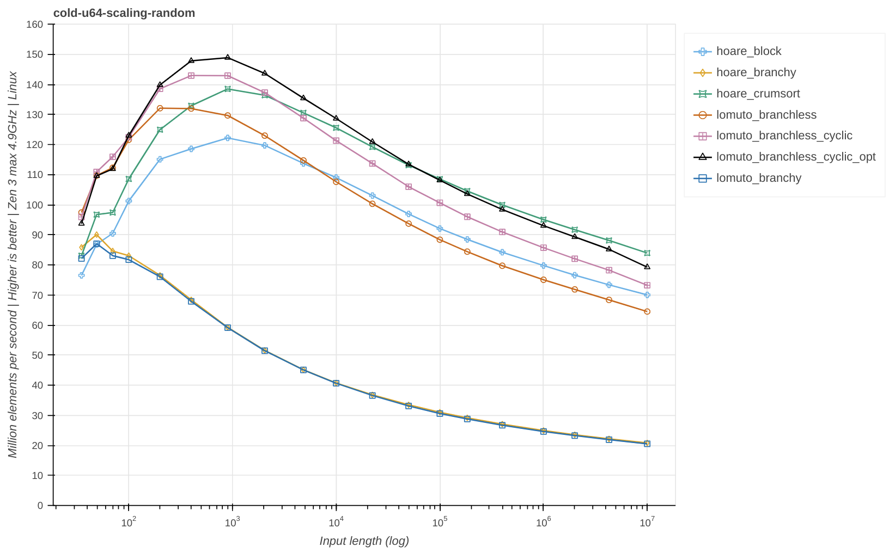

Observations:

- hoare_branchy and lomuto_branchy have pretty much the same performance.
- Both hoare_block and hoare_crumsort have to handle partial blocks at the end of the partition function, which adds significant amounts of code and with that, complexity, binary-size and opportunities for branch misprediction. The recursive nature of quicksort has it call the partition function a few times for large sub-slices and many times for small sub-slices, see the graph below. This manifests in comparatively lower throughput for smaller input lengths.
- Starting between input length 1e5 and 1e6, hoare_crumsort overtakes lomuto_branchless_cyclic_opt in terms of throughput for the random pattern. This is likely caused by the reduced write pressure on the memory sub-system. hoare_crumsort performs only a single write per element, while lomuto_branchless_cyclic_opt does two. This coincides with input lengths that no longer fit into the L2 data cache.
- Tested in isolation hoare_block and hoare_crumsort are faster for large inputs than the tested branchless lomuto implementations. Disregarding other types, binary-size, compile-times and usage safety an optimal approach would use hoare_crumsort for large sub-slices and lomuto_branchless_cyclic_opt for smaller sub-slices.
- At input length 1e7, the fastest partition implementation improves total sort throughput by ~4.09x compared to the slowest one.

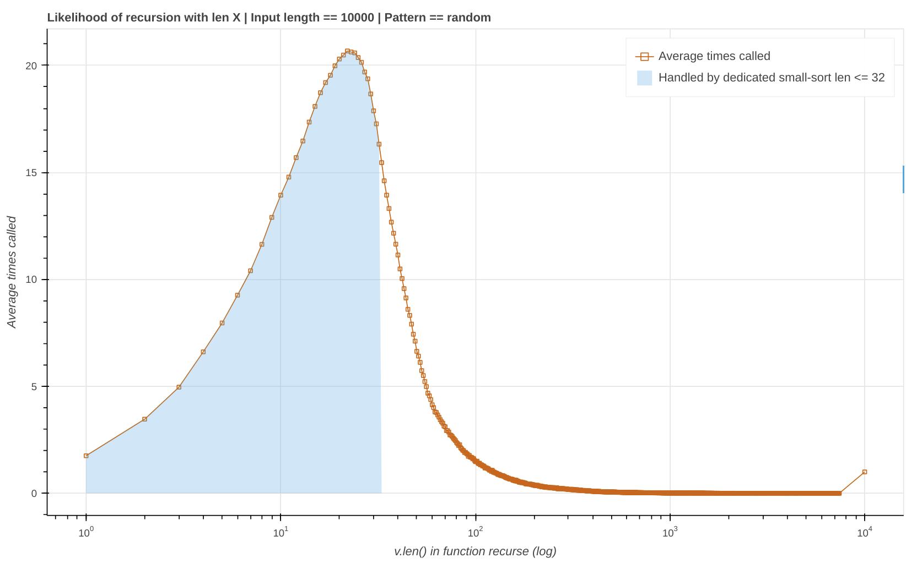

### Binary size and complexity

The tested branchless Hoare based implementations are significantly more complex than the analyzed branchless Lomuto based ones, this impacts the binary-size and compile-time of sort instantiations:

- `lomuto_branchless_cyclic_opt` [godbolt](https://rust.godbolt.org/z/5xrMnhWTe)
- `hoare_block` [godbolt](https://rust.godbolt.org/z/bTPz7aM94)
- `hoare_crumsort` [godbolt](https://rust.godbolt.org/z/4jda36381)


## Results for other patterns

The following graph shows the median runtime for the sort operation for inputs of 10_000 `u64`, across various patterns. The patterns are:

- `random`, random numbers generated by the [rand crate](https://github.com/rust-random/rand) `StdRng::gen`
- `random_d20`, uniform random numbers in the range `0..=20`
- `random_p5`, 95% 0 and 5% random values mixed in, not uniform
- `random_s95`, 95% sorted followed by 5% unsorted, simulates append + sort
- `random_z1`, [Zipfian distribution](https://en.wikipedia.org/wiki/Zipf%27s_law) with characterizing exponent s == 1.0

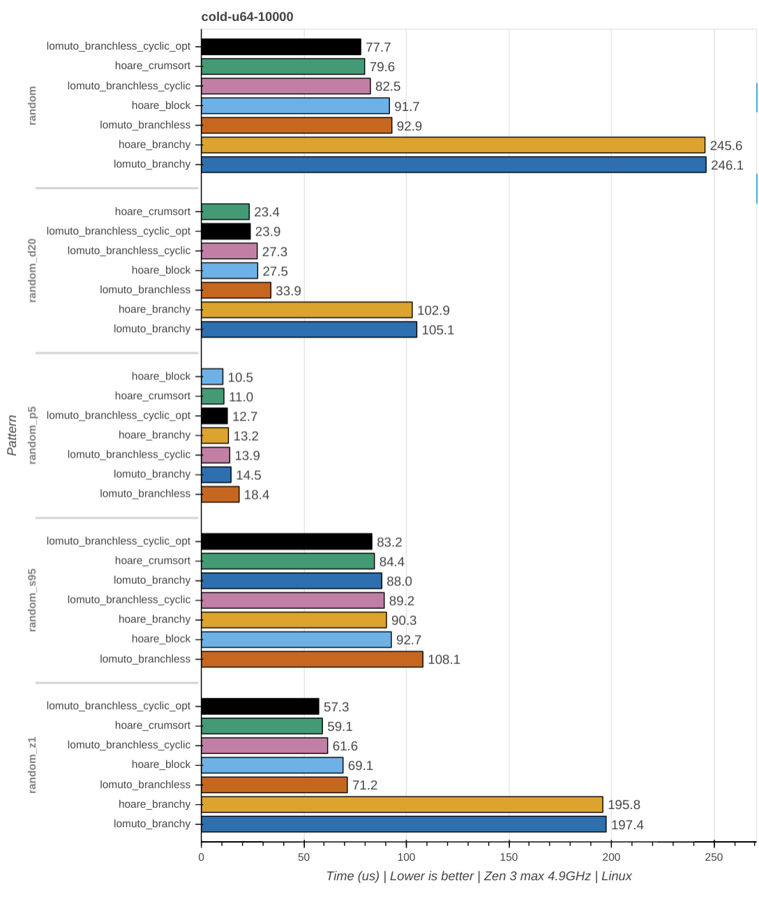

Observations:

- The random pattern is a view into the same data that has previously been shown in the scaling graphs.
- random_d20 spends practically all time in the partition implementation and none in the small-sort. With `K == 20` which is significantly smaller than `N`, ipnsort performs significantly less work, compared to the random pattern. This leads to an overall shorter runtime. By virtue of picking a good median pivot, the partitions are relatively balanced, leading to poor branch prediction accuracy in the branchy code. The comparatively larger amount of time spent in the partition also exacerbates the difference between the partition implementations. lomuto_branchless_cyclic_opt is ~1.14x times faster than lomuto_branchless_cyclic, whereas for the random pattern it is only ~1.06x times faster.
- The random_p5 pattern has the shortest runtime across the board. The 5% random values are distributed across the full `i32` range, which makes the zero statistically a very likely first pivot pick. The followup pivot pick in the right side recursion has high chance of only sampling zeros, which triggers equal partitioning of the zero values. Effectively filtering out 95% of the input and only having to perform full depth recursion for the remaining 2.5% on each side.
- random_p5 and random_s95 perform as consequence of pivot selection, what is often referred to as a "skewed partition" where the majority of values are less-than or equal-or-greater-than the pivot. On average this means the branch direction predictor has to predict a branch inside the partition loop that is consistently true or false ~97% of the time. This makes the branchy implementation competitive with the branchless ones in such scenarios, even outperforming lomuto_branchless and hoare_block.
- Zipfian distributions are sometime referred to as 80/20 distributions. Such distributions are significantly more common in real world data than fully random distributions. random_z1 shows a similar ranking among the tested implementations as the random pattern. The fastest implementation is ~3.45x faster than the slowest, compared to ~3.16x for random. This can be explained by the relatively higher percentage of runtime spent in the partition implementation and similarly poor branch prediction accuracy.

The following graph compares two implementations against each other. This allows comparing multiple patterns at once while also visualizing their scaling behavior.

### lomuto_branchless_cyclic_opt vs lomuto_branchless

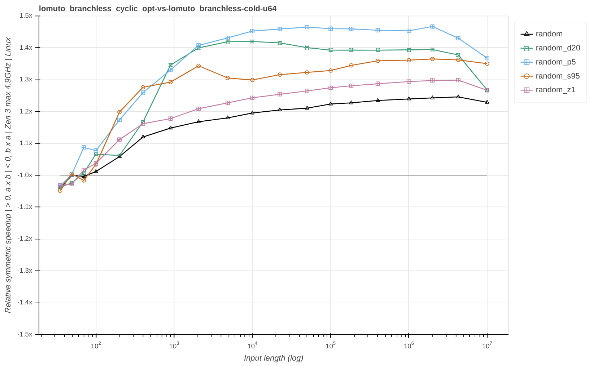

Observations:

- The random pattern shows the smallest relative speedup. This can be explained by the fact that ipnsort like other pdqsort derived implementations can filter out common values by performing an equal instead of a less-than partition. This is effective both for low cardinality patterns like random_d20 as well as filtering out common values as in random_p5 and random_z1. For these patterns ipnsort spends relatively less time in the small-sort and more in the partition, which explains the increased impact.
- The author is not sure how to explain the outsized impact on random_s95, which replicates on other micro-architectures.

### lomuto_branchless_cyclic_opt vs hoare_block

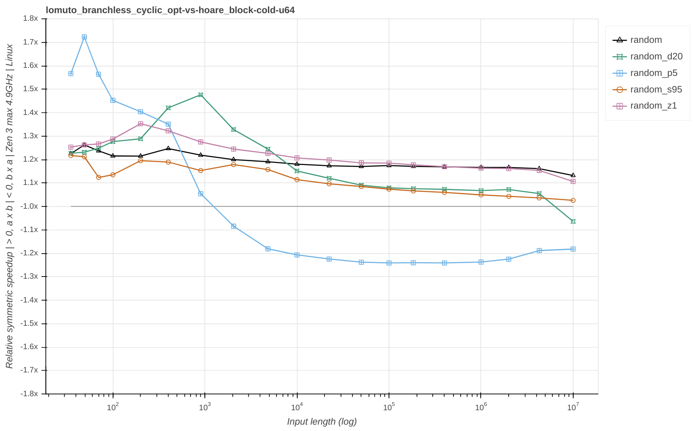

Observations:

- Compared to hoare_block, lomuto_branchless_cyclic_opt is consistently faster for all tested patterns except random_p5. Which can be explained by hoare_block having to swap relatively few values during the equal partition, mostly generating block offsets.

## Results for other types

A generic implementation has to handle user-defined types of various shapes, paired with user-defined comparison functions. While there is an unlimited amount of possible combinations, it is possible to pick certain types that demonstrate possible properties and their effects. In the benchmarks the input length range is limited to 1e5 for practical resource reasons, except for `u64` and `i32`.

### i32

Signed 32-bit integer with values in full `i32` range.

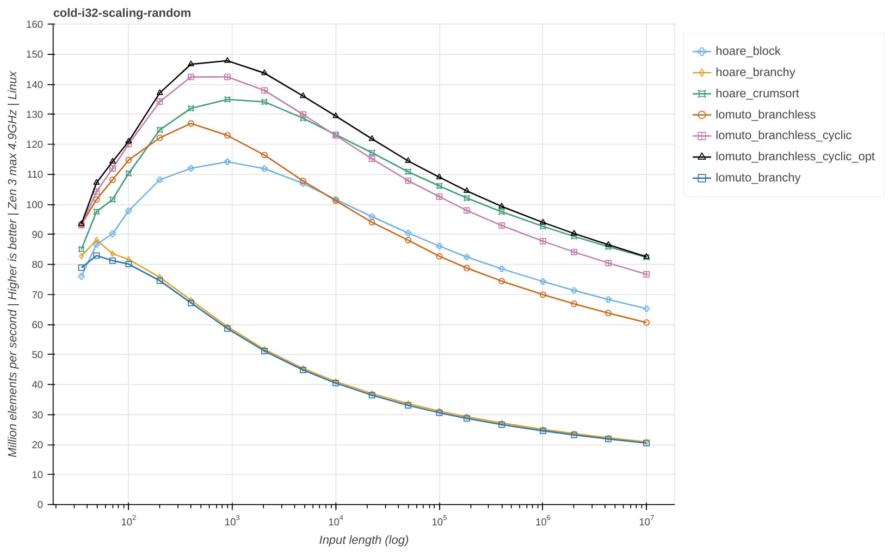

Observations:

- Mostly the same results as for `u64`.
- Slight advantage for the branchless Lomuto implementations, compared to the branchless Hoare implementations. One difference on x86 between signed and unsigned integer comparison is the status flags, and how they can be used by the compiler to optimize code-gen.

### string

Heap allocated string that resembles the rustc standard library `String`. All values for the benchmarks are derived from `i32` values. The strings all have the same length and are compared lexicographically, which in this case due to zero padding is the same as comparing the `val.saturating_abs()`. The string results are highly dependent on the allocation distribution, the benchmarks measure a relatively unrealistic scenario where the strings are allocated one after the other with minimal other work in-between.

```rust
#[repr(C)]
pub struct FFIString {
    data: *mut c_char,
    len: usize,
    capacity: usize,
}

// Construction from i32
FFIString::new(format!("{:010}", val.saturating_abs()))
```


Observations:

- The relative speedup between the branchy and branchless implementations has gone down to ~1.5x compared to the results for integers. This is caused in part by having a more expensive comparison function relative to the runtime cost of the control logic.
- hoare_crumsort performs worse than hoare_block.
- lomuto_branchless_cyclic_opt has overall the best performance.

### 1k

The 1k type simulates a type that is expensive to copy at 1KiB, but has a relatively cheap comparison function.

```rust
// Very large stack value.
#[repr(C)]
#[derive(PartialEq, Eq, Debug, Clone)]
pub struct FFIOneKibiByte {
    values: [i64; 128],
}

impl FFIOneKibiByte {
    pub fn new(val: i32) -> Self {
        let mut values = [0i64; 128];
        let mut val_i64 = val as i64;

        for elem in &mut values {
            *elem = val_i64;
            val_i64 = std::hint::black_box(val_i64 + 1);
        }
        Self { values }
    }

    fn as_i64(&self) -> i64 {
        self.values[11] + self.values[55] + self.values[77]
    }
}

impl PartialOrd for FFIOneKibiByte {
    fn partial_cmp(&self, other: &Self) -> Option<std::cmp::Ordering> {
        self.as_i64().partial_cmp(&other.as_i64())
    }
}
```

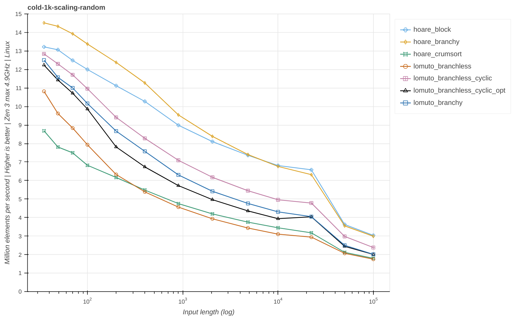

Observations:

- The results for the 1k type show completely different characteristics compared to the other tested types.
- hoare_branchy and hoare_block have the best performance, because they perform a minimal amount of element copies.
- hoare_crumsort combines block generation and block swapping into the same loop, using the input itself as temporary storage for the cyclic permutation. This involves copying the value comparatively often, and subsequently it is at the bottom of the performance ranking.
- lomuto_branchless_cyclic performs better than lomuto_branchless_cyclic_opt despite them being very similar and the speedup usually being the other way around. They both perform one `ptr::copy_nonoverlapping` which translates to a call to `memcpy` for `FFIOneKibiByte`, and each performs one `ptr::copy` each loop iteration, which translates to a call to `memmove`. With lomuto_branchless_cyclic the chance that `ptr::copy` will copy the same value on-top of itself are relatively high as seen in the visualization. `memmove` can early return if the source and destination address are the same.

#### Type introspection in ipnsort

The main version of ipnsort without replaced partition implementations, has two distinct partition implementation it chooses from at compile-time based on the `mem::size_of::<T>()` of the type that is sorted. lomuto_branchless_cyclic_opt as the branchless option for most types, and one that optimizes for a minimum of element copies. The small-sort has three options with more complex criteria. Using type introspection enables ipnsort to more effectively optimize for a diverse set of scenarios.

### f128

The f128 type simulates a type that is relatively cheap to copy at 16 bytes. Performs no heap access, but performs a relatively expensive math function as part of each comparison.

```rust
// 16 byte stack value, with more expensive comparison.
#[repr(C)]
#[derive(PartialEq, Debug, Clone, Copy)]
pub struct F128 {
    x: f64,
    y: f64,
}

impl F128 {
    pub fn new(val: i32) -> Self {
        let val_f = (val as f64) + (i32::MAX as f64) + 10.0;

        let x = val_f + 0.1;
        let y = val_f.log(4.1);

        assert!(y < x);
        assert!(x.is_normal() && y.is_normal());

        Self { x, y }
    }
}

// Goal is similar code-gen between Rust and C++
// - Rust https://godbolt.org/z/3YM3xenPP
// - C++ https://godbolt.org/z/178M6j1zz
impl PartialOrd for F128 {
    fn partial_cmp(&self, other: &Self) -> Option<std::cmp::Ordering> {
        // Simulate expensive comparison function.
        let this_div = self.x / self.y;
        let other_div = other.x / other.y;

        // SAFETY: We checked in the ctor that both are normal.
        let cmp_result = unsafe { this_div.partial_cmp(&other_div).unwrap_unchecked() };

        Some(cmp_result)
    }
}
```

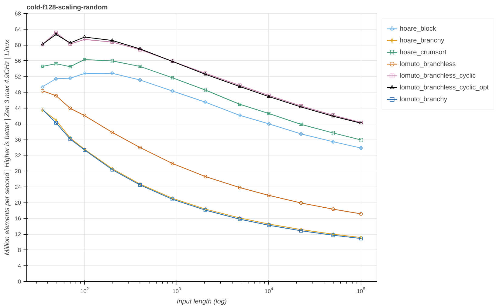

Observations:

- As with all tested types except `i32` and `u64`, the comparatively larger impact of the increased amount of comparisons required as the input length grows, means there is no pronounced throughput peak.
- lomuto_branchless_cyclic and lomuto_branchless_cyclic_opt have more or less the same throughput, likely limited by the 13.5 cycle 64-bit floating-point division latency on Zen 3.
- A large gap exists between lomuto_branchless and the other branchless implementations.

## Results on other micro-architectures

It is one thing to write high-performance code for one specific micro-architecture or even one specific super-computer, as is commonly done in the high-performance computing (HPC) world. And a different one to write high-performance code that generalizes well across different micro-architectures, from small embedded chips all the way up to server chips. It puts a strict limit on the assumption one should make about the hardware, the availability of ISA extensions such as AVX and the effects of optimizations.

### Haswell

The micro-architecture called Haswell released in the year 2013 by Intel, is the successor to the very successful Sandy Bridge micro-architecture released in the year 2011, which then was followed by [Skylake](https://chipsandcheese.com/2022/10/14/skylake-intels-longest-serving-architecture/) in the year 2015. Broadwell is a node shrink of the same micro-architecture, which implies higher frequencies and/or better energy efficiency, but the micro-architecture is essentially the same.

```
Linux 5.19
rustc 1.75.0-nightly (aa1a71e9e 2023-10-26)
Intel i7-5500U 2-Core Processor (Broadwell micro-architecture)
CPU boost enabled.
```

#### Scaling random

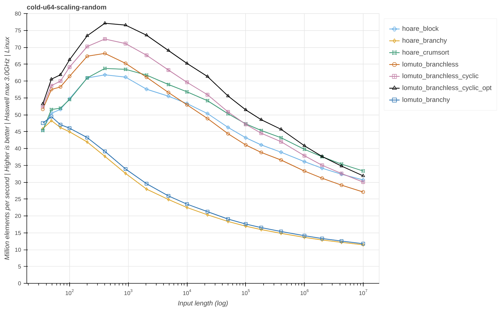

Observations:

- The overall ranking and shape are similar to the Zen 3 results.
- The branchless Hoare implementations perform relatively worse, which can be explained by their more complex control logic having a larger relative impact.
- Peak throughput is half that of Zen 3. Clock frequency alone only accounts for a ~1.63x improvement, which suggests a ~1.19x improvement in elements per cycle in this scenario for Zen 3 over Haswell.
- Zen 3 has ~2.49x the throughput at input length 1e7, which translates to a ~1.52x elements per cycle improvement. For larger input sizes, a key factor will be main memory bandwidth. 1e7 `u64` is 80 MB per input, which exceeds the 4MB shared L3 of the i7-5500U, as well as the 32MB of L3 per CCD for Zen 3. The tested Zen 3 machine has double the main memory bandwidth, which explains the correlation between relative speedup and input length.
- lomuto_branchy is slightly faster than hoare_branchy.
- At input length 1e7, the fastest partition implementation improves total sort throughput by ~2.92x compared to the slowest one, which is the smallest measure gap across the tested micro-architectures. This could be indicative of comparatively smaller CPU frontend re-steer penalties, as well as limited core width putting an upper limit on instruction level parallelism (ILP).

#### lomuto_branchless_cyclic_opt vs hoare_block

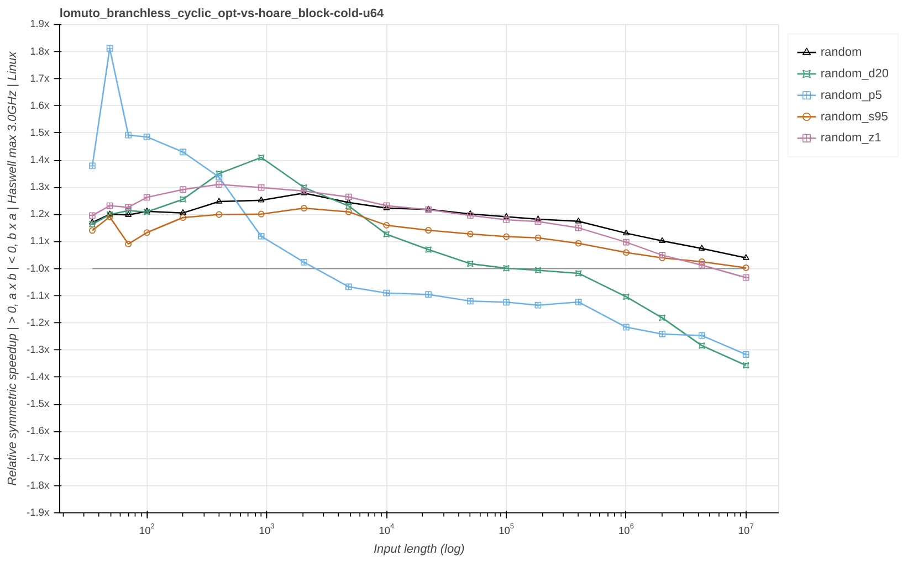

Observations:

- The overall ranking is similar to the Zen 3 results.
- Once the input doesn't fit into the 4MB L3 anymore, hoare_block start gaining on lomuto_branchless_cyclic_opt. This can be explained by the lower average write pressure on the memory sub-system for the branchless Hoare implementations.

### Firestorm

The P-core micro-architecture called Firestorm released in the year 2020 by Apple and found in the A14 and M1 family of chips, is one of the widest and most capable micro-architectures available to consumers to date. The machine-code generated for the Arm instruction set architecture (ISA) by LLVM is broadly similar to the machine-code generated for the x86 ISA, but there are meaningful differences one has to account for when writing cross-platform high-performance code. Like the aforementioned loop unrolling issue, as described in the second section called "Performance measurement", and more.

```
Darwin Kernel Version 22.6.0
rustc 1.75.0-nightly (aa1a71e9e 2023-10-26)
Apple M1 Pro 6+2 Core Processor (Firestorm P-core micro-architecture)
CPU boost enabled.
```

#### Scaling random

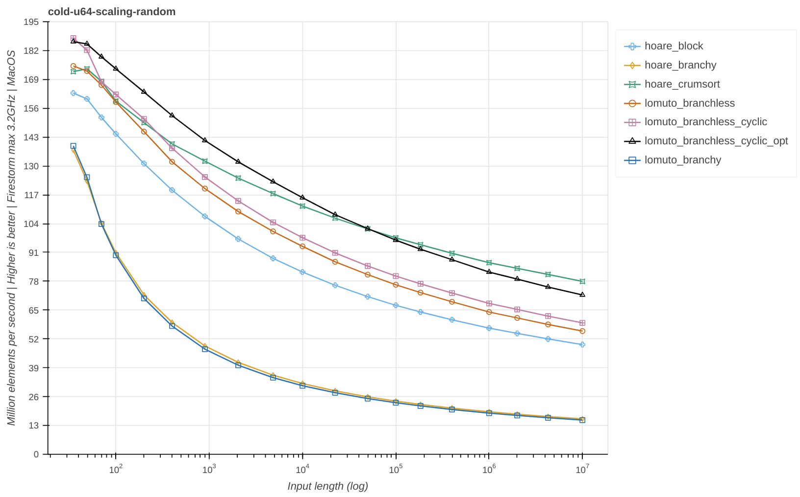

Observations:

- The equilibrium point between the effects of cold caches and less work, happens at a significantly smaller input length compare to Zen 3.
- Assuming the same instructions per cycle (IPC) and mapping of instructions to cycles, Zen 3 should be ~1.53x faster than Firestorm by virtue of clock frequency. Yet the micro-architecture released in the same year as Zen 3, goes from exceeding it to closely trailing it in terms of absolute throughput when the effects of branch misprediction are minimized. Comparing lomuto_branchless_cyclic_opt throughput on Zen 3 with Firestorm and normalizing clock speed, reveals ~1.45x higher elements per cycle at input length 900 and ~1.39x at 1e7. In contrast lomuto_branchy goes from ~1.23x down to ~1.15x, demonstrating the increased effect of branch prediction accuracy on wider micro-architectures. Benchmarking the partition implementation lomuto_branchy in isolation yields a consistent ~1.13x improvement in elements per cycle compared to Zen 3.
- No noticeable additional reduction in throughput is measured when inputs go past the 16MB L3 cache, as seen on Zen 3 and Haswell.
- At input length 1e7, the fastest partition implementation improves total sort throughput by ~5.06x compared to the slowest one, which is the largest measure gap across the tested micro-architectures.

#### lomuto_branchless_cyclic_opt vs hoare_block

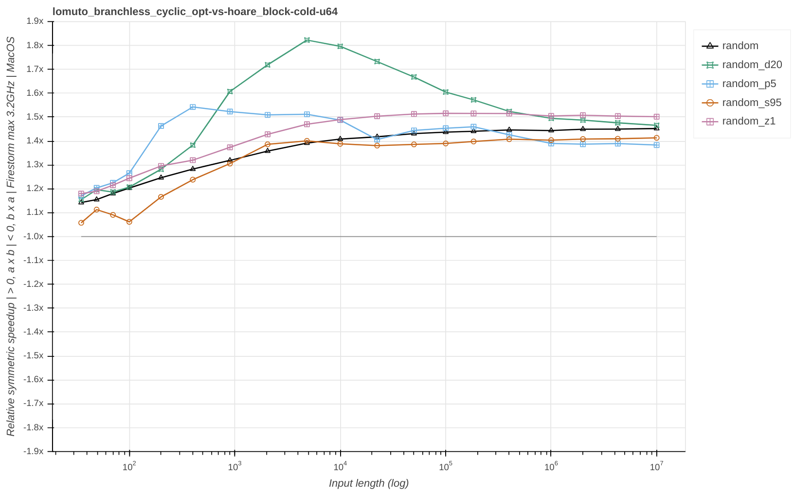

Observations:

- Compared to Zen 3, Firestorm shows larger relative improvements across all tested patterns.
- Compared to Zen 3, no tested pattern and size combination has hoare_block outperform lomuto_branchless_cyclic_opt on Firestorm. This is caused in part by differences in code-gen.

### Icestorm

The E-core micro-architecture called Icestorm found in the A14, and M1 family of chips, along side the Firestorm P-core micro-architecture, is extremely capable when [compared](https://images.anandtech.com/doci/17102/SPECint2017.png) to contemporary designs with similar power envelopes like the ARM Cortex-A55. This can be in part attributed to different design goals, where ARM is conservative with chip area, Apple is lavish, allowing for a wide out-of-order (OoO) design.

```
Darwin Kernel Version 22.6.0
rustc 1.75.0-nightly (aa1a71e9e 2023-10-26)
Apple M1 Pro 6+2 Core Processor (Icestorm E-core micro-architecture)
CPU boost enabled.
```

#### Scaling random

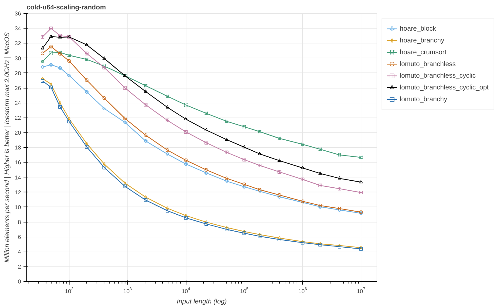

Observations:

- Icestorm is the weakest of the tested micro-architectures in terms of absolute throughput as well as frequency normalized throughput.
- hoare_crumsort is the clear winner on Icestorm, overtaking lomuto_branchless_cyclic_opt at small input lengths.
- The median relative speedup for lomuto_branchless_cyclic versus lomuto_branchless is ~1.23x. This is significantly higher than the ~1.05x on Firestorm, demonstrating significant differences in the two micro-architectures.
- At input length 1e7, the fastest partition implementation improves total sort throughput by ~3.8x compared to the slowest one, which is larger than on Haswell, indicating that the Icestorm micro-architecture is impacted more heavily by branch misprediction than Haswell.

#### lomuto_branchless_cyclic_opt vs hoare_block

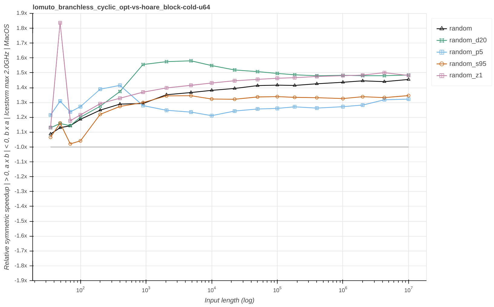

Observations:

- The overall ranking is similar to the Firestorm results.
- As with Firestorm, no tested pattern and size combination has hoare_block outperform lomuto_branchless_cyclic_opt on Icestorm.

## Author's conclusion and opinion

As with many things, every step that took me closer also revealed a fractal growth in complexity. I started seriously looking into partition implementations in the winter of 2022. This journey has been exciting, frustrating, joyful, arduous and above all else, educational. I hope you learned something from reading this document, I tried to write it in a way that makes the topic approachable to non-experts.

This journey took me on a long windy path, with many hours exploring eventual dead ends. What might look like a neat linear progression was nothing like that. I probably spent 95+% of the time experimenting with Hoare derived implementations. The Lomuto derived approach happened more by accident than on purpose. [Here](https://github.com/Voultapher/sort-research-rs/blob/lomcyc-partition-bench/src/other/partition/graveyard/graveyard.rs) you can find the tip of the iceberg of ideas that did not pan out.

If this inspires you to look into making software more efficient, here are some lessons I learned I'd like to share:
- Viewing benchmarks through the lens of a scientific experiment can help you avoid a well known list of mistakes that make the results misleading.
- Building custom tools for the domain you are looking into can help you gain a novel perspective.
- There is no shortcut for reading and understanding generated machine-code. Approximations like number of instructions can be helpful but also misleading. Learning to understand machine-code unlocks many doors.
- Avoid relying on a single measurement tool. As shown here, tools like llvm-mca can be quite unreliable, as can be uiCA, in both directions. And runtime benchmarks can give you repeatable improvements and regressions for exactly the same machine code. For example the sort-research-rs benchmarks do not control for code alignment and heap layout.
- Dismissing results that disagree with your current understanding will keep you ignorant.
- Analyzing components in isolation with tools like godbolt can sometimes be misleading. code-gen can look different in a real program with more surrounding context. It can help to occasionally analyze generated machine-code with tools like [iaito](https://github.com/radareorg/iaito/) in a real setting.

Stay curious.

## Thanks

Thank you Orson Peters for all the help and thoughtful discussions. Thank you Roland Bock for your detailed feedback and ideas how to make this writeup more readable.
