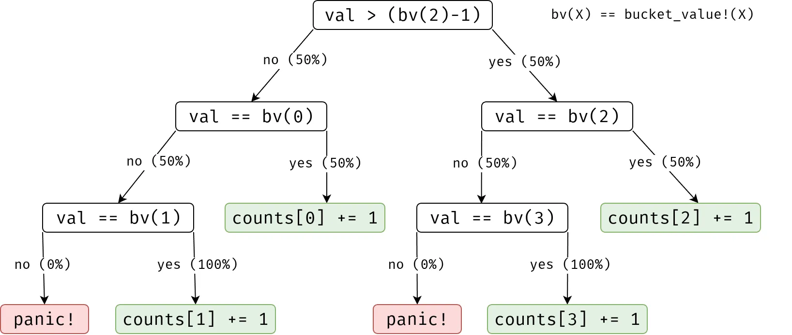

# The unreasonable effectiveness of modern sort algorithms

Author: Lukas Bergdoll @Voultapher  
Date: 2025-09-09 (YYYY-MM-DD)

This is a comparison of domain-specific sort algorithms to modern
general-purpose hybrid sort algorithms.

---

Bias disclosure: the author of this document is the co-author of ipnsort and
driftsort which are the implementations used by the Rust standard library.

## Scenario

A software component is given data to sort. It is known that the values will be
of low cardinality. Despite being of the type `u64` which can hold 2^64 distinct
values, only exactly 4 distinct values are ever observed. Given this severely
constrained scenario, a programmer might reasonably decide to use a specialized
sort implementation instead of a library provided one, since they know more
about the data than a generic implementation can.

### Benchmark setup

Benchmarks are performed on the following machine and using the
[sort-research-rs](https://github.com/Voultapher/sort-research-rs) benchmark
suite with the `random_d4` pattern.

```
Linux 6.16
rustc 1.91.0-nightly (6ba0ce409 2025-08-21)
AMD Ryzen 9 5900X 12-Core Processor (Zen 3 micro-architecture)
CPU boost enabled.
```

## Domain optimized algorithms

### BTree

```rust
fn bucket_sort(v: &mut [u64]) {
    let mut buckets = std::collections::BTreeMap::new();

    for elem in v.iter().copied() {
        *buckets.entry(elem).or_insert(0) += 1;
    }

    let mut offset = 0;
    for (elem, count) in buckets {
        v[offset..offset + count].fill(elem);
        offset += count;
    }
}
```

This approach uses a `BTreeMap` to count the occurrences of each value and since
binary trees are sorted by construction, the iteration at the end will be sorted
correctly.


Plotting throughput on the Y axis derived from the time to sort N values as
shown on the X axis in log steps. A value of ~145 million elements per second at
input length 1_000 (10^3 or 1e3) implies that it took on median ~6.9us to sort
the 1_000 elements.

These are cold and not hot benchmarks, L1i - but not L1d - and the
branch-target-buffer (BTB) are flushed before each measurement and the input is
random for each iteration. This measures one-off calls to sort as part of a
larger program and not throughput in the classical sense as typical hot
micro-benchmarks would. The differences between hot and cold benchmarks is
negligible past an input length of 1e3.

Measured throughput starts low as L1i, BTB and uop cache misses dominate as well
as the cost of memory allocation. For larger inputs fixed costs are amortized
and caches are hot and throughput increases.

Of the 64KB L1d, 512KB L2 and 32MB L3 caches, accessible by the single thread
doing the computation in the benchmark, the L3 is the biggest and slowest, with
a latency of ~47 cycles. Given an average ~32.7 cycles per element at a
throughput of 150 million elements per second, the CPU clearly can't wait to
compute each value individually and then fetch the next one. Modern CPUs are
pipelined, which means they fetch data and instructions before they are needed
and attempt to hide latency by being ahead *enough* to never have to wait for
them. Ideally the CPU would like to know that it has to process element XN and
then fill the time it has to wait for XN with processing X0, X1, X2 ...  XN-1.

At the very minimum the sort function will have to read the data in `v` once
into registers to process it and then write it back. With a single-threaded L3
read and write bandwidth of ~122GB/s this puts an upper limit on the possible
throughput for L3 sized inputs at 0.6 cycles per element. The data access
pattern in `for elem in v.iter()` and `v[offset..offset + count].fill(elem);` is
a linear scan that is easy to predict, prefetch, pipeline and batch.

Since the implementation is spending ~32 cycles longer than absolutely necessary
per element, it is either compute bound or doing other memory accesses that are
hidden by abstraction.

### Hash

```rust
fn bucket_sort(v: &mut [u64]) {
    let mut buckets = fxhash::FxHashMap::default();

    for elem in v.iter().cloned() {
        *buckets.entry(elem).or_insert(0) += 1;
    }

    let mut buckets_sorted = buckets.into_iter().collect::<Vec<_>>();
    buckets_sorted.sort_unstable_by_key(|(val, _count)| *val);

    let mut offset = 0;
    for (elem, count) in buckets_sorted {
        v[offset..offset + count].fill(elem);
        offset += count;
    }
}
```

Hash maps offer similar key value mapping functionality to binary trees and
given a fast hashing function can be faster than binary trees. However they give
up the ordered property, which means an additional sorting step is required. The
sorting step is O(K * log(K)) where K is the number of distinct elements in `v`.


The hash map approach is significantly faster than the binary tree. This will
vary with the used hash function and data structure implementations.

An effect that was visible before but is more pronounced here, is that for the
measured inputs larger than `8B * 2e6 = 16MB` throughput decreases for both
approaches. This is indicative of pipeline stalls caused by the high latency
inherent to large off-chip memory (DRAM). Specifically the CPU was not able to
fill the ~400 cycles it has to wait for data from DRAM with work and spends an
increasing amount of time waiting instead of working.

### Match

```rust
// These are the only four values in the data to sort.
macro_rules! bucket_value {
    // Static lookup
    (0) => {
        4611686016279904256
    };
    (1) => {
        4611686018427387903
    };
    (2) => {
        4611686020574871550
    };
    (3) => {
        4611686022722355197
    };
    // Dynamic lookup
    ($idx:expr) => {
        match $idx {
            0 => bucket_value!(0),
            1 => bucket_value!(1),
            2 => bucket_value!(2),
            3 => bucket_value!(3),
            _ => unreachable!(),
        }
    };
}

fn bucket_sort(v: &mut [u64]) {
    let mut counts = [0; 4];

    for val in v.iter() {
        match val {
            bucket_value!(0) => counts[0] += 1,
            bucket_value!(1) => counts[1] += 1,
            bucket_value!(2) => counts[2] += 1,
            bucket_value!(3) => counts[3] += 1,
            _ => unreachable!("Unexpected value: {val}"),
        }
    }

    let mut offset = 0;
    for (i, count) in counts.iter().enumerate() {
        v[offset..offset + count].fill(bucket_value!(i));
        offset += count;
    }
}
```

Four possible values invites the option to explicitly handle each one with a
custom code path. This requires the values to be encoded in the program which
can lead to issues if the values ever change.

The specific numbers are the values found in the u64-random_d4 pattern and where
not chosen specifically for this comparison.


Avoiding the memory allocations required by `BTreeMap` and `HashMap` yields an
improvement for inputs of length <= 100. For larger inputs, branch misprediction
limits throughput to ~200 million elements per second, implying the CPU spends
~24.5 cycles per element.

In practice the tested rustc version generates a binary search to find the
matching match arm.



Zen 3 has a 1024 entry L1 BTB, comfortably fitting the 9 jumps at play in the
loop. The CPU knows where the branches are in the instruction stream, but 3 of
the 9 jumps are equally likely to be taken as not taken. The
branch-*target*-buffer (BTB) yields near perfect predictions, but the
branch-*history*-buffer (BHB) yields wrong predictions for these branches 50% of
the time. On average this will incur one branch misprediction penalty
per loop iteration. To be precise, there is a 25% chance for no misprediction,
50% chance for one misprediction and 25% chance for two mispredictions. Together
with the pipelined work lost and cache latency this explains the poor
throughput.

The generated and annotated loop assembly and a more detailed throughput
analysis is attached for optional closer inspection.

<details>

```asm
        movabs  r11, 4611686020574871549 ; bucket_value!(2) - 1
        movabs  rbx, 4611686016279904256 ; bucket_value!(0)
        movabs  r14, 4611686018427387903 ; bucket_value!(1)
        movabs  r15, 4611686020574871550 ; bucket_value!(2)
        movabs  r12, 4611686022722355197 ; bucket_value!(3)
        xor     eax, eax ; counts[3] aliased to rax
        xor     ecx, ecx ; counts[2] aliased to rcx
        xor     r9d, r9d ; counts[1] aliased to r9
        xor     r8d, r8d ; counts[0] aliased to r8
.LBB1_3:
        mov     r13, qword ptr [rsi + r10] ; Load val
        cmp     r13, r11
        jg      .LBB1_7
        cmp     r13, rbx
        je      .LBB1_10
        cmp     r13, r14
        jne     .LBB1_9 ; jump to panic
        inc     r9 ; counts[1] += 1
        jmp     .LBB1_13
.LBB1_7:
        cmp     r13, r15
        je      .LBB1_11
        cmp     r13, r12
        jne     .LBB1_9 ; jump to panic
        inc     rax ; counts[3] += 1
        jmp     .LBB1_13
.LBB1_10:
        inc     r8 ; counts[0] += 1
        jmp     .LBB1_13
.LBB1_11:
        inc     rcx ; counts[2] += 1
.LBB1_13:
        add     r10, 8
        cmp     rdx, r10
        jne     .LBB1_3 ; Jump back to loop beginning
```

The misprediction penalty for uop cache hits - which is the case given the small
code footprint - is 15-16 cycles on Zen3. The computed load `mov r13, qword ptr
[rsi + r10]` takes 5 cycles when served from L1 and 12 cycles when served from
L2. This latency can be hidden by speculative pipelined execution, but only if
prediction is 100% correct. Assuming - wrongly - that the pipeline will notice
it's mistake after the load from L1 or L2 completes and that there is a 50/50
L1/L2 split yields `15.5 + 8.5 = 24` cycles per element for the match loop.
Additional testing suggests the value filling at the end takes an addition ~0.6
cycles per element. Which would give a computed 24.6 cycles per element, closely
matching the measured ~24.5 cycles per element. In practice the approximation
ignores that values waiting for L3 will cause a bigger bubble, but happen less
frequently since bubbles can give the prefetchers time to fill up the lower
level caches. It also ignores that the case of two mispredictions in one loop
iteration will not have to wait for caches the second time, only the pipeline
restart caused by the first misprediction.

</details>

### Branchless

```rust
fn bucket_sort(v: &mut [u64]) {
    let mut counts = [0; 4];

    for val in v.iter() {
        counts[0] += (*val == bucket_value!(0)) as usize;
        counts[1] += (*val == bucket_value!(1)) as usize;
        counts[2] += (*val == bucket_value!(2)) as usize;
        counts[3] += (*val == bucket_value!(3)) as usize;
    }

    let mut offset = 0;
    for (i, count) in counts.iter().enumerate() {
        v[offset..offset + count].fill(bucket_value!(i));
        offset += count;
    }
}
```

CPU pipeline hazards caused by branch misprediction can be avoided by evaluating
every branch unconditionally and masking the unwanted result. If there are no
branches to predict, the CPU only occasionally hallucinates unwanted ones into
existence and then predict them wrong.


The combination of simple memory access patterns and virtually no branch
misprediction yields a significant improvement over the hash map approach. For
up to L3 sized inputs, the throughput is bound by decode width and available
backend resources. In total there are ~20 instructions per loop iteration. With
~0.6 cycles for the fill at the end and ~4.5 cycles per element in total that
leaves ~3.9 cycles per loop iteration, or inversely ~5.1 instruction-per-cycle
(IPC). An IPC value of ~5.1 is close to the peak possible effective throughput
of ~5.7, dictated by the narrowest point in Zen 3's pipeline the 6-wide renamer.
Any further gains in sort throughput will have to be achieved by doing fewer
computations.

### Perfect hash function (phf)

```rust
fn bucket_sort(v: &mut [u64]) {
    let mut counts = [0; 4];

    for val in v.iter() {
        let idx = 3 - ((val + 3) % 4);
        counts[idx as usize] += 1;
    }

    let mut offset = 0;
    for (i, count) in counts.iter().enumerate() {
        v[offset..offset + count].fill(bucket_value!(i));
        offset += count;
    }
}
```

A perfect hash function is a mathematical object that allows mapping from one
key space to another key space without collisions but only works for a
predefined set of keys. In addition to being a phf `3 - ((val + 3) % 4)` also
maps the values to their corresponding index in the final output, effectively
sorting them.


For L3 sized inputs bucket_phf can do ~1.7 billion elements per second, implying
the CPU spends ~2.9 cycles per element. At this point anything else done with
the data will likely be the bottleneck, not sorting.

It's possible to improve throughput further with automatic or manual
vectorization.

## Robustness

Domain optimized algorithms are susceptible to changes in the data they process.
For example the values might change or a new data source adds data with
different characteristics. It's also possible that the assumptions made don't
generalize to all existing uses of the software.

In a changed scenario where 5% of the data is fully random, the behavior would
change in the following way:

| Name       | Effect                         |
|------------| -------------------------------|
| BTree      | Loss of efficiency (2x)        |
| Hash       | Loss of efficiency (2x)        |
| Match      | Panic                          |
| Branchless | Incorrect output, silent       |
| Phf        | Incorrect output, silent       |

## Comparison to generic algorithms

### `slice::sort_unstable`

Sorting stability is not required in this scenario, so the appropriate standard
library function is `slice::sort_unstable`.


For L3 sized inputs rust_std_unstable can do ~660 million elements per second,
implying the CPU spends ~7.4 cycles per element. It does so without knowing
anything about the input before processing it and is only able to establish a
less than relationship between two elements.

Since rust_std_unstable does more memory accesses than the hash map approach it is
affected more intensely by the increased latency of DRAM.

### Various generic algorithms

Generic sort implementations are found in most language standard libraries,
often with an allocating stable and in-place unstable variant.
[BlockQuicksort](https://arxiv.org/abs/1604.06697) is notable for popularizing
branchless partitioning. Based on BlockQuicksort
[pdqsort](https://arxiv.org/abs/2106.05123) is notable for inventing a robust
approach for filtering out common values, with an expected time to sort N
elements with K distinct elements of O(N * log(K)).

The details about what versions are being tested are found
[here](https://github.com/Voultapher/sort-research-rs/blob/60e19e3d56912171b4356de77499f9d798f9f12a/Cargo.toml).


Phf, branchless and match bucket sorting results are omitted from this graph to
limit visual overload and range compression.

For L3 sized inputs rust_std_unstable can do ~660 million elements per second,
implying the CPU spends ~7.4 cycles per element. It does so without knowing
anything about the input before processing it and only being able to establish a
less than relationship between two elements.

The peculiar shape of the rust_std_stable results stands out. Additional testing
with other pdqsort derived stable quicksorts, fluxsort and glidesort shows
similar results. Despite all three using somewhat different partitioning
approaches, this seems to be caused by the memory access pattern as part of
stable partitioning and quirks in the Zen 3 prefetcher and L2<->L3 interactions.

All the best performing sort implementations derive their low cardinality
handling from pdqsort. Driftsort (rust_std_stable), ipnsort (rust_std_unstable)
and crumsort.

Radsort is a radix sort and as such unable to adapt to patterns in the data.

Generic C based implementations are not able to inline the user-provided
comparison function, which severely [impacts their
performance](https://github.com/Voultapher/sort-research-rs/blob/main/writeup/intel_avx512/text.md#c-sort-interface).
Crumsort works around this by having users define the comparison function via a
macro before including the implementation header. However this limits each
compilation module to one comparison function.

## Author's conclusion and opinion

It's absolutely possible to beat even the best sort implementations with domain
specific knowledge, careful benchmarking and an understanding of CPU
micro-architectures. At the same time, assumptions will become invalid, mistakes
can creep in silently and good sort implementations can be surprisingly fast
even without prior domain knowledge. If you have access to a high-quality sort
implementation, think twice about replacing it with something home-grown.

## Acknowledgements

The title is an homage to Eugene Wigner's 1960 paper "The Unreasonable
Effectiveness of Mathematics in the Natural Sciences".

Orson Peters and Roland Bock helped as a technical reviewers.

